# Jobsheet 1

## Langkah 1 – Pengecekan Lingkungan

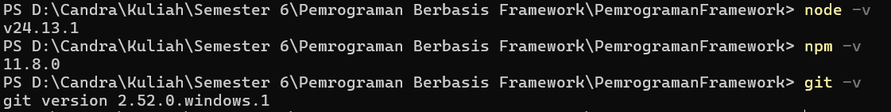

## Langkah 2 – Membuat Project Next.js

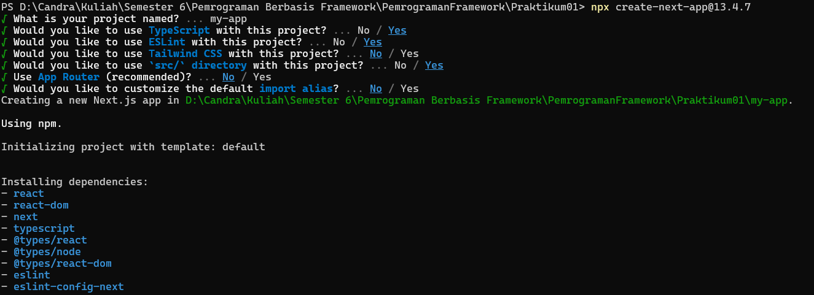

## Langkah 3 – Menjalankan Server Development

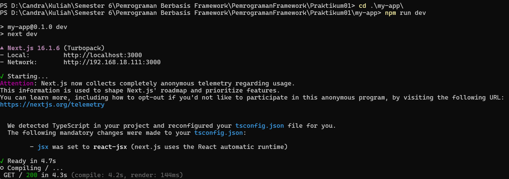

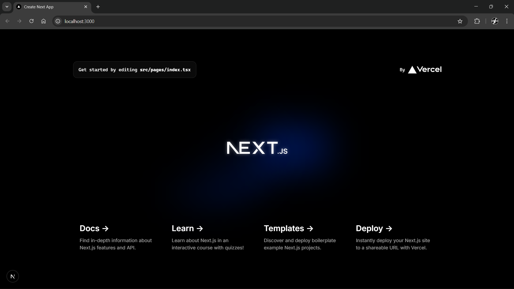

## Langkah 4 – Mengenal Struktur Folder

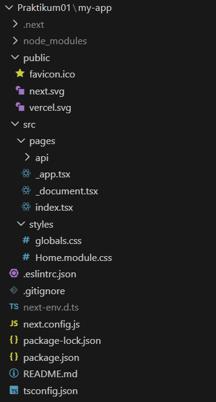

## Langkah 5 – Modifikasi Halaman Utama

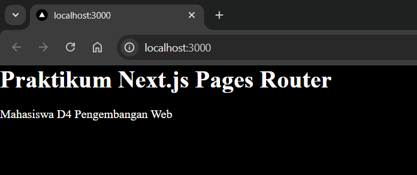

## Langkah 6 – Modifikasi API

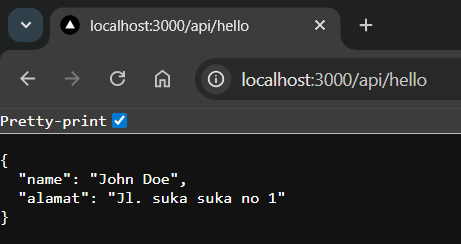

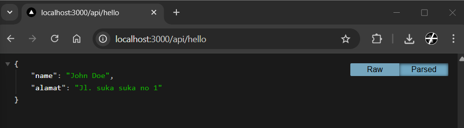

## Langkah 7 – Modifikasi Background

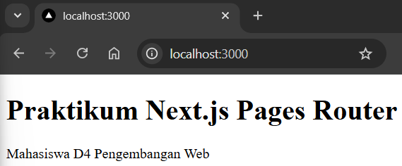

# Tugas Praktikum

## Tugas 1 (Wajib)

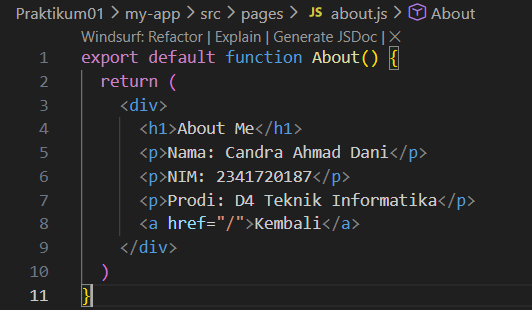

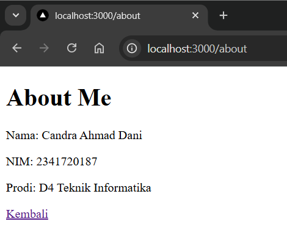

## Tugas 2 (Pengayaan)

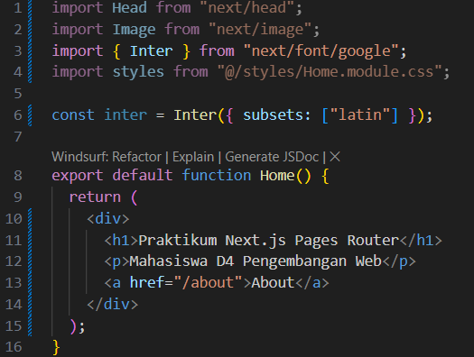

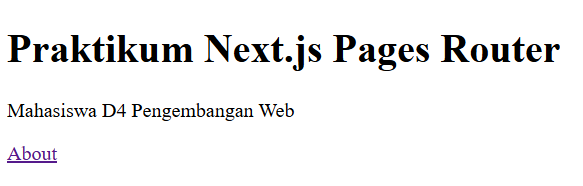

## Pertanyaan

1. Mengapa Pages Router disebut sebagai routing berbasis file?
   
   Pages Router disebut berbasis file karena sistem routing-nya otomatis dibuat berdasarkan struktur folder dan nama file di dalam folder pages.

2. Apa perbedaan Next.js dengan React standar (CRA)?
  
   Next.js adalah framework lengkap dengan routing, SSR, SSG, dan API bawaan, sedangkan React standar (CRA) hanya setup dasar SPA sehingga fitur seperti routing dan SEO harus ditambahkan sendiri.
3. Apa fungsi perintah npm run dev?
  
   npm run dev untuk menjalankan project dalam mode development (lokal).
4. Apa perbedaan npm run dev dan run build ?

    - npm run dev digunakan saat proses pengembangan dan belum dioptimasi untuk produksi.
    - npm run build digunakan untuk membuat versi production yang sudah dioptimasi (minify, compress, dll). Hasil build ini biasanya dijalankan dengan npm start atau di-deploy ke server hosting.
