# Jobsheet 2

## 1. Routing Dasar (Static Routing)

- FIle Halaman About

  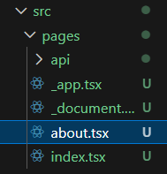

  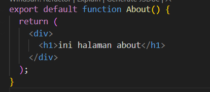

- Uji di Browser

  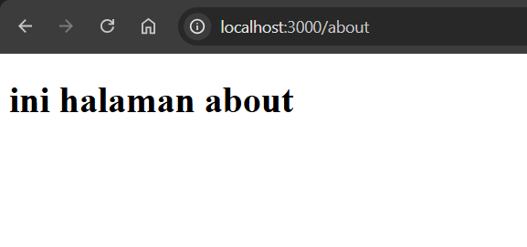

## 2. Routing Menggunakan Folder

- Rapikan Struktur Pages

  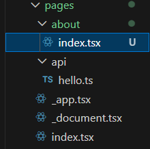

- Uji di Browser

  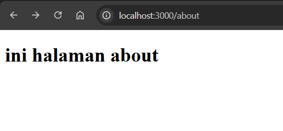

## 3. Nested Routing

- Buat Folder Setting

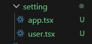

- Modifikasi Kode

  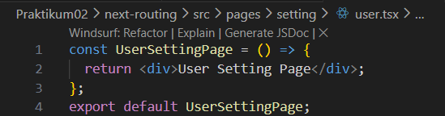

  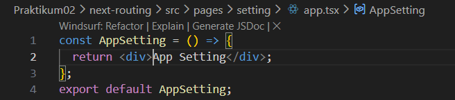

- Akses:

  /setting/user

  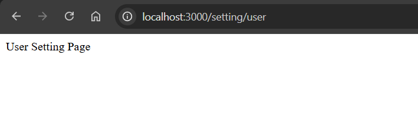

  /setting/app

  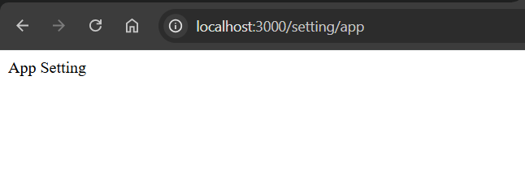

- Modifikasi struktur folder

  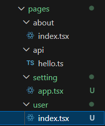

- Jalankan di browser

  

* Nested Lebih Dalam

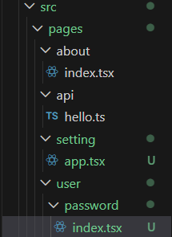

- Akses:
  /setting/user/password

  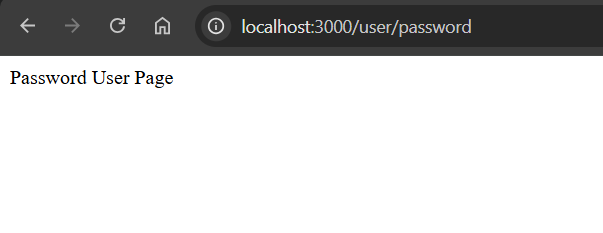

## 4. Dynamic Routing

- Buat Halaman Produk

  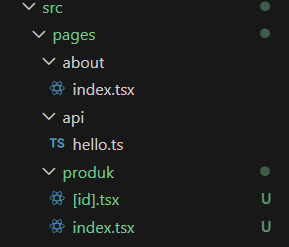

- Buka browser

  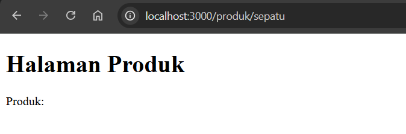

* Cek menggunakan console.log

  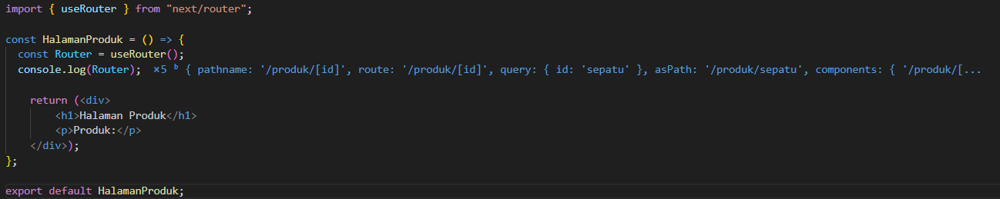

* Modifikasi [id].tsx

  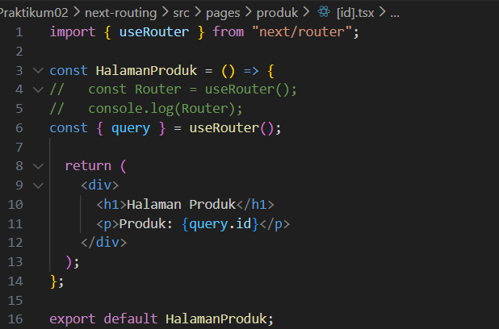

* Buka browser

  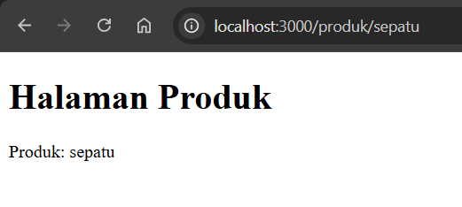

  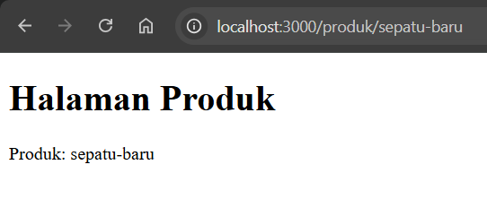

  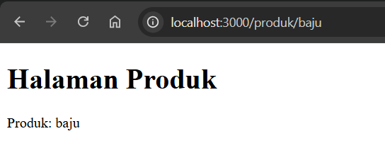

## 5. Membuat Komponen Navbar

- Struktur Komponen

  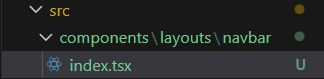

* Modifikasi index.tsx

  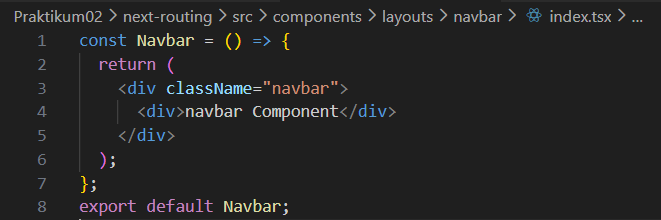

* Modifikasi global.css

  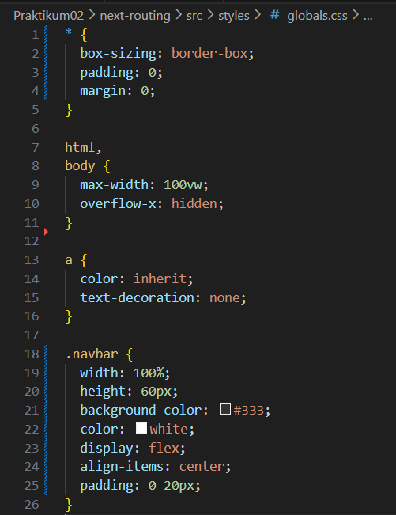

- Modifikasi index.tsx pada folder pages

  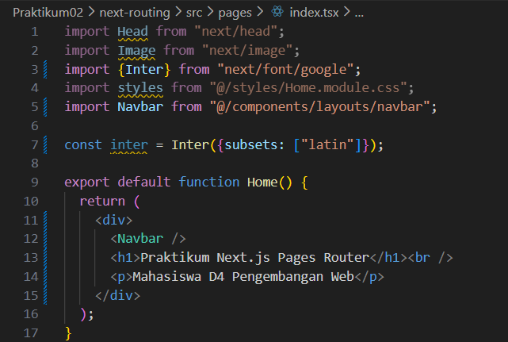

* Jalankan di browser

  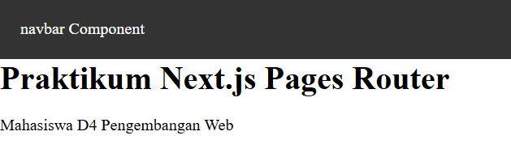

* Modifikasi navbar agar tampil di semua page

  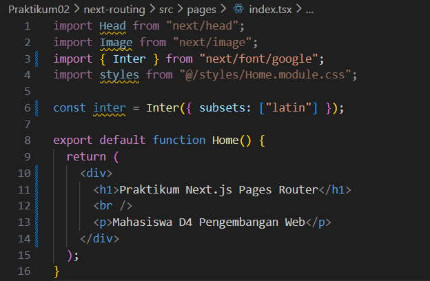

  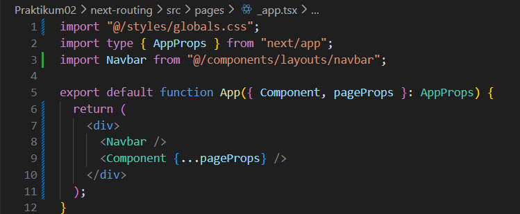

* Jalankan browser

  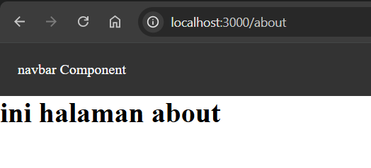

  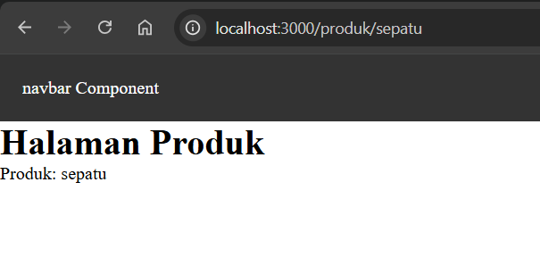

## 6. Membuat Layout Global (App Shell)

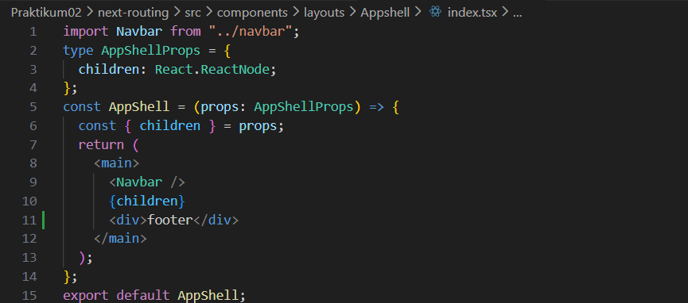

## 7. Implementasi Layout di \_app.tsx

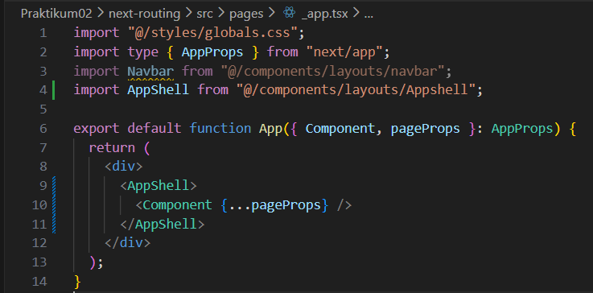

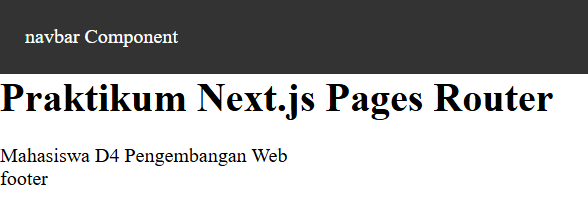

# Tugas Praktikum

## Tugas 1 – Routing

1. Buat halaman:
   - /profile

     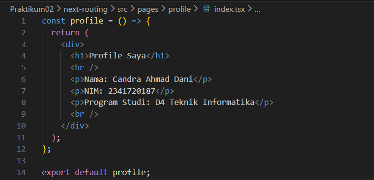

   - /profile/edit

     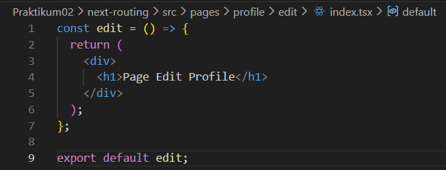

2. Pastikan routing berjalan tanpa error

   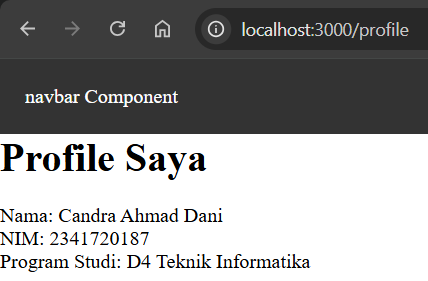

   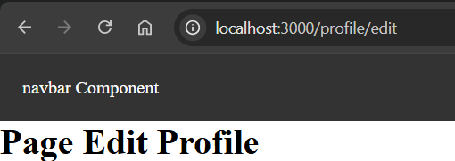

## Tugas 2 – Dynamic Routing

1. Buat routing:

2. /blog/[slug]

   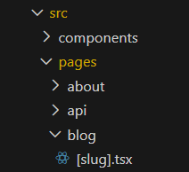

3. Tampilkan nilai slug di halaman

   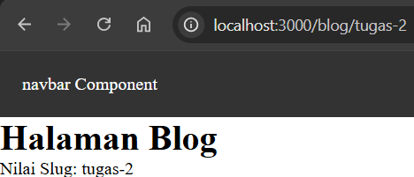

## Tugas 3 – Layout

1. Tambahkan Footer pada AppShell

   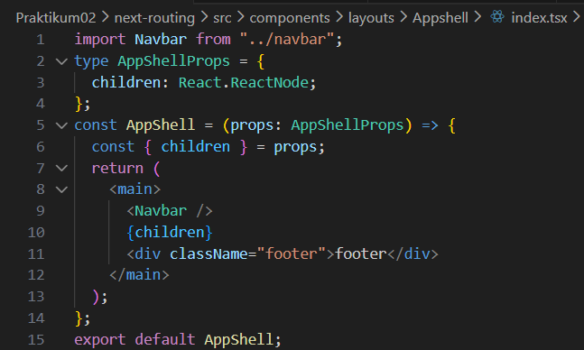

   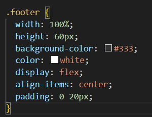

2. Footer tampil di semua halaman

   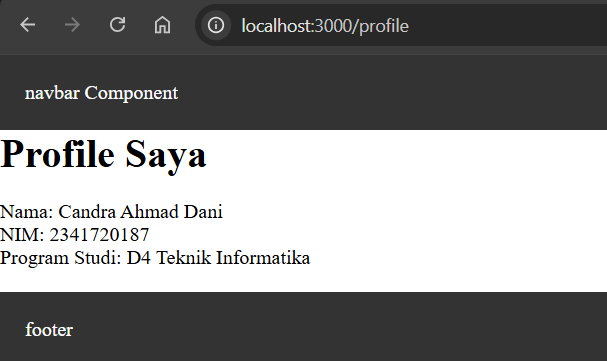

## Pertanyaan Refleksi

1. Apa perbedaan routing berbasis file dan routing manual?

   Routing berbasis file adalah sistem routing yang otomatis dibuat berdasarkan struktur folder dan file di dalam project (seperti di Next.js). Jadi kita tidak perlu menuliskan konfigurasi route secara manual.

2. Mengapa dynamic routing penting dalam aplikasi web?

   Dynamic routing memungkinkan satu template halaman digunakan untuk menampilkan berbagai data yang berbeda berdasarkan parameter pada URL. Hal ini membuat aplikasi lebih fleksibel, efisien, dan mudah dikembangkan, terutama ketika menangani banyak data seperti artikel, produk, atau profil pengguna.

3. Apa keuntungan menggunakan layout global dibanding memanggil komponen satu per satu?

   Layout global memungkinkan elemen yang sama digunakan secara konsisten di banyak halaman tanpa harus ditulis berulang-ulang. Hal ini membuat struktur kode lebih rapi, mengurangi duplikasi, mempermudah perawatan (maintenance), dan menjaga konsistensi tampilan di seluruh aplikasi.
