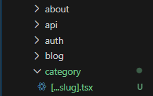
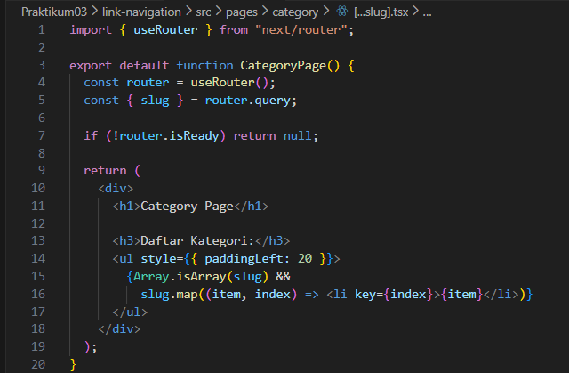
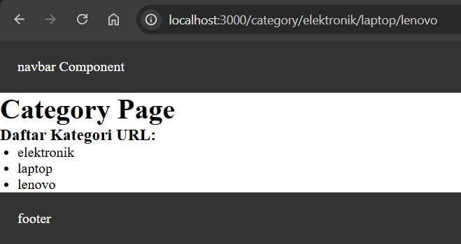
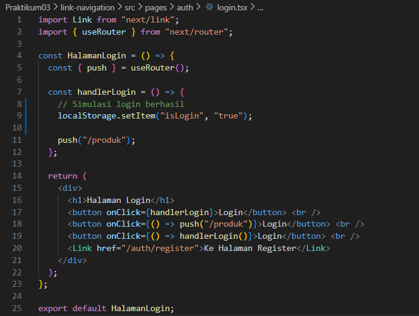
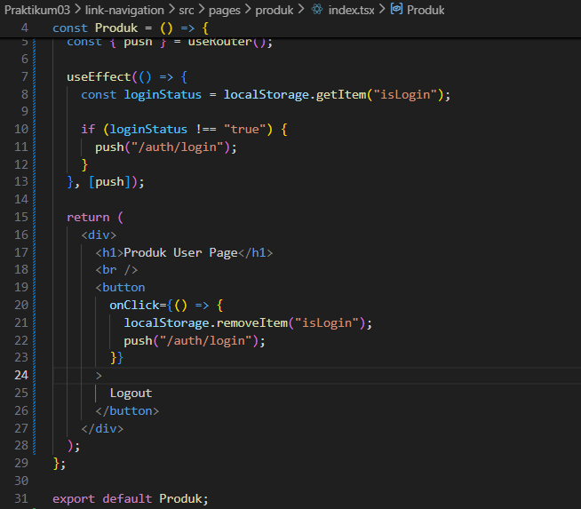
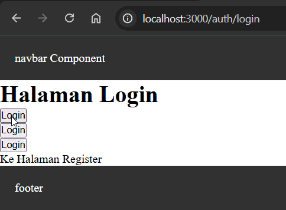
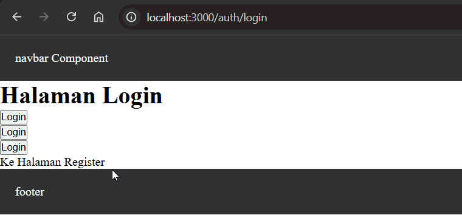
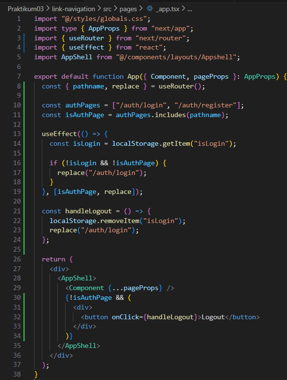
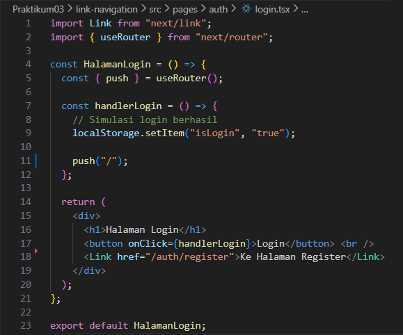
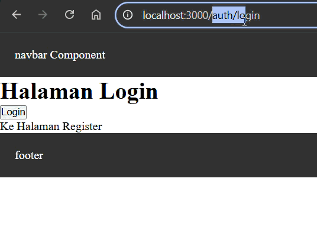

# Jobsheet 3

## Langkah 1 – Menjalankan Project

## Langkah 2 – Membuat Catch-All Route

## Langkah 3 – Pengujian Catch-All Route

## Langkah 4 – Optional Catch-All Route

## Langkah 5 – Validasi Parameter

## Langkah 6 – Membuat Halaman Login & Register

## Langkah 7 – Navigasi Imperatif (router.push)

## Langkah 8 – Simulasi Redirect (Belum Login)

# Tugas Praktikum

## Tugas 1 (Wajib)

- Buat catch-all route:

- /category/[...slug].js

- Tampilkan seluruh parameter URL dalam bentuk list.

## Tugas 2 (Wajib)

- Buat navigasi:
  - Login → Product (imperatif)

    

    

    

  - Login ↔ Register (Link)

    

## Tugas 3 (Pengayaan)

- Terapkan redirect otomatis ke login jika user belum login.

  

  

  

## Pertanyaan Evaluasi

1. Apa perbedaan [id].js dan [...slug].js?

   `[id].js` digunakan untuk menangkap satu parameter URL (berupa string), sedangkan `[...slug].js` digunakan untuk menangkap banyak parameter sekaligus dalam bentuk array (catch-all route).

2. Mengapa slug berbentuk array?

   Karena setiap segmen URL yang dipisahkan tanda / akan dibaca sebagai elemen terpisah, sehingga Next.js menyimpannya dalam bentuk array. 
   
3. Kapan sebaiknya menggunakan Link dan router.push()? 
   
   Link digunakan untuk navigasi biasa melalui klik, sedangkan router.push() digunakan untuk navigasi yang membutuhkan logika tambahan seperti setelah login atau submit form.

4. Mengapa navigasi Next.js tidak me-refresh halaman?

   Karena Next.js menggunakan client-side navigation (SPA), sehingga hanya mengganti komponen tanpa me-reload seluruh halaman.
