# Jobsheet 3

## Langkah 1 – Menjalankan Project

## Langkah 2 – Membuat Catch-All Route

## Langkah 3 – Pengujian Catch-All Route

## Langkah 4 – Optional Catch-All Route

## Langkah 5 – Validasi Parameter

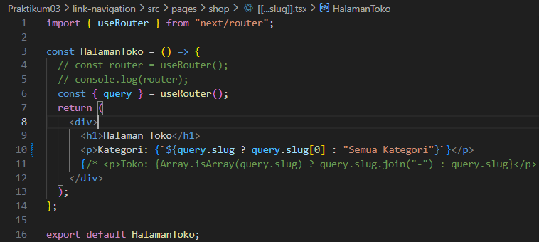

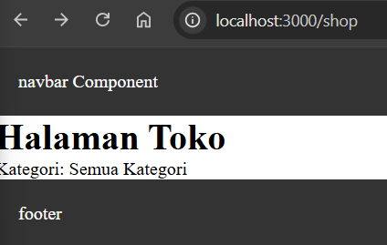

## Langkah 6 – Membuat Halaman Login & Register

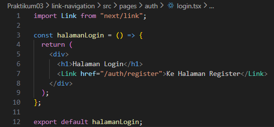

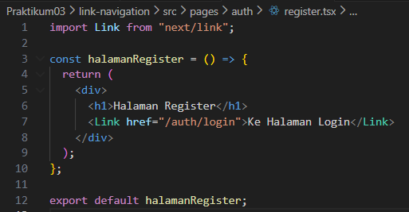

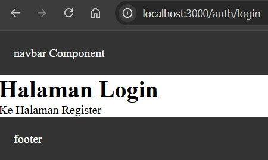

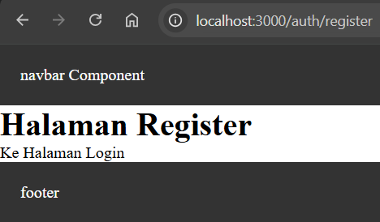

## Langkah 7 – Navigasi Imperatif (router.push)

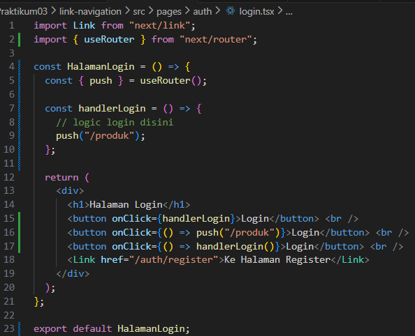

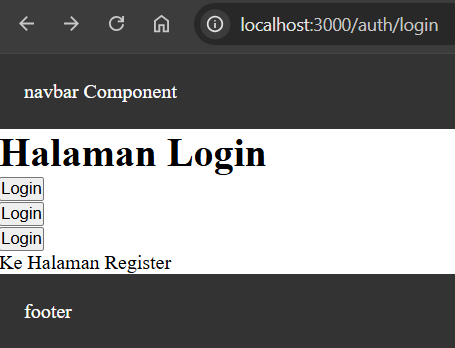

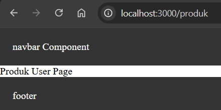

## Langkah 8 – Simulasi Redirect (Belum Login)

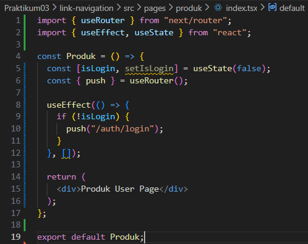

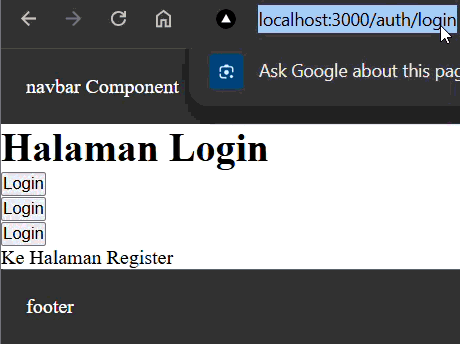

