# Jobsheet 3

## Langkah 1 – Menjalankan Project

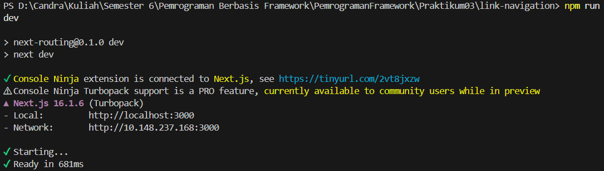

## Langkah 2 – Membuat Catch-All Route

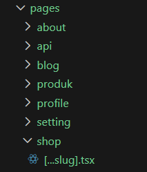

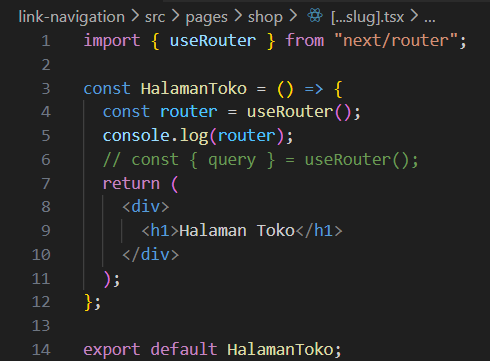

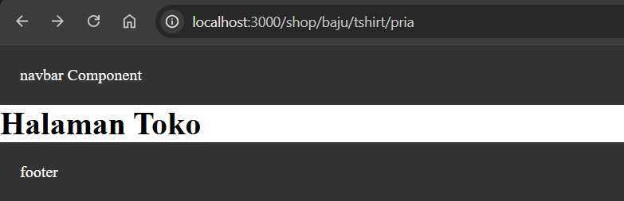

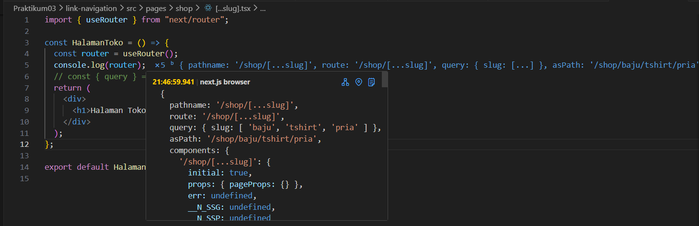

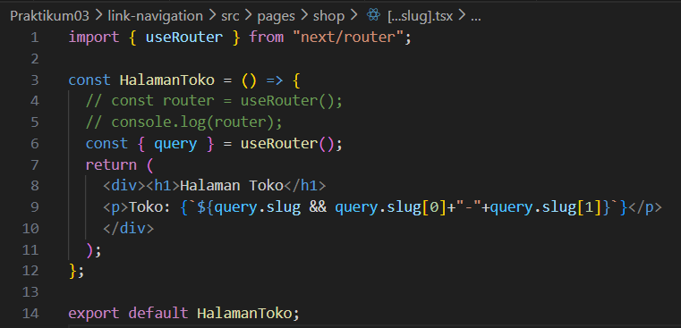

## Langkah 3 – Pengujian Catch-All Route

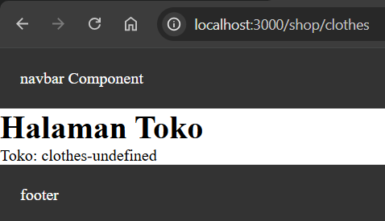

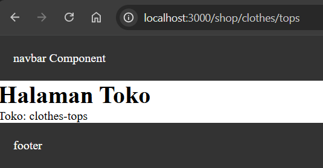

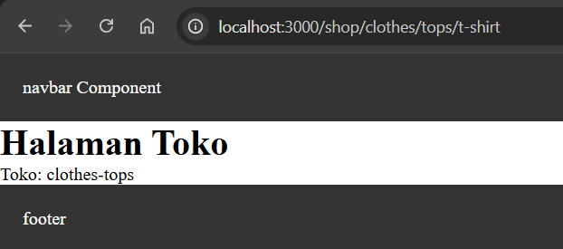

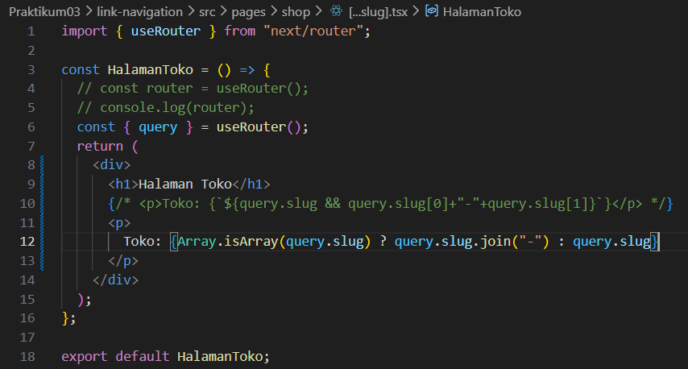

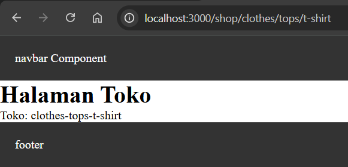

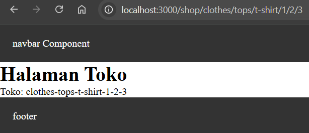

## Langkah 4 – Optional Catch-All Route 

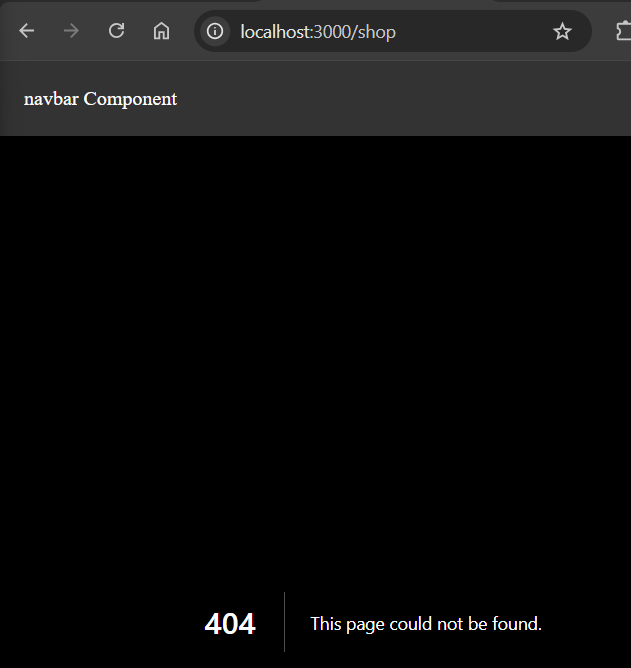

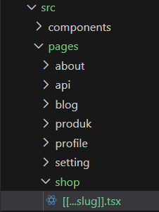

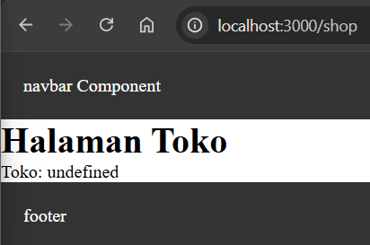

