# Jobsheet 4

## 1. Global CSS

## 2. CSS Module (Local Scope)

## 3. Styling untuk Pages (CSS Module)

## 4. Conditional Rendering Navbar (Tanpa Navbar di Login)

## 5. Refactoring Struktur Project (Best Practice)

## 6. Inline Styling (CSS-in-JS)

## 7. Kombinasi Global CSS + CSS Module

## 8. SCSS (SASS)

## 9. Tailwind CSS

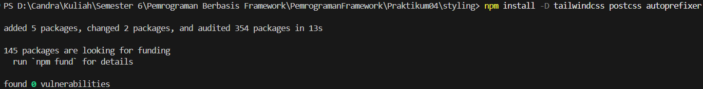

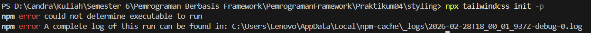

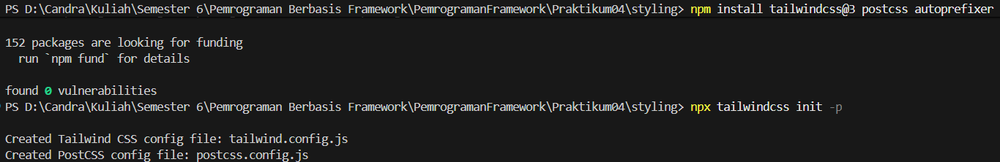

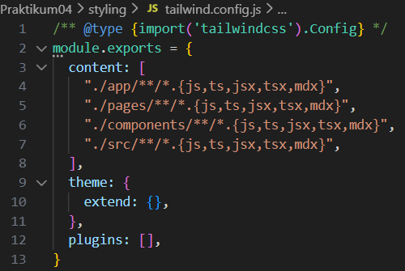

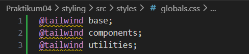

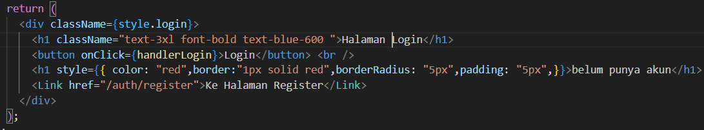

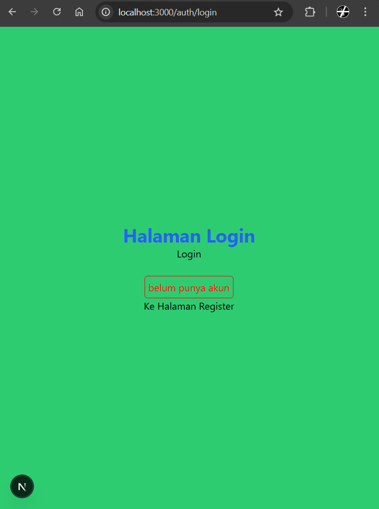

# Tugas Praktikum

## Tugas 1

- Buat halaman Register
- Gunakan CSS Module

  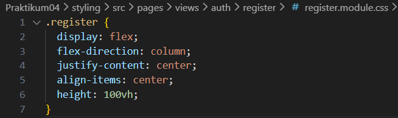

  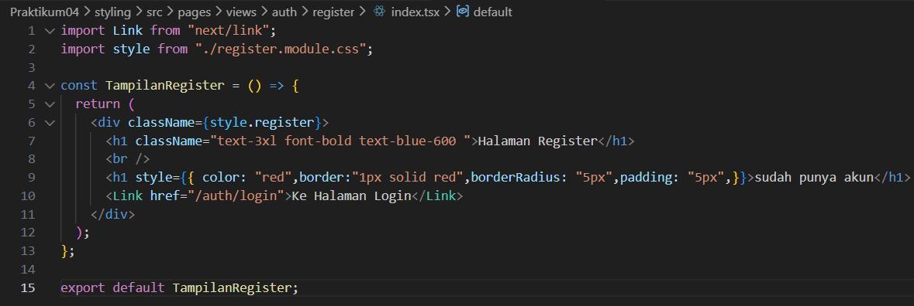

  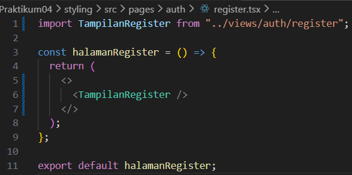

  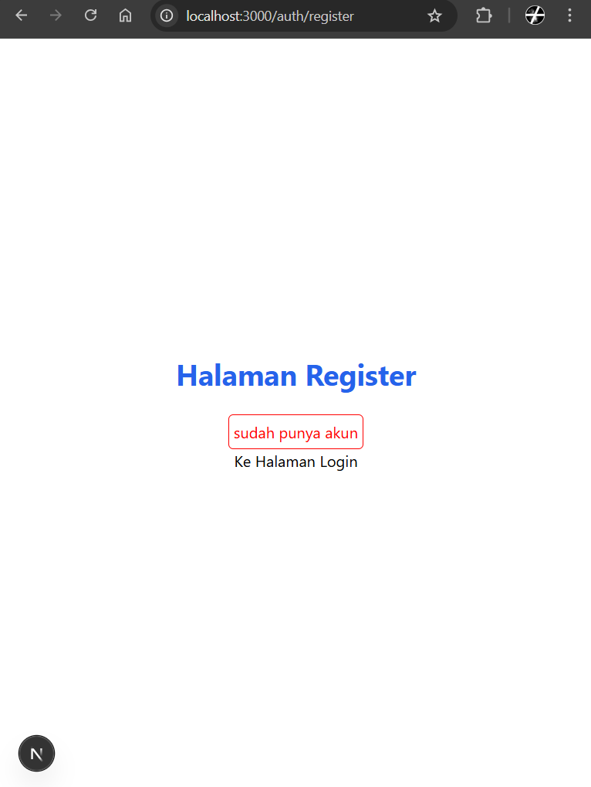

## Tugas 2

- Refactor halaman Produk ke folder views
- Pisahkan Hero Section dan Main Section

  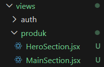

  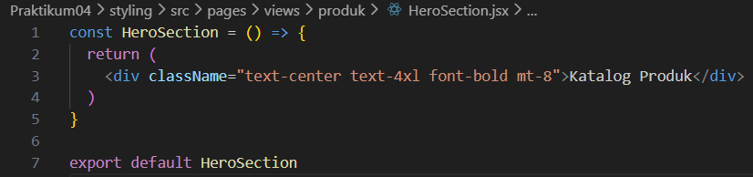

  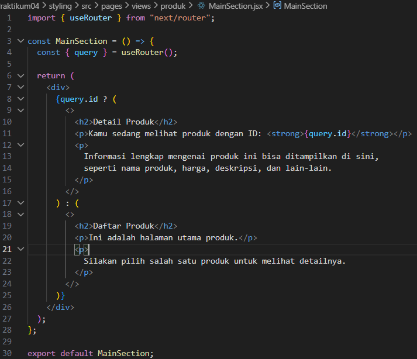

  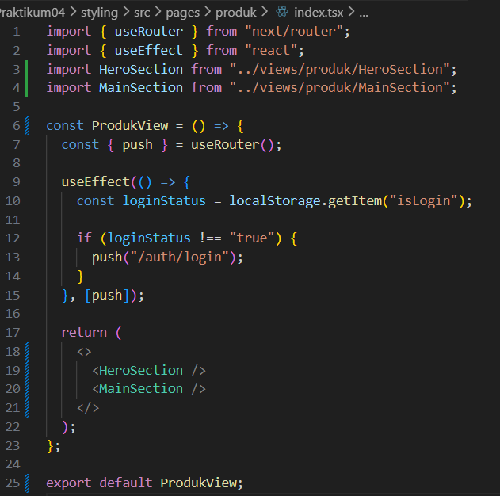

  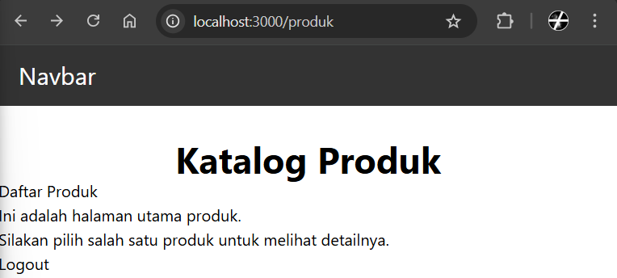

## Tugas 3

- Terapkan Tailwind CSS
- Gunakan minimal 5 utility class

  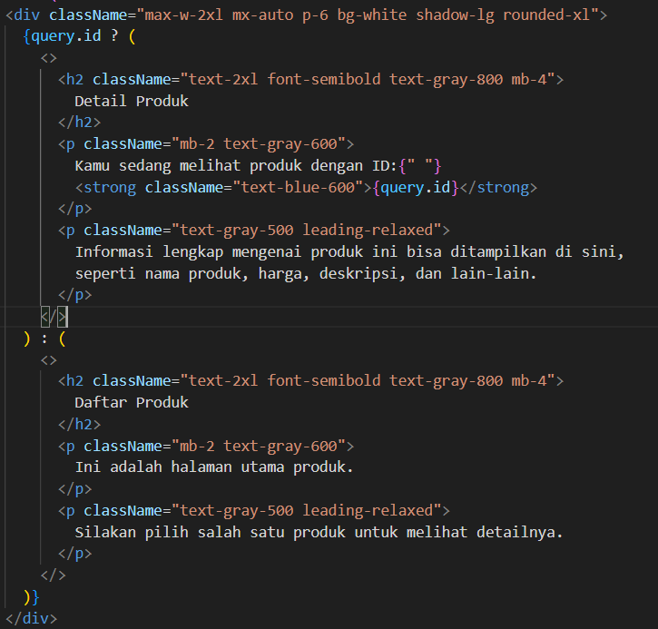

  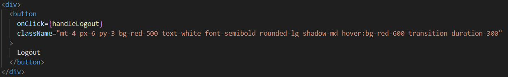

  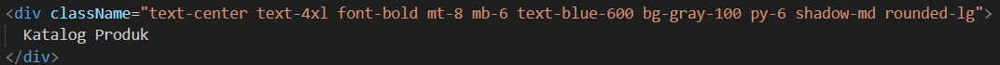

  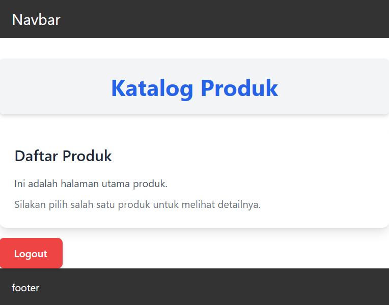

## Pertanyaan Refleksi

1. Kapan sebaiknya menggunakan CSS Module dibanding Global CSS?

   CSS Module sebaiknya dipakai saat kita ingin style hanya berlaku untuk satu komponen saja dan tidak mengganggu komponen lain. Ini cocok digunakan di project seperti Next.js atau React supaya tidak terjadi bentrok antar class CSS.

2. Apa kelemahan inline styling?

   Inline styling punya kelemahan karena tidak bisa pakai fitur seperti :hover, media query, atau selector yang lebih kompleks. Selain itu, kodenya jadi kurang rapi dan sulit digunakan ulang di bagian lain.

3. Mengapa SCSS cocok untuk project skala besar?

   SCSS cocok untuk project besar karena bisa memakai variable, nesting, dan fitur lain yang membuat CSS lebih terstruktur. Jadi lebih mudah dibaca dan dikelola saat project semakin banyak file.

4. Apa keunggulan Tailwind dibanding CSS tradisional?

   Tailwind CSS lebih praktis karena kita bisa langsung memberi style lewat class tanpa membuat file CSS baru. Ini membuat proses membuat tampilan jadi lebih cepat dan konsisten dibanding CSS biasa.
