# Jobsheet 4

## 1. Global CSS

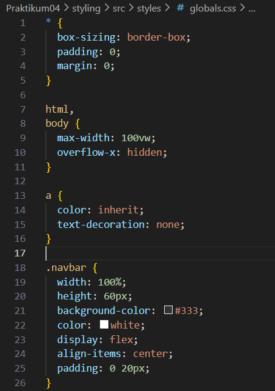

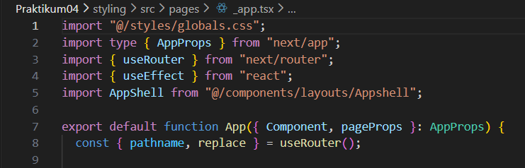

## 2. CSS Module (Local Scope)

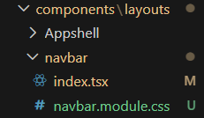

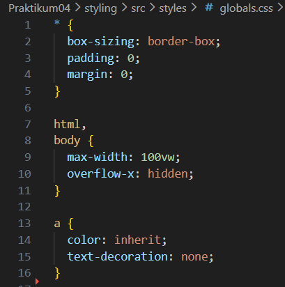

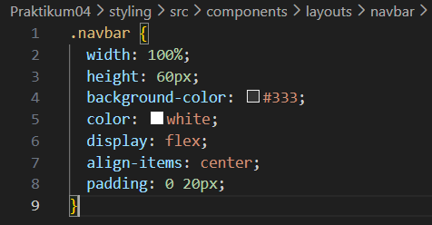

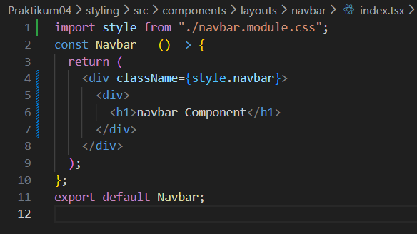

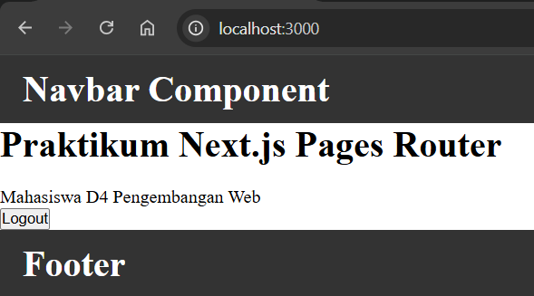

## 3. Styling untuk Pages (CSS Module)

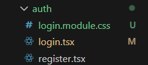

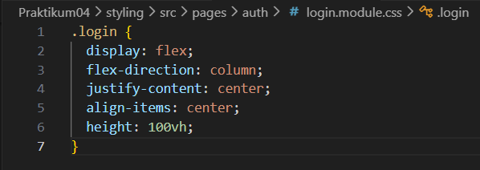

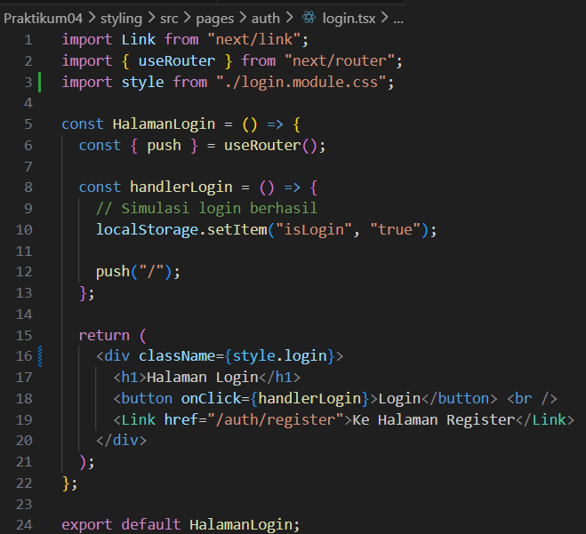

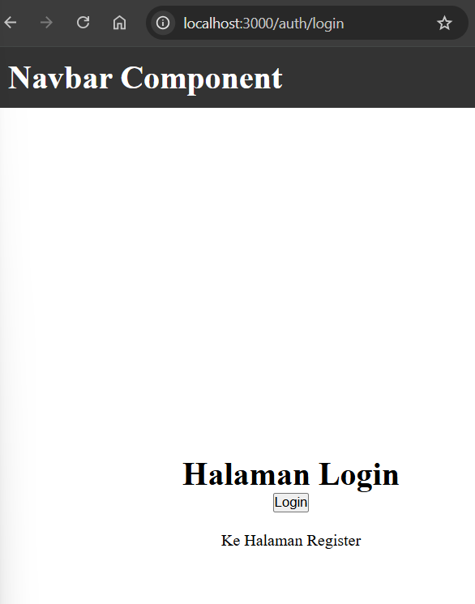

## 4. Conditional Rendering Navbar (Tanpa Navbar di Login)

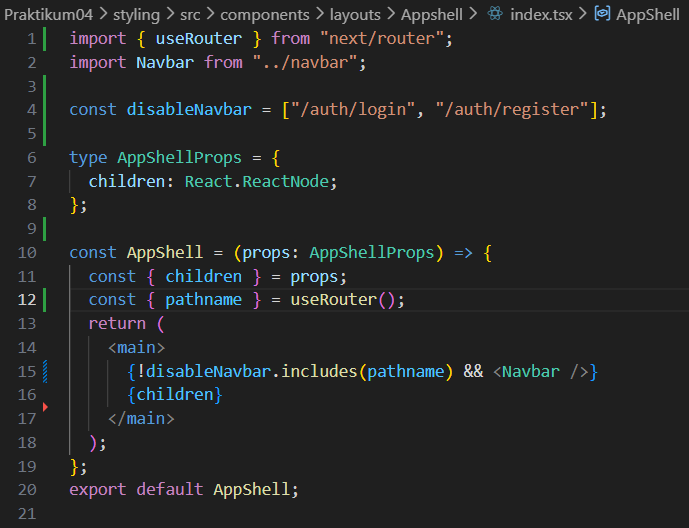

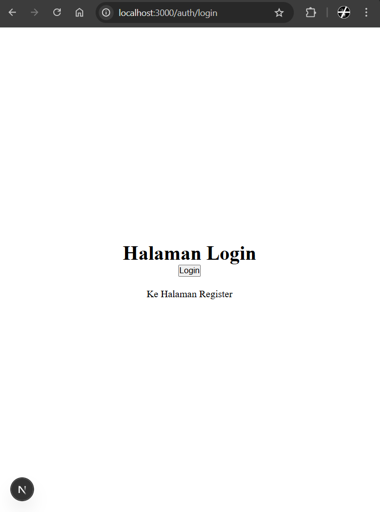

## 5. Refactoring Struktur Project (Best Practice)

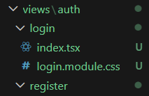

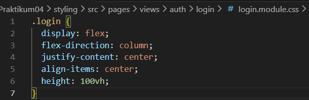

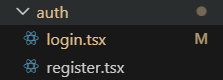

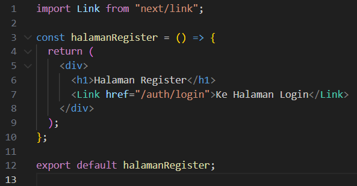

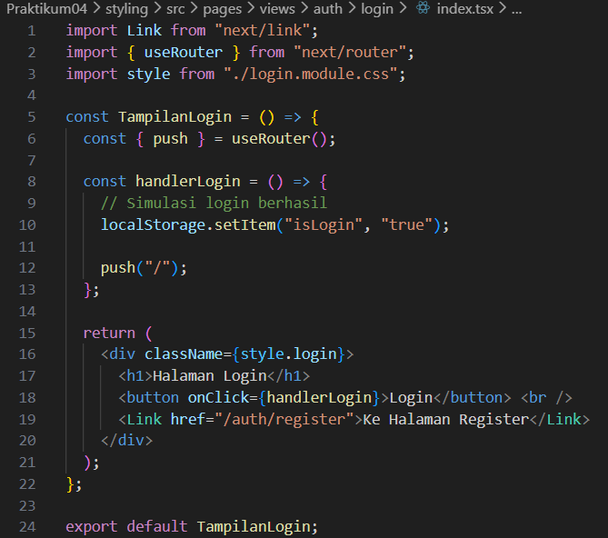

## 6. Inline Styling (CSS-in-JS)

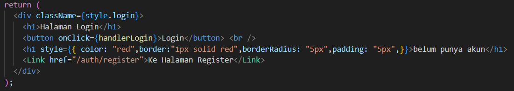

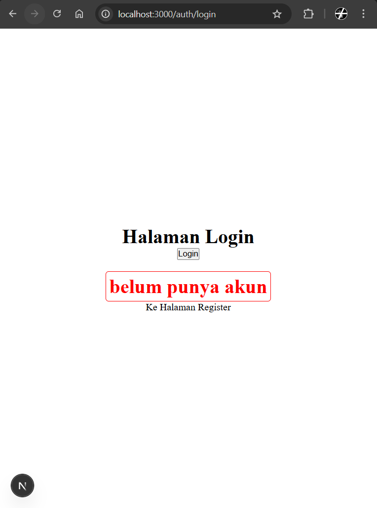

## 7. Kombinasi Global CSS + CSS Module

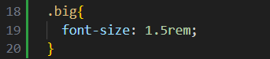

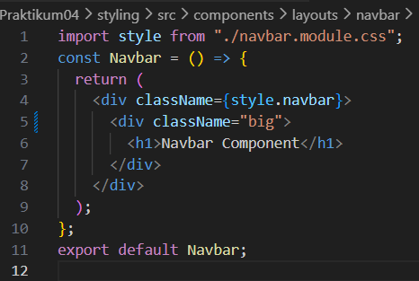

## 8. SCSS (SASS)

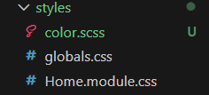

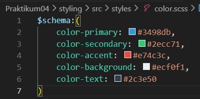

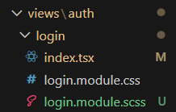

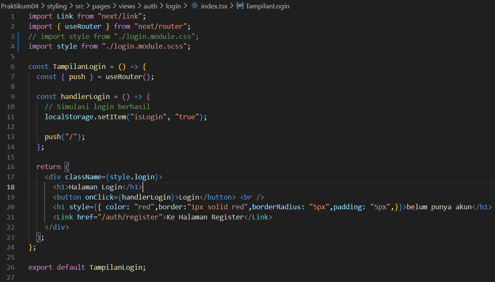

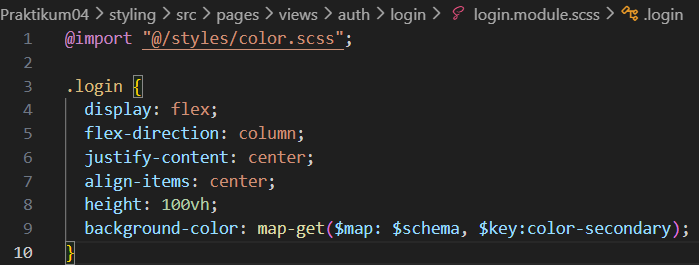

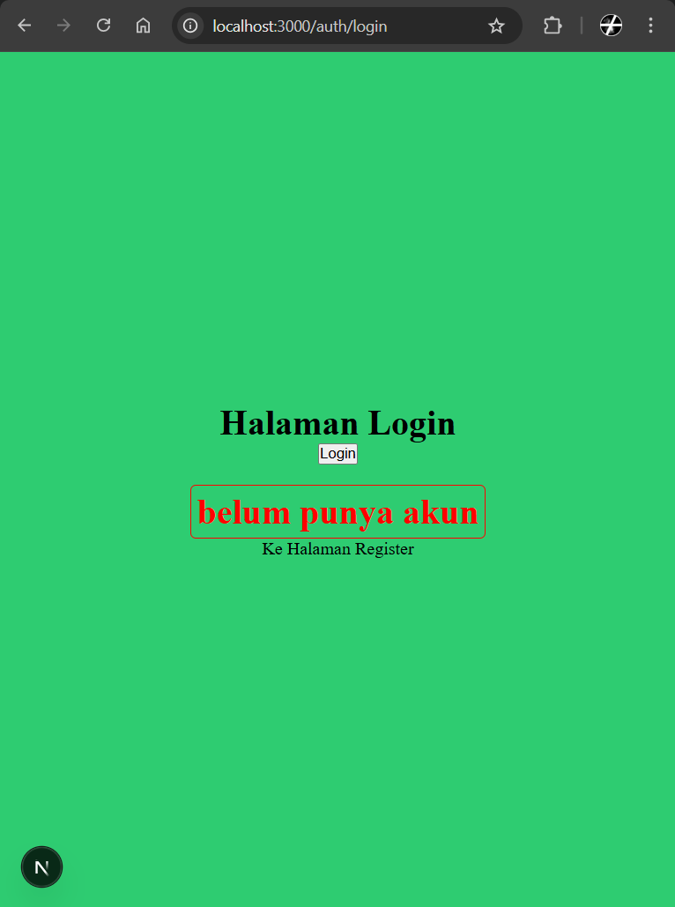