# Jobsheet 5

## 1 Menjalankan Project

## 2. Membuat Custom Document

## 3. Pengaturan Title per Halaman

## 4. Membuat Custom Error Page (404)

## 5. Styling Halaman 404

## 6. Menampilkan Gambar dari Folder Public

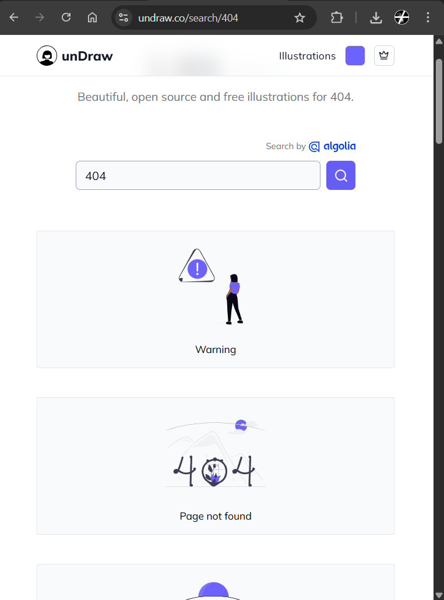

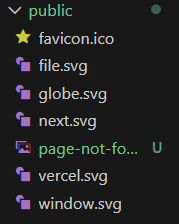

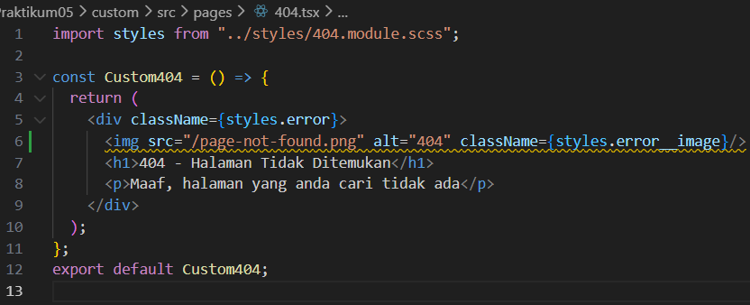

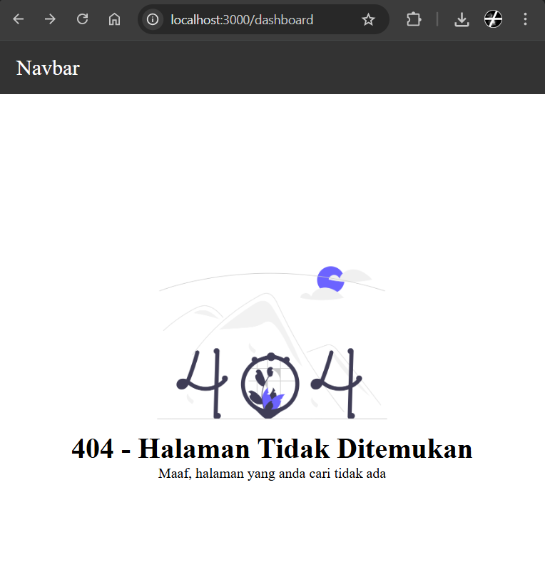

# Tugas Praktikum

## Tugas 1 (Wajib)

Tambahkan:

- Judul halaman
- Deskripsi singkat
- Gambar ilustrasi

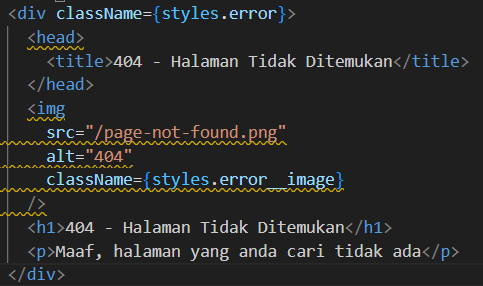

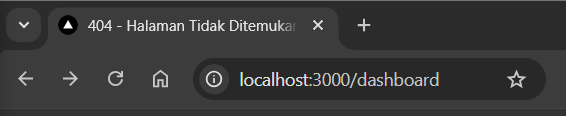

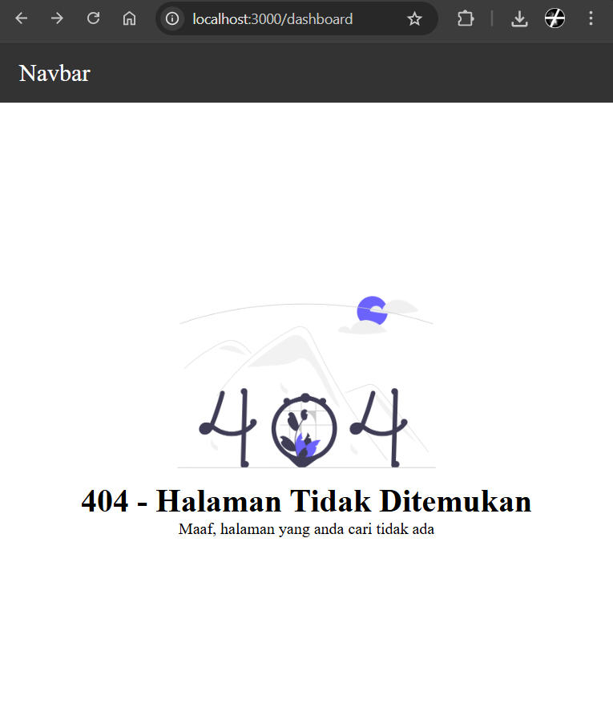

## Tugas 2 (Wajib)

- Custom warna, font, dan layout halaman 404
- Navbar tidak tampil di halaman 404

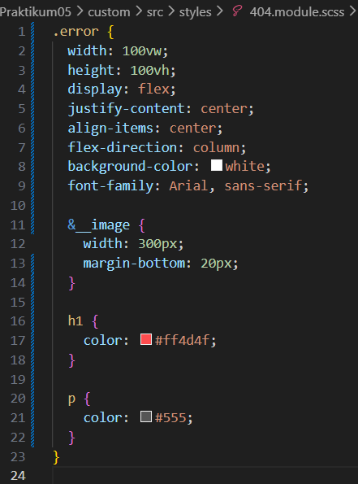

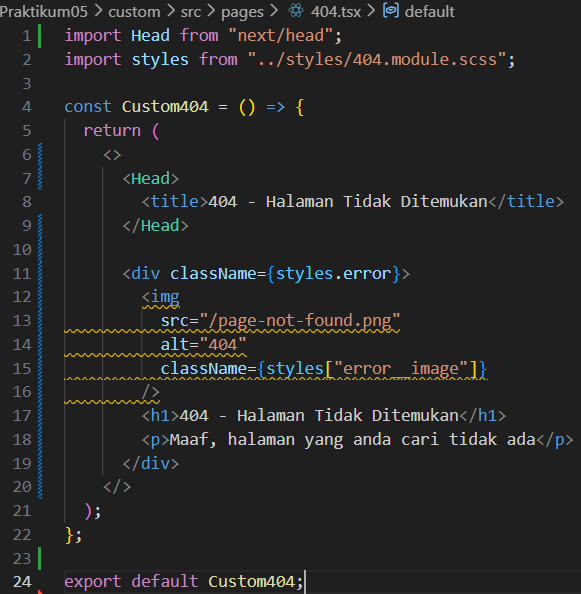

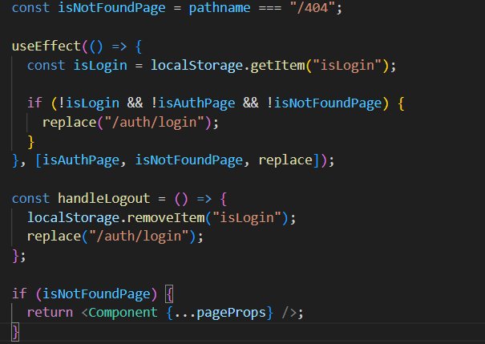

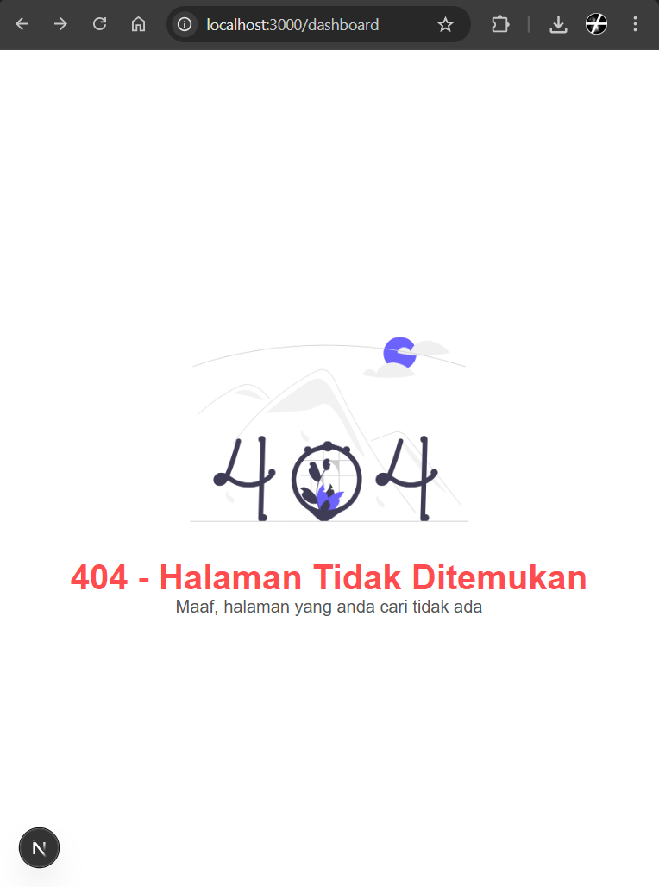

## Tugas 3 (Pengayaan)

- Tambahkan tombol:
  - “Kembali ke Home”
- Gunakan navigasi Next.js (Link)

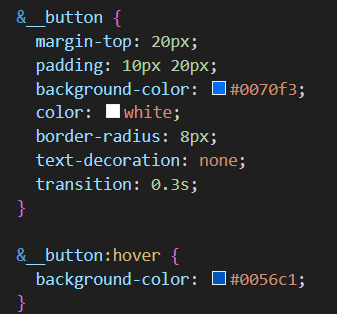

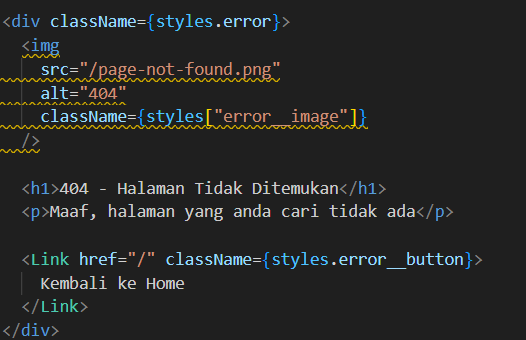

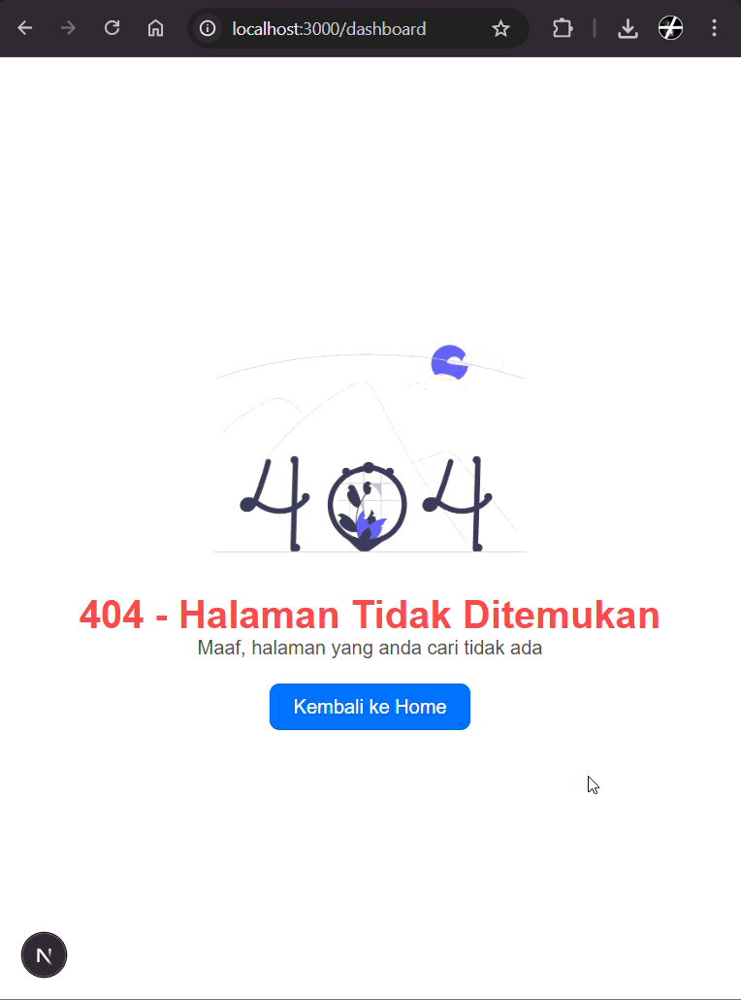

