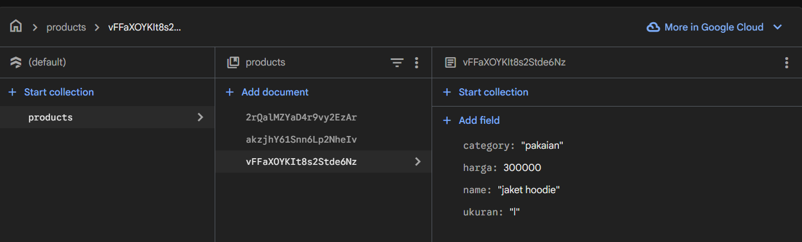
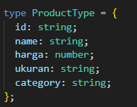
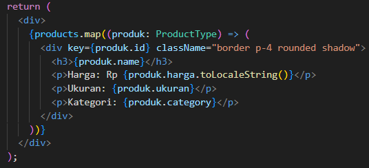
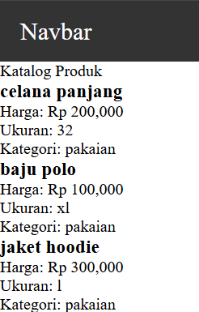
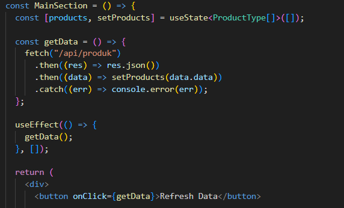
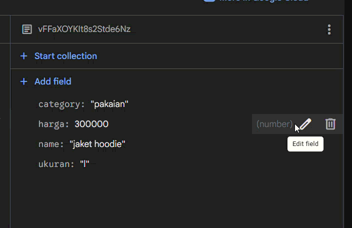
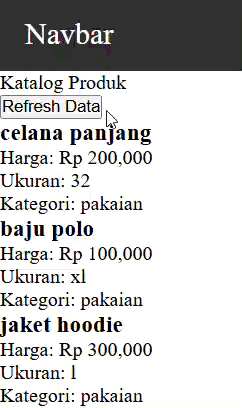

# Jobsheet 6

## 1. Menjalankan Project

## 2. Membuat API Produk

## 3. Fetch Data API di Frontend

## 4. Setup Firebase

## 5. Install Firebase

## 6. Konfigurasi Environment Variable

## 7. Konfigurasi Firebase

## 8. Ambil Data dari Firestore

## 9. API Mengambil Data Firebase

# Tugas Praktikum

## Tugas 1 (Wajib)

- Tambahkan minimal 3 data produk di Firestore

- Pastikan data tampil di halaman produk

## Tugas 2 (Wajib)

- Tambahkan field baru:
  - category

- Tampilkan category di frontend

## Tugas 3 (Pengayaan)

- Tambahkan tombol Refresh Data

- Gunakan fetch ulang tanpa reload halaman

## Pertanyaan Evaluasi

1. Apa fungsi API Routes pada Next.js?

   API Routes digunakan untuk membuat backend langsung di dalam project Next.js. Dengan API Routes, kita bisa membuat endpoint seperti /api/produk untuk mengambil, menambah, atau mengubah data tanpa perlu membuat server terpisah (misalnya Express). Jadi frontend dan backend bisa dalam satu project.

2. Mengapa .env.local tidak boleh di-push ke repository?

   Karena file .env.local biasanya berisi data sensitif seperti API key, password, atau konfigurasi database. Jika di-push ke repository (terutama public), orang lain bisa melihat dan menyalahgunakan data tersebut. Oleh karena itu biasanya file ini dimasukkan ke .gitignore.

3. Apa perbedaan data statis dan data dinamis?

   Data statis adalah data yang tidak berubah dan sudah ditentukan sebelumnya, misalnya teks tetap di halaman atau data hardcode. Data dinamis adalah data yang bisa berubah-ubah, biasanya diambil dari database atau API, seperti daftar produk dari Firestore.

4. Mengapa Next.js disebut framework fullstack?

   Karena Next.js bisa menangani frontend (React, tampilan UI) dan backend (API Routes, server-side rendering) dalam satu framework. Jadi tidak perlu membuat backend dan frontend secara terpisah.
