# Jobsheet 6

## 1. Menjalankan Project

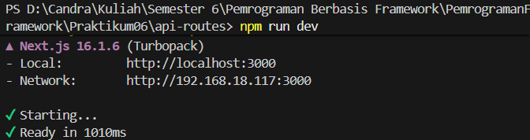

## 2. Membuat API Produk

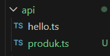

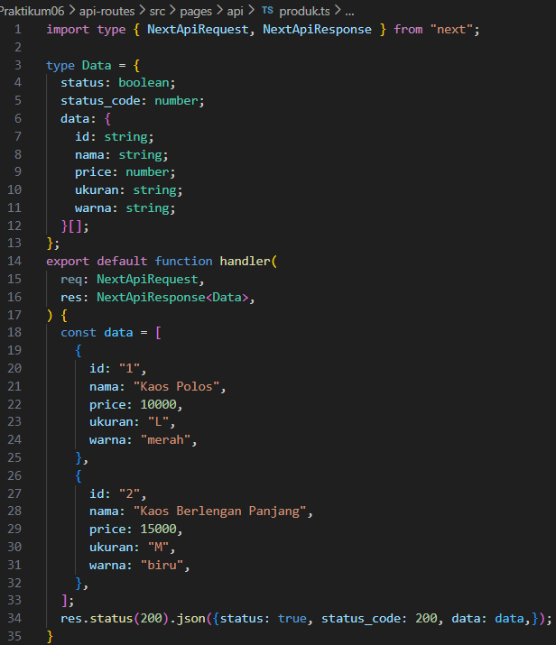

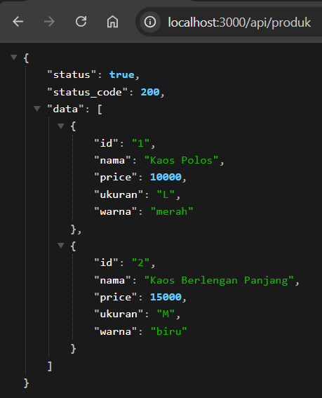

## 3. Fetch Data API di Frontend

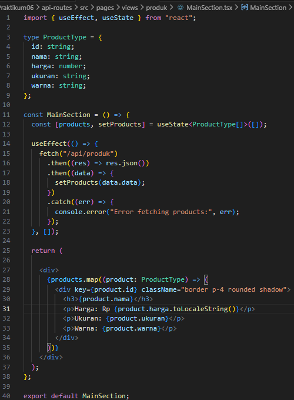

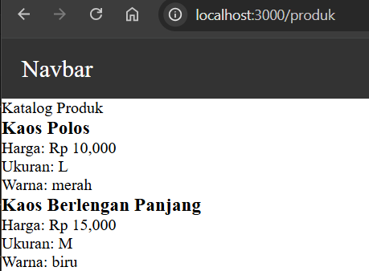

## 4. Setup Firebase

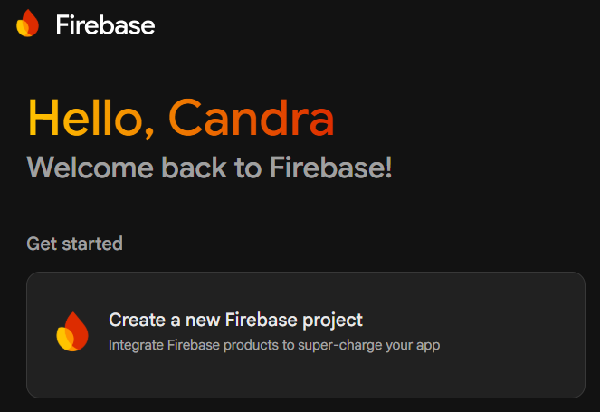

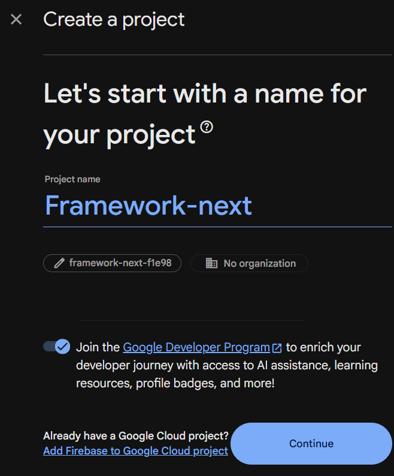

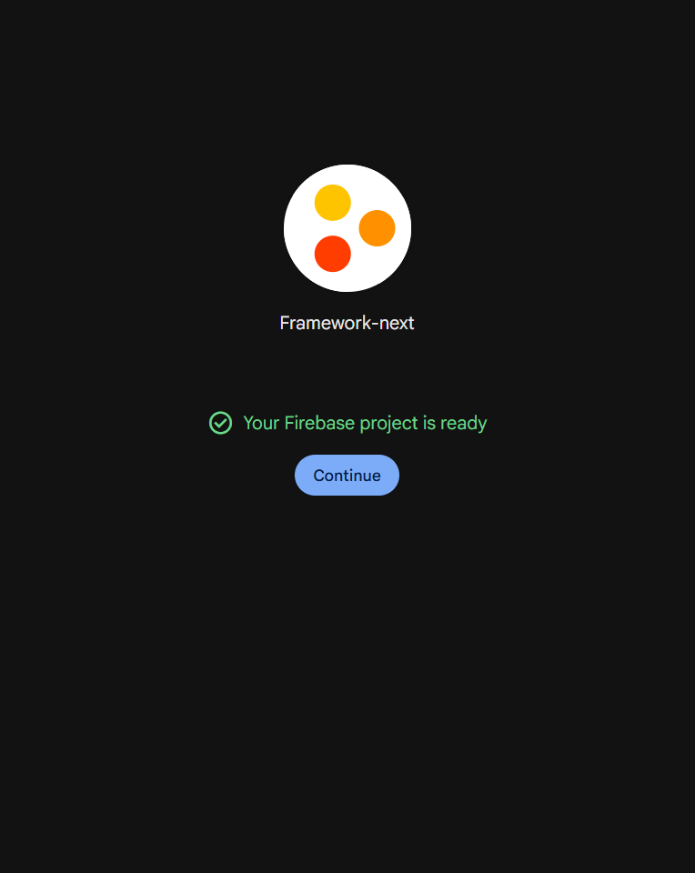

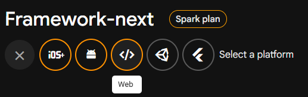

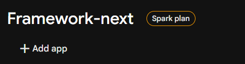

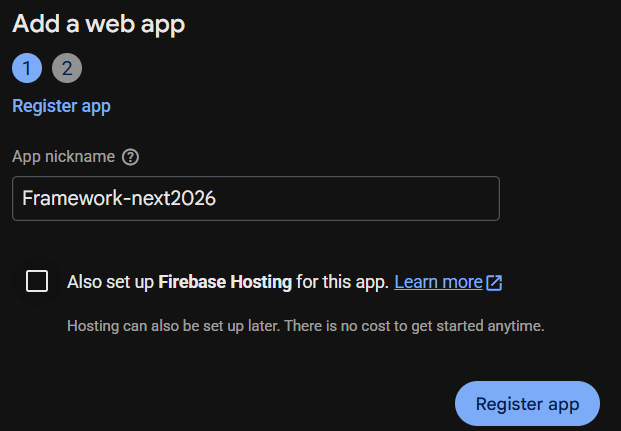

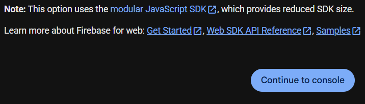

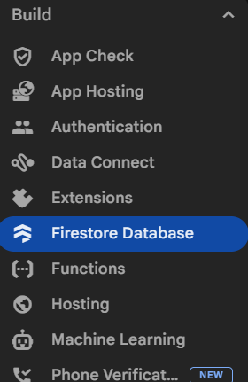

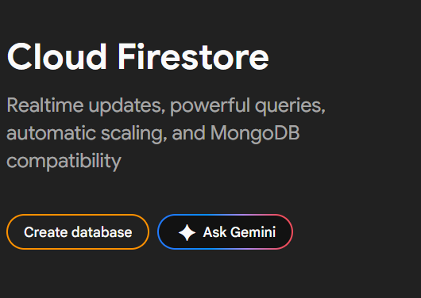

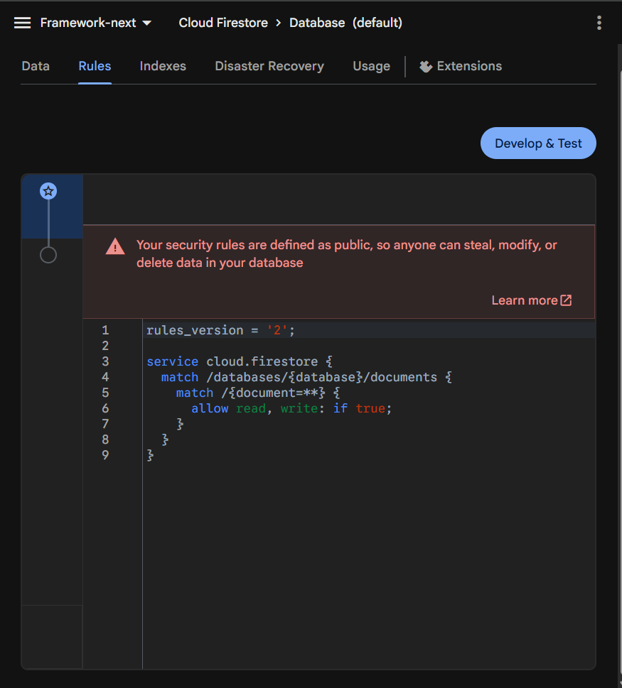

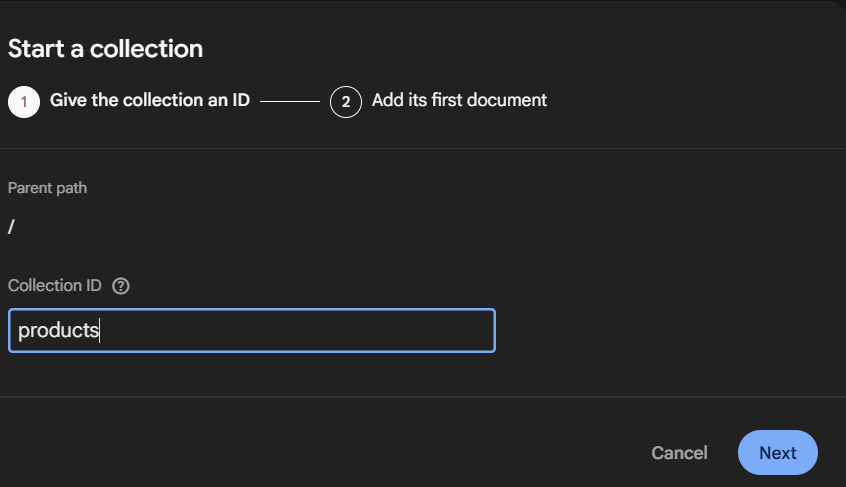

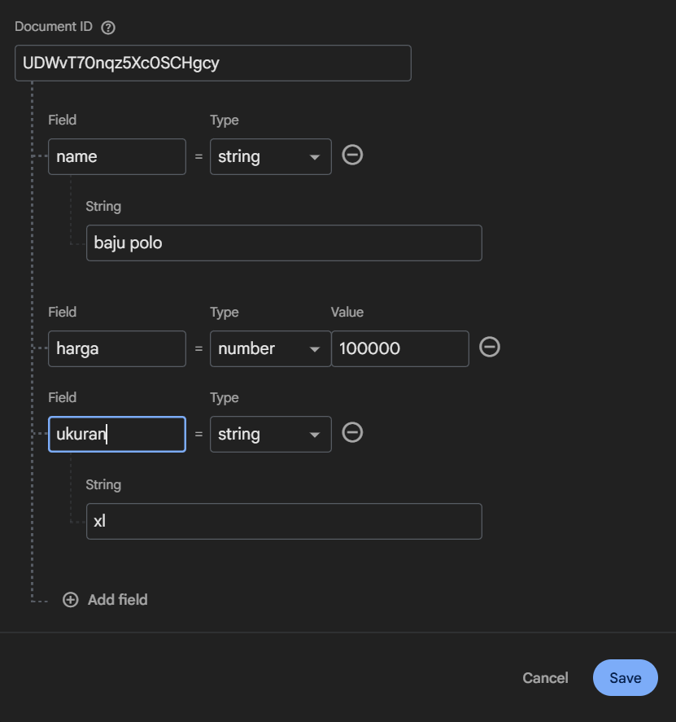

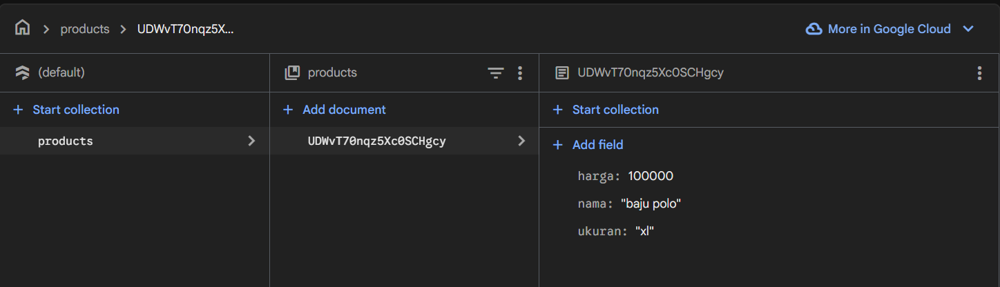

## 5. Install Firebase

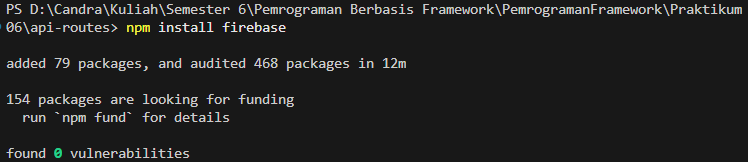

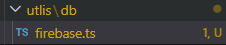

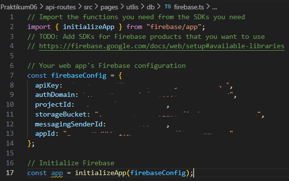

## 6. Konfigurasi Environment Variable

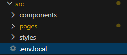

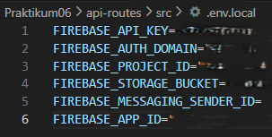