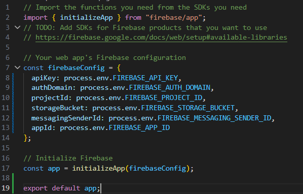
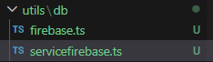
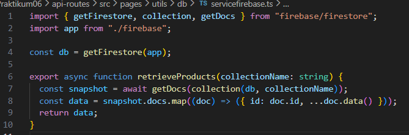
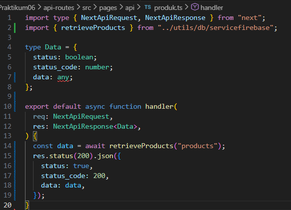
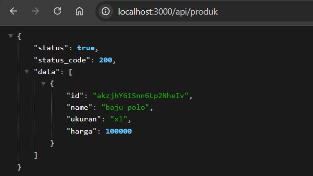
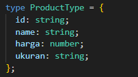
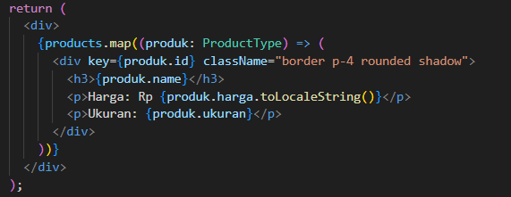
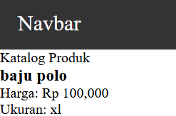
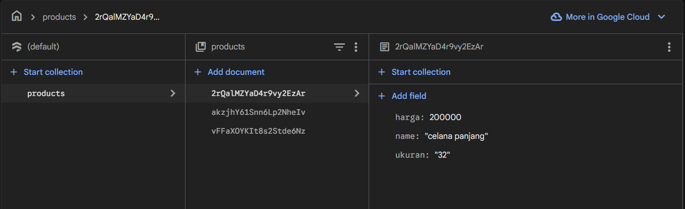
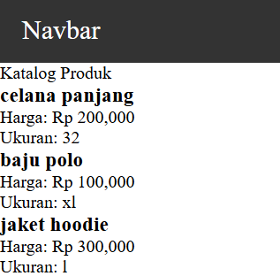

# Jobsheet 6

## 1. Menjalankan Project

## 2. Membuat API Produk

## 3. Fetch Data API di Frontend

## 4. Setup Firebase

## 5. Install Firebase

## 6. Konfigurasi Environment Variable

## 7. Konfigurasi Firebase

## 8. Ambil Data dari Firestore

## 9. API Mengambil Data Firebase

# Tugas Praktikum

## Tugas 1 (Wajib)

- Tambahkan minimal 3 data produk di Firestore

- Pastikan data tampil di halaman produk

