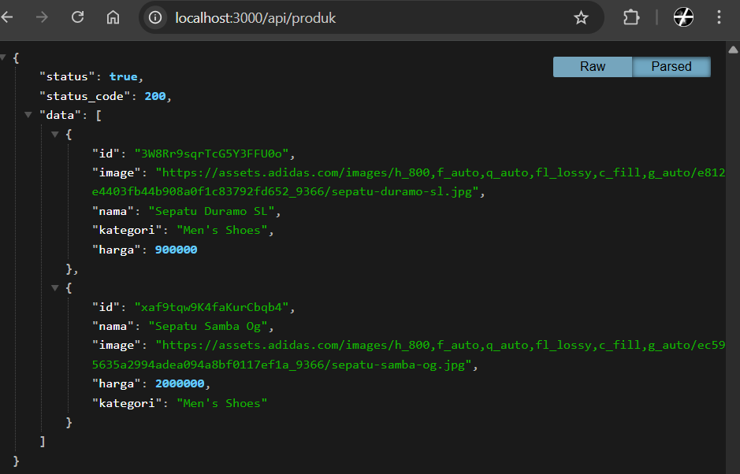

# Jobsheet 7

## 1. Setup Data Produk

1. Siapkan project Next.js.
2. Buat endpoint API /api/products.
3. Pastikan data memiliki:
   - id
   - name
   - category
   - price
   - image
4. jalankan browser http://localhost:3000/api/produk

