# Jobsheet 7

## 1. Setup Data Produk

1. Siapkan project Next.js.
2. Buat endpoint API /api/products.
3. Pastikan data memiliki:
   - id
   - name
   - category
   - price
   - image
4. jalankan browser http://localhost:3000/api/produk

   

## 2. Implementasi CSR dengan useEffect

1. Membuat file index.tsx pada folder views/products

   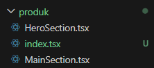

2. Modifikasi index.tsx

   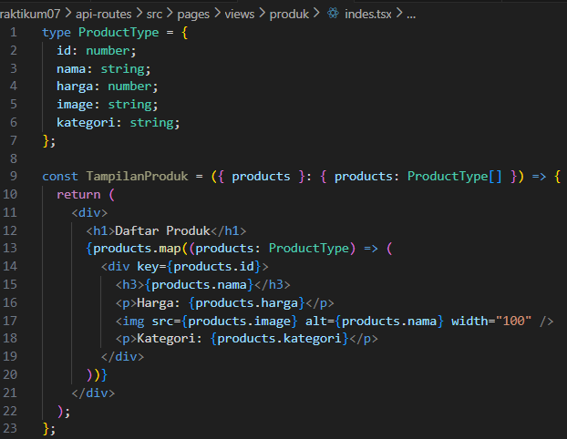

3. Buka file index.tsx pada pages/produk/

   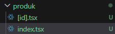

4. Modifikasi index.tsx pada pages/produk/

   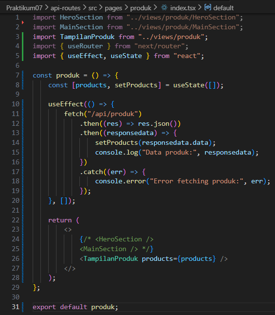

5. Jalankan browser http://localhost:3000/produk

   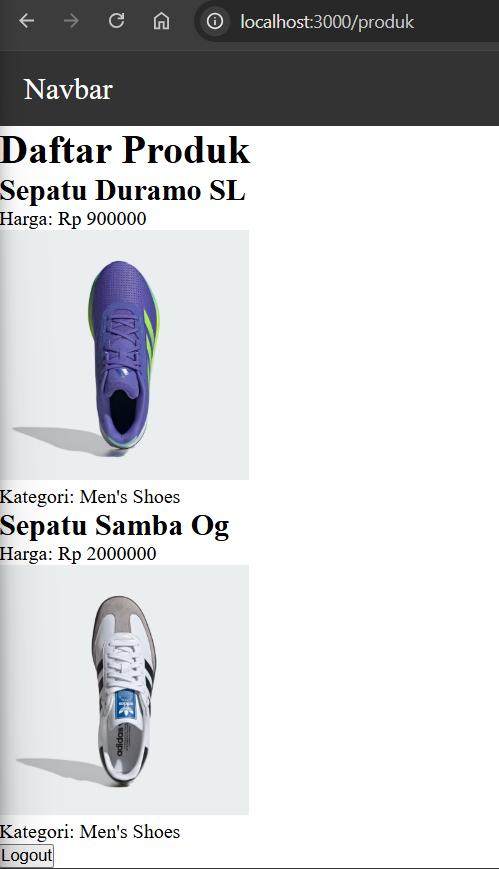

6. Pada folder produk buat file produk.modules.scss

   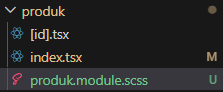

7. Modifikasi produk.modules.scss

   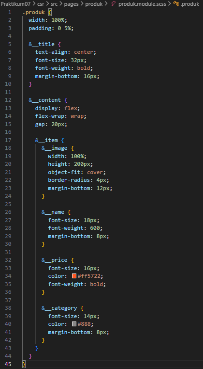

8. Modifikasi Pada file index.tsx pada folder pages/views/product

   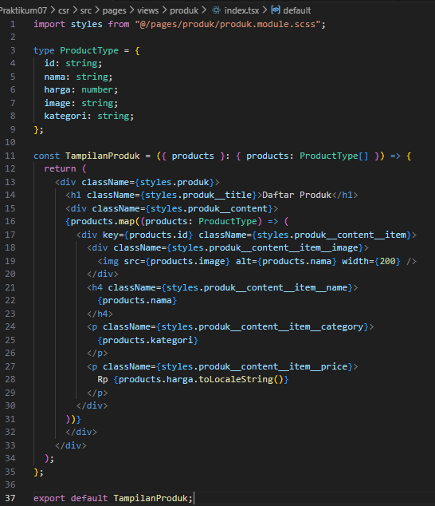

9. Jalankan Browser

   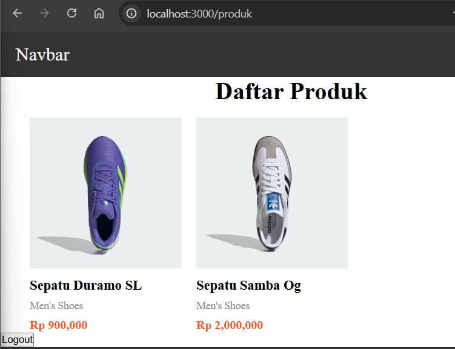

## 3. Implementasi Skeleton Loading

1. Modfikasi file index.tsx pada folder views/product/index.tsx

   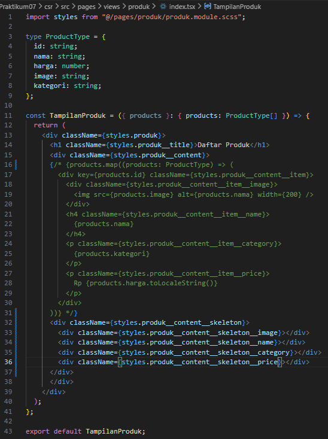

2. Modifikasi file product.module.scss

   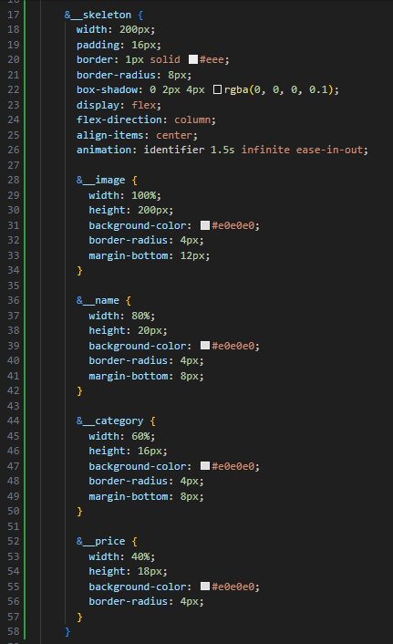

   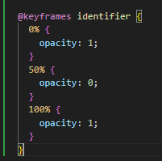

3. Jalankan browser maka akan muncul skeleton yang terdapat animasi berkedip

   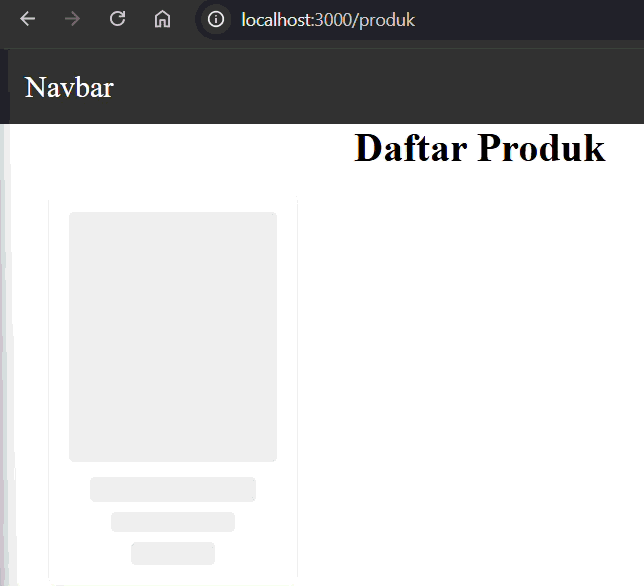

4. Modifikasi pada index.tsx pada folder views/product/index.tsx

   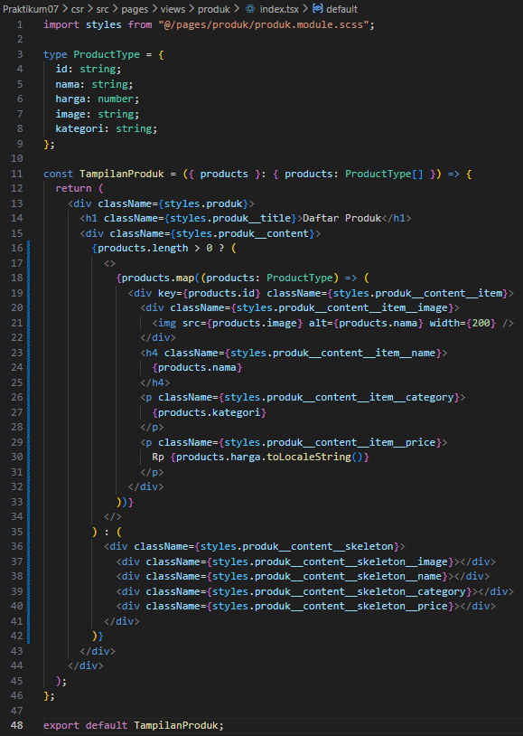

5. Jalankan browser
   - Jika dijalankan akan muncul skeletonnya terlebih dahulu setelah itu muncul gambar dan informasinya

   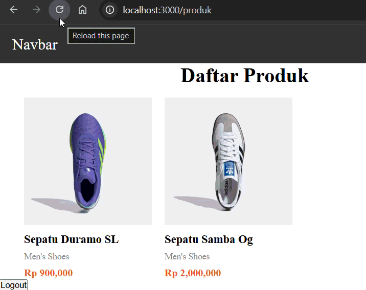

## 4. Implementasi SWR

1. Install SWR

   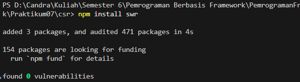

2. Buka dan modifkasi file index.tsx pada folder pages/product/

   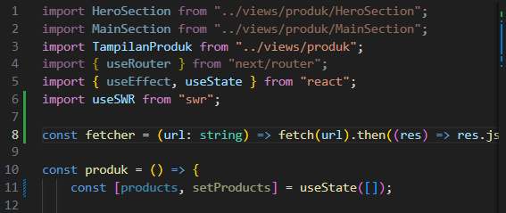

   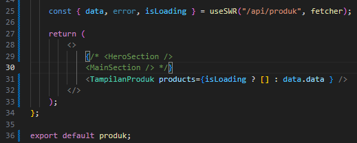

3. Agar terlihat lebih rapi

- Buat folder swr pada utils dan tambahkan file dengan nama fetcher.js

  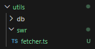

- Modifikasi file fetcher.ts

  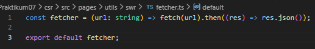

- Modifikasi file index.tsx pada folder pages/produk

   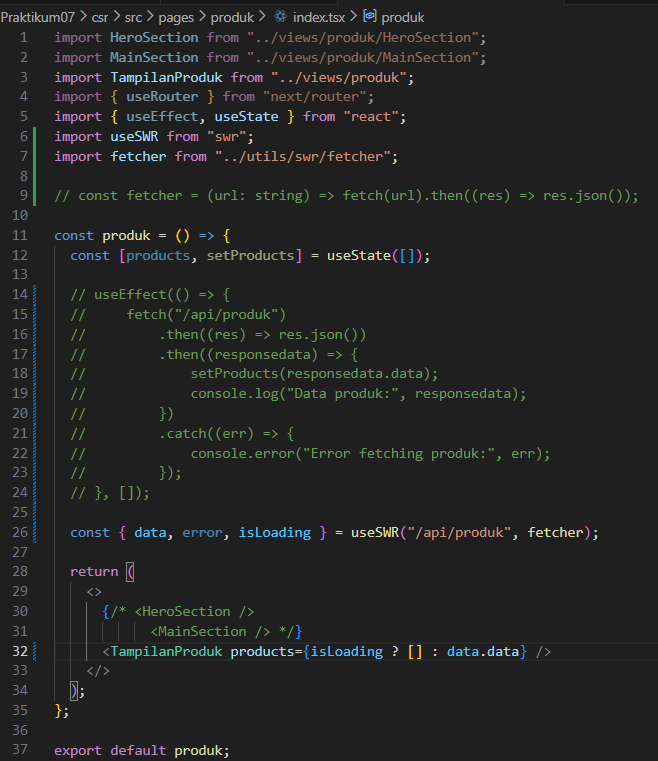

### Hasil & Perbandingan

   

useEffect manual membutuhkan kode lebih panjang karena state dan loading harus diatur sendiri. Data hanya diambil saat komponen mount dan tidak memiliki cache, sehingga selalu fetch ulang kecuali direfresh manual.

SWR lebih ringkas karena cukup satu hook, memiliki cache sehingga data tampil instan, serta otomatis melakukan revalidasi dan menangani loading.

