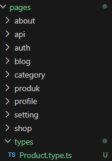
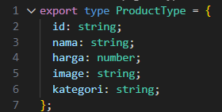
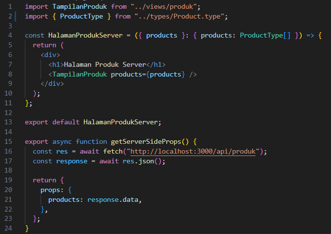
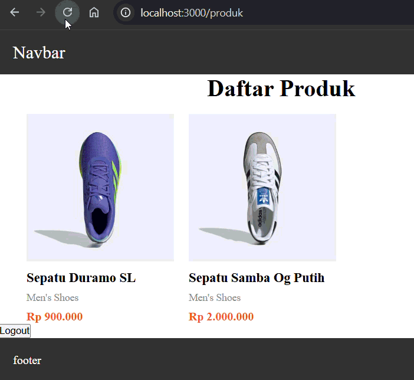
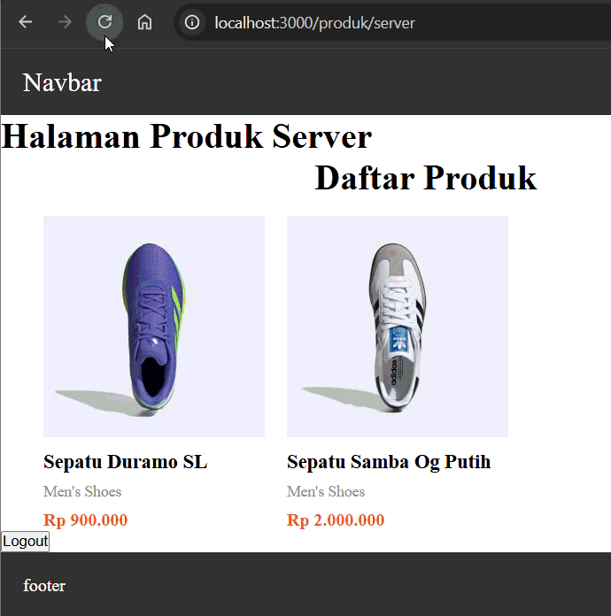
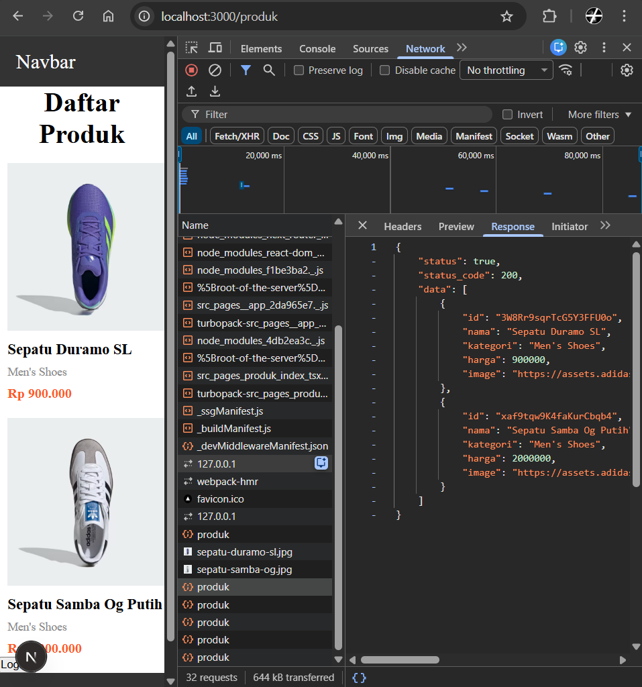
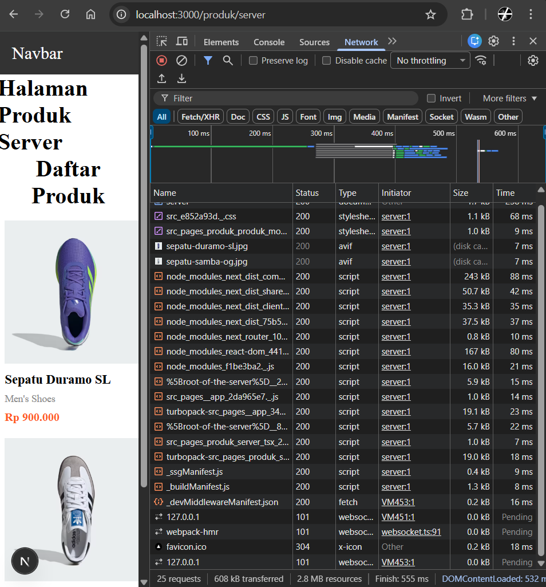

# Jobsheet 8

## 1. Setup Halaman SSR

1. Buat file baru pada pages/products/server.tsx

   

2. Modifikasi file server.tsx :

   

3. Jalankan browser : http://localhost:3000/produk/server

   

## 2. Implementasi getServerSideProps pada server.tsx

1. Tambah getServerSideProps pada server.tsx

   

2. Jalankan browser `http://localhost:3000/produk/server`

   

## 3. Refactor Type ( produk type )

1. Buat folder types pada folder pages dan buat file Product.type.ts

   

2. Modifikasi Product.type.ts

   

3. Setelah membuat file Product.type.ts maka modifikasi pada file server.tsx menjadi

   

## 4. Uji Perbedaan SSR vs CSR

### Uji 1 – Skeleton

- CSR: Skeleton muncul saat refresh

  

- SSR: Skeleton tidak muncul saat Refresh

  

### Uji 2 – Network Tab

1. Buka DevTools → Network → XHR
2. Refresh halaman CSR → Request API terlihat

   

3. Refresh halaman SSR → Request API tidak terlihat

   

### Uji 3 – Response HTML

- CSR: HTML awal kosong (berisi skeleton)

  

- SSR: HTML sudah berisi data produk lengkap

  

## E. Studi Analisis

Jawab pertanyaan berikut:

1. Mengapa SSR lebih baik untuk SEO?

   SSR (Server Side Rendering) lebih baik untuk SEO karena halaman sudah dirender menjadi HTML lengkap di server sebelum dikirim ke browser. Dengan begitu mesin pencari seperti Google dapat langsung membaca konten halaman tanpa perlu menjalankan JavaScript terlebih dahulu, sehingga proses pengindeksan menjadi lebih mudah dan cepat.

2. Kapan sebaiknya menggunakan SSR?

   SSR sebaiknya digunakan ketika halaman membutuhkan data yang selalu diperbarui setiap kali pengguna membuka halaman, seperti halaman berita, produk, atau informasi yang sering berubah. Dengan SSR, server akan mengambil data terbaru terlebih dahulu lalu mengirimkan halaman yang sudah berisi data tersebut ke pengguna.

3. Apa kekurangan SSR dibanding CSR?

   Kekurangan SSR dibanding CSR (Client Side Rendering) adalah setiap permintaan halaman harus diproses oleh server terlebih dahulu, sehingga dapat meningkatkan beban server dan memperlambat respon jika jumlah pengguna sangat banyak. Selain itu, proses implementasi SSR biasanya lebih kompleks dibandingkan CSR.

4. Mengapa skeleton tidak muncul pada SSR?
   Skeleton loading tidak muncul pada SSR karena data sudah diproses dan dirender di server sebelum halaman dikirim ke browser. Saat halaman diterima oleh client, konten sudah lengkap sehingga komponen skeleton atau loading tidak sempat ditampilkan.
