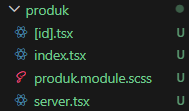
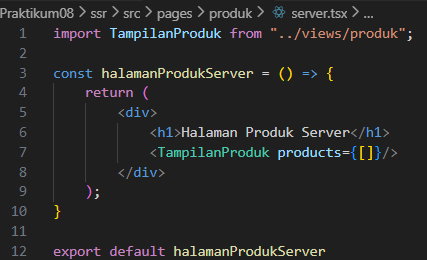
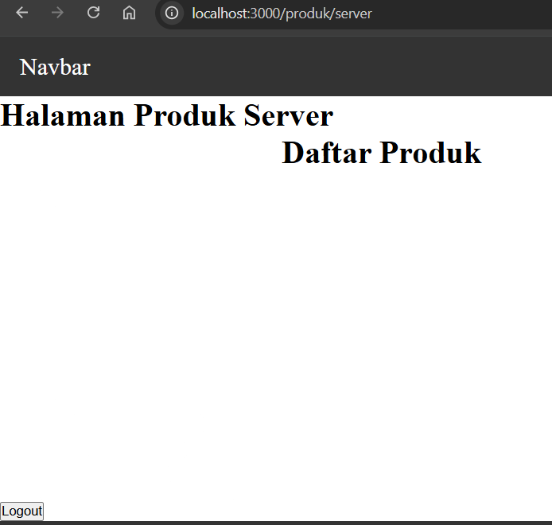
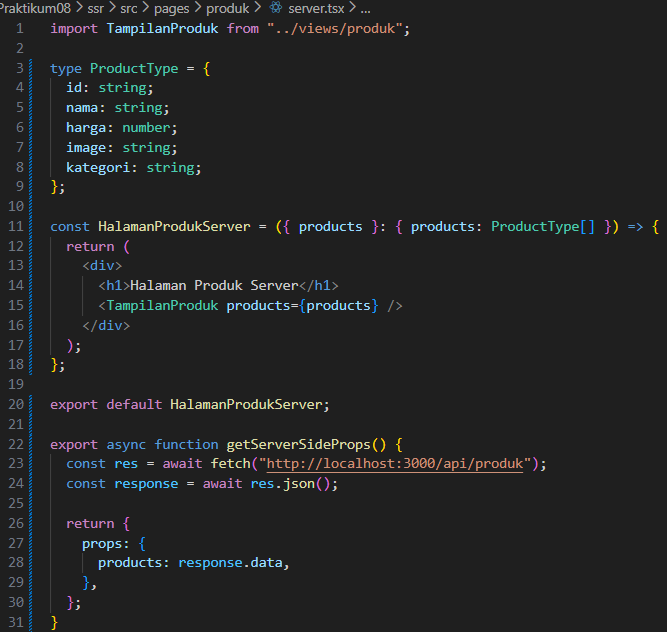
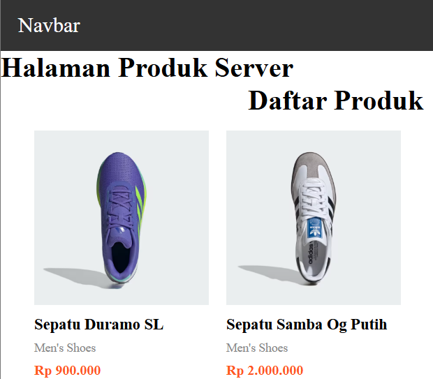

# Jobsheet 8

## 1. Setup Halaman SSR

1. Buat file baru pada pages/products/server.tsx

   

2. Modifikasi file server.tsx :

   

3. Jalankan browser : http://localhost:3000/produk/server

   

## 2. Implementasi getServerSideProps pada server.tsx

1. Tambah getServerSideProps pada server.tsx

   

2. Jalankan browser `http://localhost:3000/produk/server`

   
