# Jobsheet 9

## 1. Setup Halaman Static

1. Buat file baru pada pages/products/static.tsx

   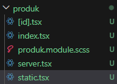

2. Modifikasi file static.tsx

   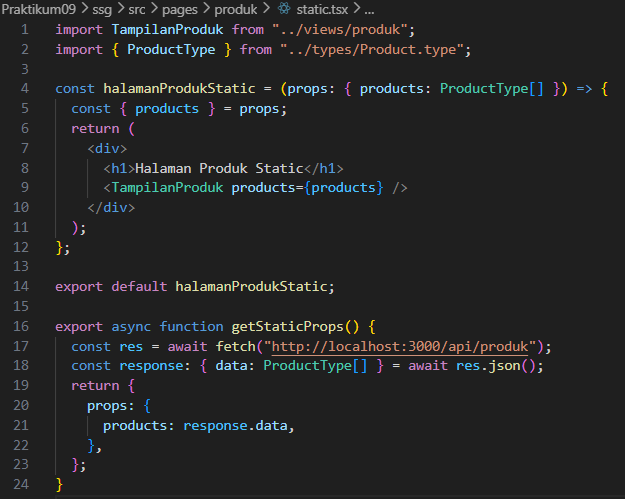

## 2. Build Production Mode

1. Pindah beberapa folder diluar pages antara lain

- Untuk menghindari error maka folder Views, utils, styles dipindah di luar folder src sehingga susunan folder pada src sebagai berikut

  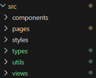

2. Jalankan: npm run build

- Jalankan npm run dev dan pastikan ini jalan ( jangan distop saat ngebuild ), jadi buka dua terminal
  - Terminal 1 : jalankan aplikasi npm run dev

    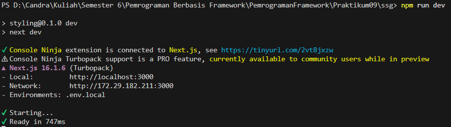

  - Terminal 2 : build aplikasi

    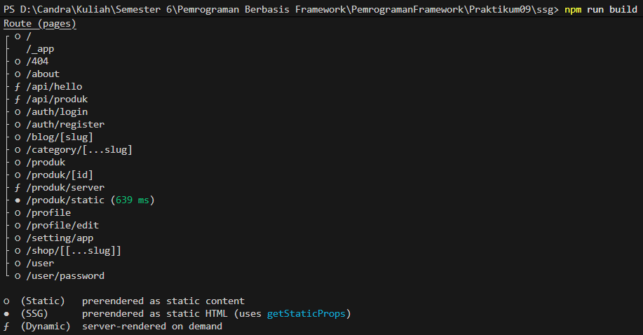

3. Jalankan npm run start dan Akses: http://localhost:3000/products/static

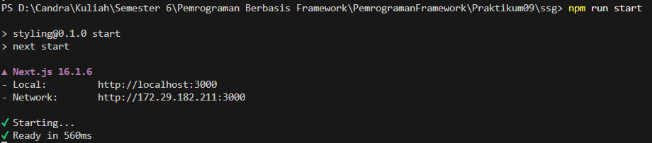

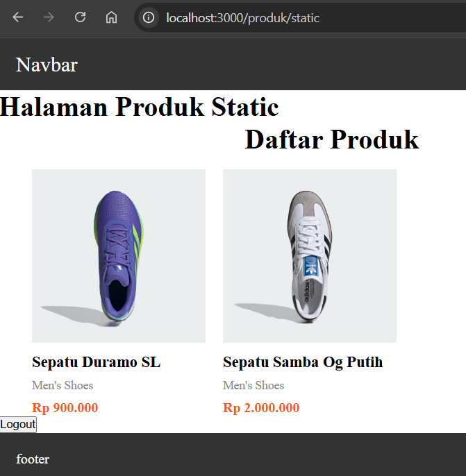

## 3. Pengujian Perubahan Data

- Uji 1 – Tambah Data di Database

1. Buka database firebasenya -
   Tambahkan produk baru di database.

   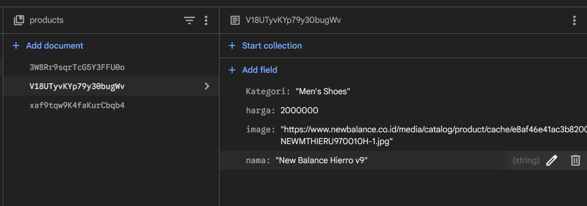

2. Buka halaman:
   - /products (CSR) → Data bertambah

     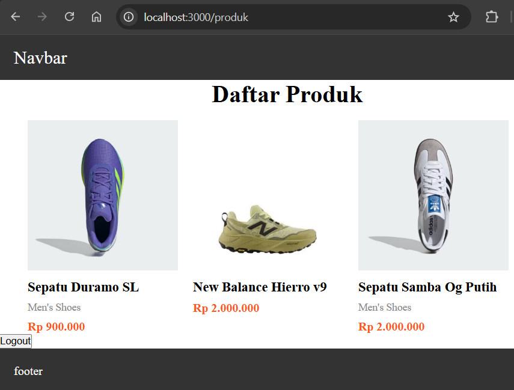

   - /products/server (SSR) → Data bertambah

   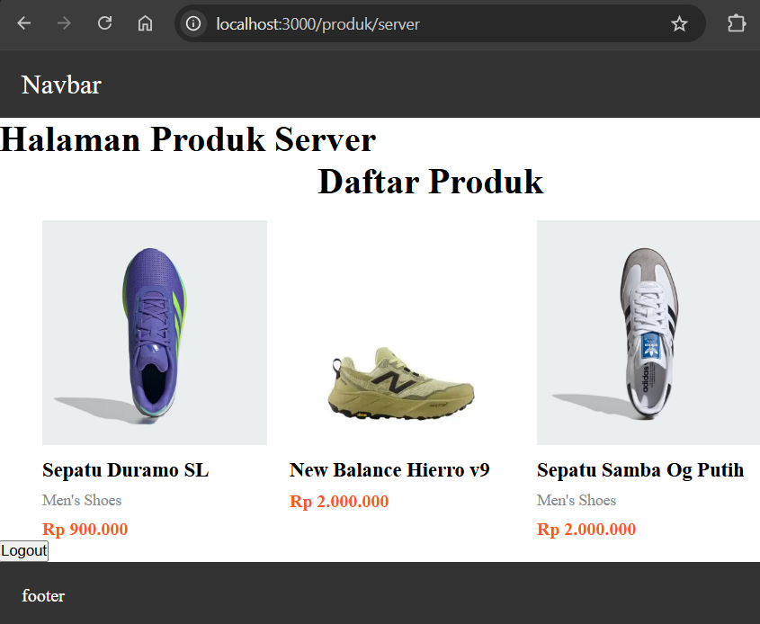
   - /products/static (SSG) → Data tidak berubah

   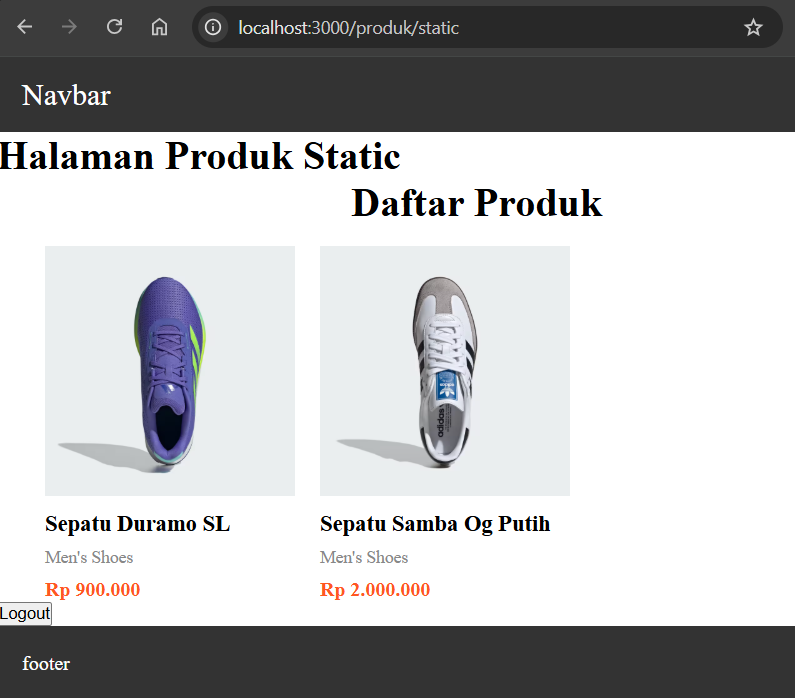

- Uji 2 – Build Ulang

1. Jalankan kembali:
   - npm run build
     - lakukan secara bersamaan dengan npm run dev saat melakukan npm run
       build

       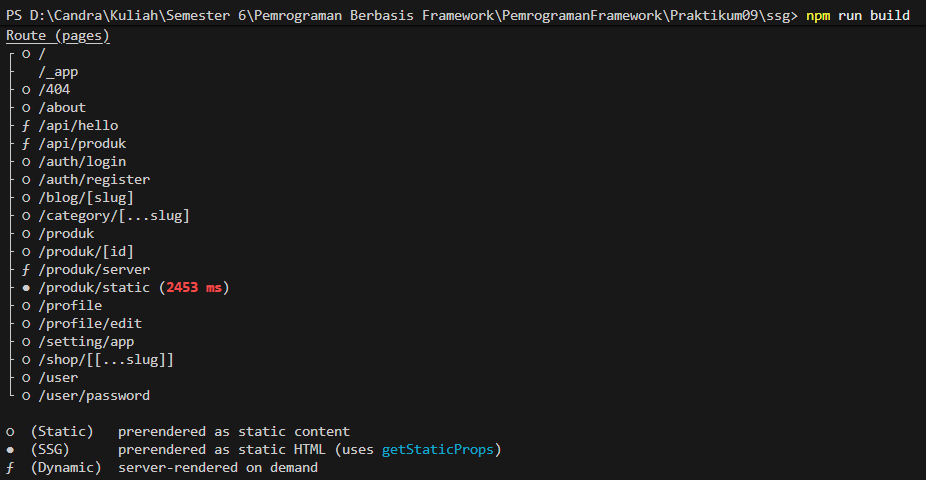

       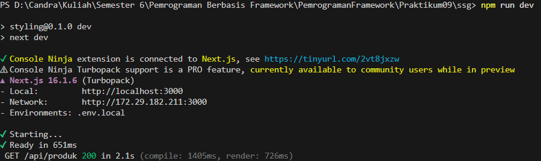

   - npm run start
     - npm run dev stop terlebih dahulu setelah itu npm run start

       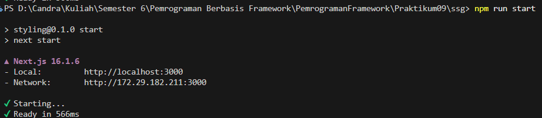

2. Refresh halaman static
   → Data baru muncul

   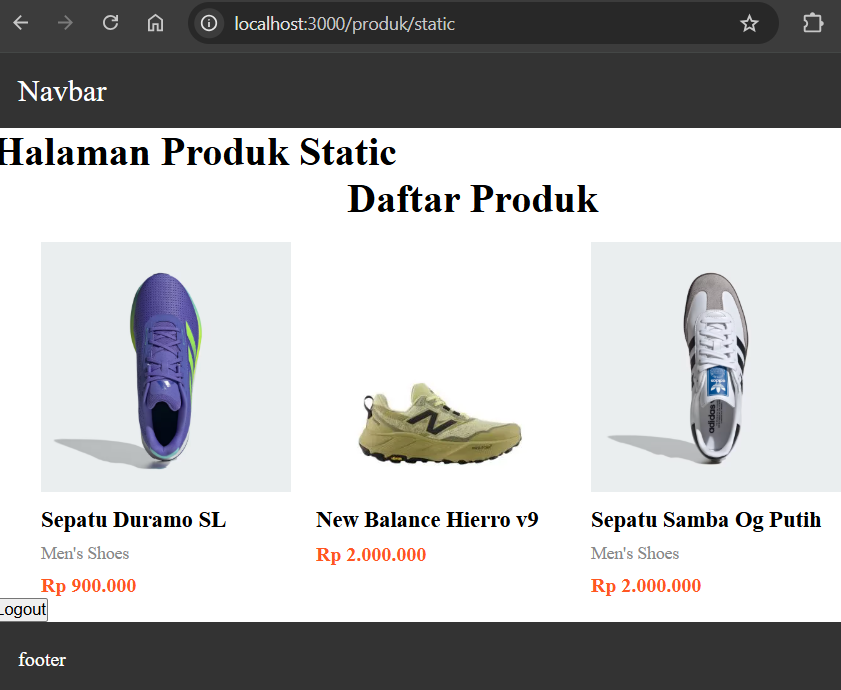

## Studi Analisis

Jawab pertanyaan berikut:

1. Mengapa SSG tidak menampilkan data terbaru?

   SSG (Static Site Generation) tidak menampilkan data terbaru karena halaman dibuat saat proses build saja, bukan saat pengguna membuka halaman. Jadi jika ada perubahan data setelah proses build selesai, halaman yang ditampilkan tetap menggunakan data lama sampai dilakukan build ulang.

2. Mengapa SSG lebih cepat?

   SSG lebih cepat karena halaman sudah berupa file HTML statis yang siap dikirim ke pengguna tanpa perlu proses pengambilan data atau rendering di server setiap kali halaman diakses. Hal ini membuat waktu loading lebih singkat.

3. Kapan SSG tidak cocok digunakan?

   SSG tidak cocok digunakan ketika aplikasi membutuhkan data yang sering berubah atau harus selalu menampilkan informasi terbaru, seperti dashboard real-time, aplikasi chat, atau sistem yang datanya selalu diperbarui.

4. Mengapa e-commerce tidak cocok menggunakan SSG murni?

   E-commerce tidak cocok menggunakan SSG murni karena data seperti stok produk, harga, atau promo bisa berubah dengan cepat. Jika menggunakan SSG saja, pengguna bisa melihat informasi yang sudah tidak terbaru, sehingga berpotensi menimbulkan kesalahan saat melakukan pembelian.

5. Apa perbedaan build mode dan development mode?

   Build mode adalah proses saat aplikasi dipersiapkan untuk produksi, di mana semua file di-compile dan dioptimasi agar lebih cepat saat dijalankan. Sedangkan development mode adalah mode saat proses pengembangan, di mana perubahan kode bisa langsung terlihat tanpa perlu melakukan build ulang, sehingga memudahkan developer saat membuat atau memperbaiki aplikasi.
