# Jobsheet 10

## 1. Membuat Dynamic Route

1. Buka file pages/products/[product].tsx dan modfikasi sbb ( line 20 )

   

2. Jalankan browser http://localhost:3000/produk

   

3. Jika kita klik salah satu gambar maka akan menuju halaman lain

   

## 2. Implementasi CSR (Client Rendering)

1.  Modifikasi pada file [produk].tsx pada folder src/pages/produk/

    

2.  Pada file produk.ts pada folder pages/api di rename menjadi [[...product]].ts

    

3.  Modifikasi file servicefirebase.ts

    

4.  Modifikasi file [[...produk]].ts

    

5.  Jalankan browser http://localhost:3000/api/produk/3W8Rr9sqrTcG5Y3FFU0o

    

6.  Jalankan alamat url http://localhost:3000/api/produk/123

    

7.  Buat file dengan nama index.tsx pada folder views/DetailProduct selain itu buat juga file dengan nama detailProduct.module.scss

    

8.  Modifikasi detailProduct.module.scss

    

    

9.  Modifikasi index.tsx pada folder DetailProduct

    

10. Modifikasi file [product].tsx

    

11. Modifikasi index.tsx pada folder views/detailProduct line 16

    

12. Jalankan browser http://localhost:3000/produk/ saat produk diklik maka akan muncul
    detailProduk http://localhost:3000/produk/pAWIT99SWmVbVrNm49ml

    

    

13. Agar tulisan detail produk ditengah maka modifikasi file detailProduct.module.scss line 103-108 dan file index.tsx tambahkan code pada line 7,8 dan 22 menjadi

    

    

14. Sehingga hasilnya seperti berikut

    

## 3. Implementasi SSR

1. Modifikasi [produk].tsx pada folder src/pages/produk dan comment line 9 sampai 20 dikarena kita akan menggunakan metode SSR. Tambahkan beberapa kode untuk SSR

   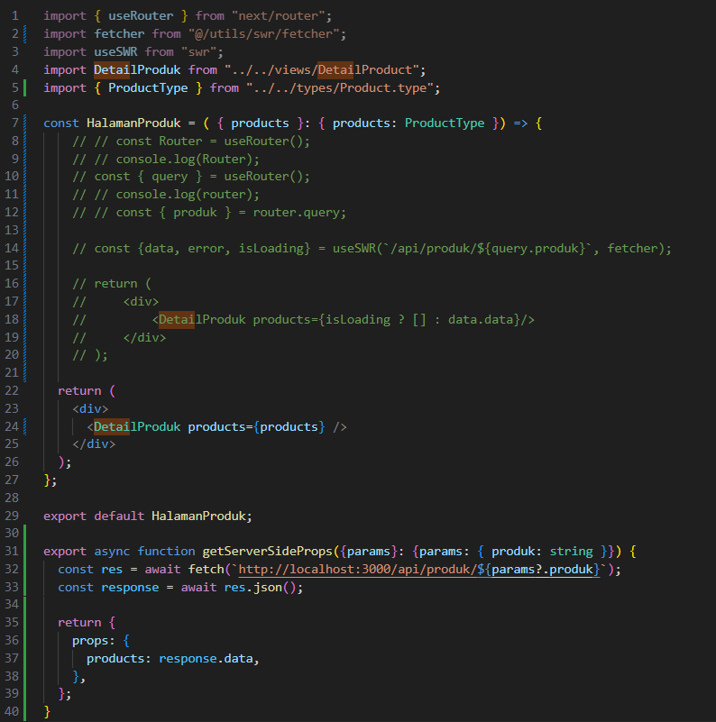

2. Jalankan browser http://localhost:3000/produk/server

   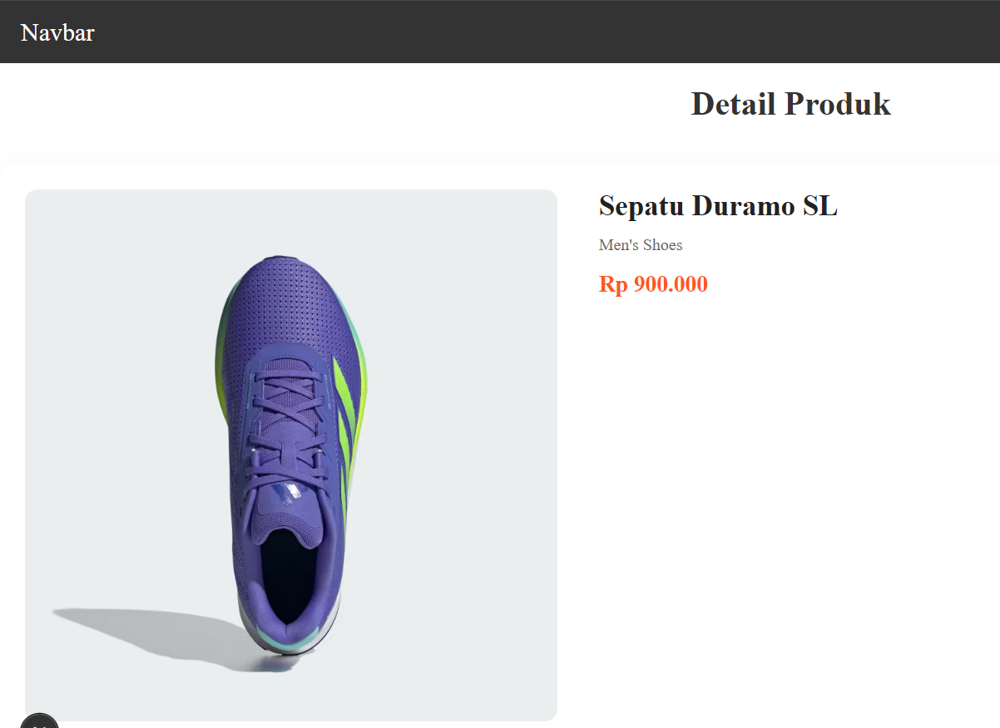

   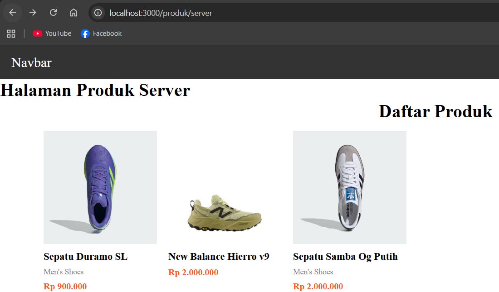

## 4. Implementasi Static Site Generation (Dynamic SSG)

1. Buka file [produk].tsx dan modifikasi seperti berikut

   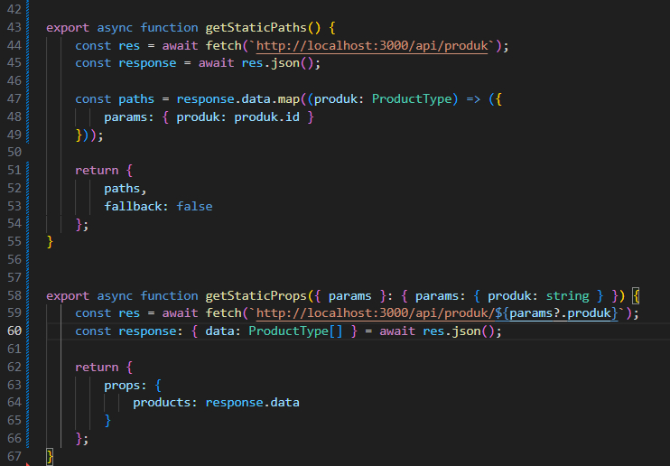

2. Buka file index.tsx pada folder src/views/DetailProduct dan modifikasi pada line 11

   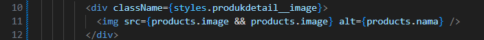

3. Jalankan browser http://localhost:3000/produk

   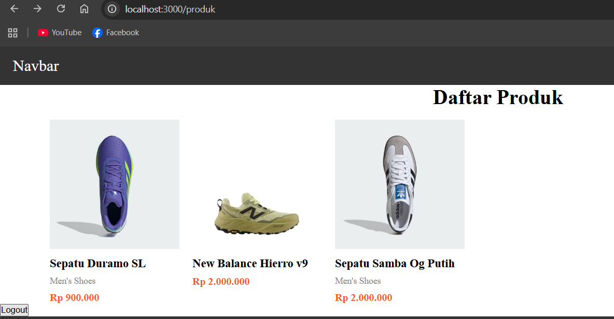

   Saat diklik salah satu produk

   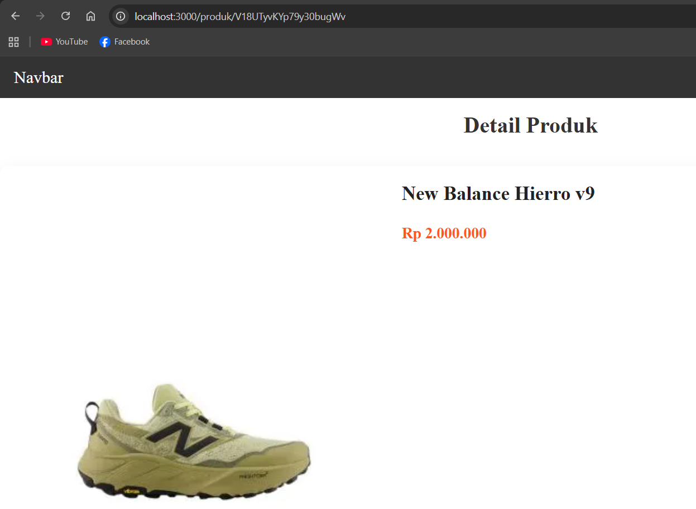

# Pengujian

## CSR

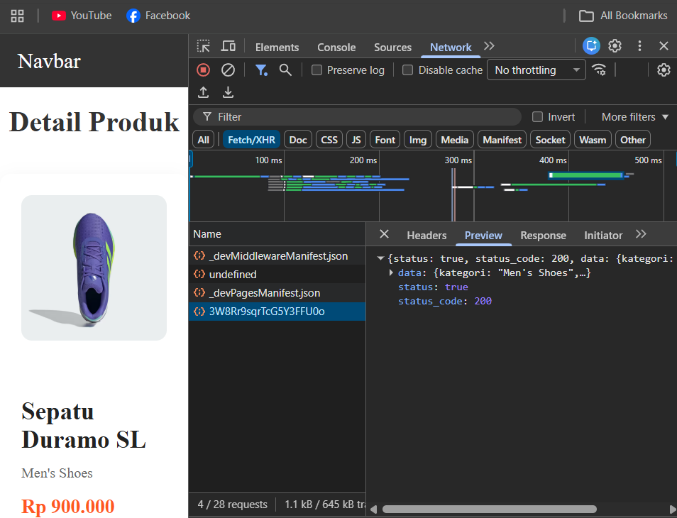

## SSR

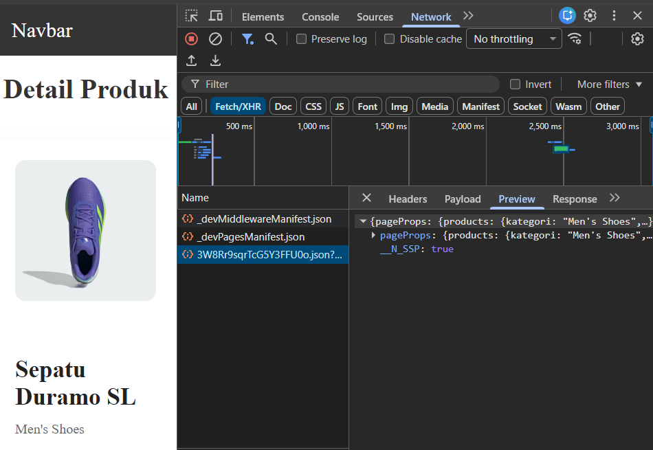

## SSG

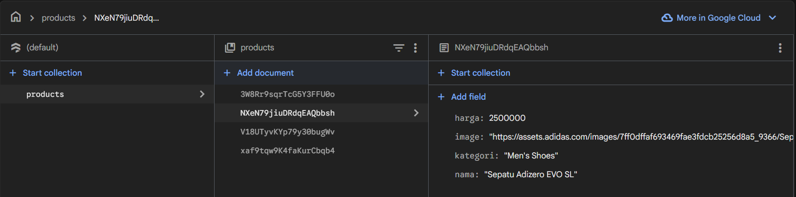

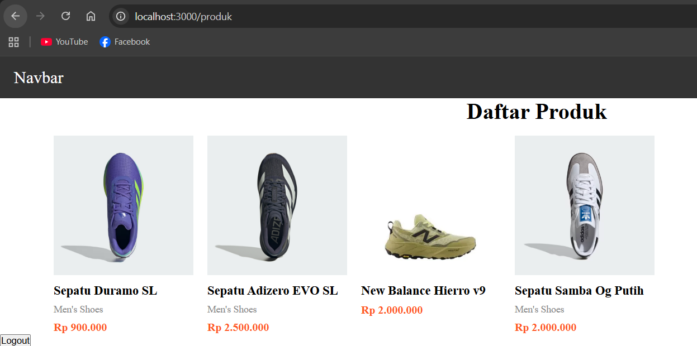

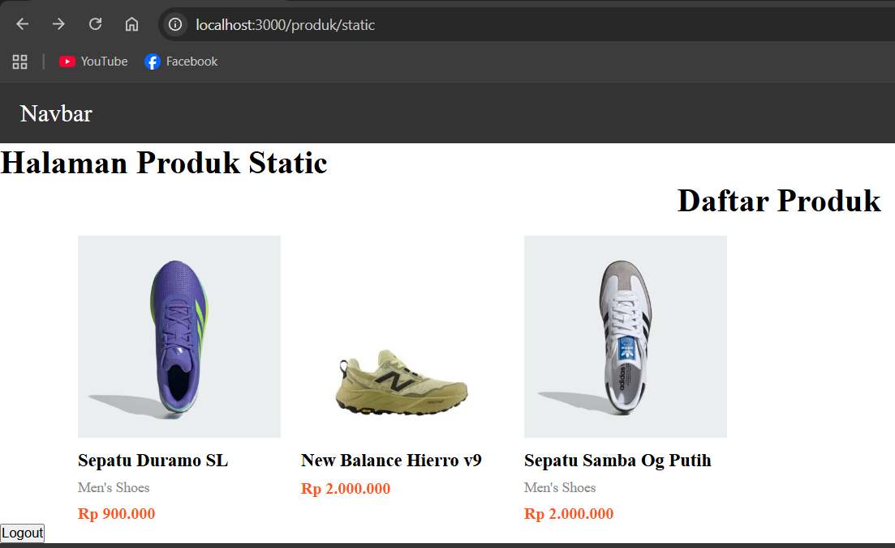

## Tabel Perbandingan:

| Aspek          | CSR (Client Side Rendering)                                                              | SSR (Server Side Rendering)                                                 | SSG (Static Site Generation)                                                          |
| -------------- | ---------------------------------------------------------------------------------------- | --------------------------------------------------------------------------- | ------------------------------------------------------------------------------------- |
| Loading        | Awal loading cenderung lebih lama karena browser harus download JS lalu render di client | Lebih cepat karena HTML sudah dirender di server sebelum dikirim ke browser | Sangat cepat karena halaman sudah berupa file statis yang siap ditampilkan            |
| Build Required | Tidak perlu build khusus untuk data karena semua diambil saat runtime di client          | Tidak perlu build data karena proses render dilakukan setiap ada request    | Perlu proses build saat deploy untuk generate halaman statis                          |
| SEO            | Kurang optimal karena konten awal kosong dan menunggu JS selesai dijalankan              | Sangat baik karena konten langsung tersedia dari server                     | Sangat baik karena konten sudah statis dan mudah diindeks oleh mesin pencari          |
| Perubahan Data | Data bisa real-time karena diambil langsung dari client setiap ada interaksi             | Data selalu up-to-date karena di-render ulang setiap request                | Data tidak langsung berubah, perlu rebuild atau menggunakan revalidation untuk update |

## Pertanyaan Analisis

1. Mengapa getStaticPaths wajib pada dynamic SSG?

   getStaticPaths wajib pada dynamic SSG karena saat build, Next.js harus tahu daftar path (misalnya id produk) yang akan dibuat menjadi file statis; tanpa itu, framework tidak tahu halaman mana saja yang perlu di-generate.

2. Mengapa CSR membutuhkan loading state?

   CSR membutuhkan loading state karena data diambil di sisi client setelah halaman dirender, sehingga ada jeda waktu (fetching) sebelum data muncul, dan loading digunakan untuk memberi feedback ke user agar tidak terlihat kosong.

3. Mengapa SSG tidak menampilkan produk baru tanpa build ulang?

   SSG tidak menampilkan produk baru tanpa build ulang karena halaman sudah di-generate menjadi file statis saat build, jadi perubahan data di database tidak langsung mempengaruhi halaman sampai dilakukan rebuild atau revalidation.

4. Mana metode terbaik untuk halaman detail e-commerce?

   Metode terbaik untuk halaman detail e-commerce biasanya SSR atau SSG dengan revalidation, karena butuh SEO yang baik dan data yang relatif up-to-date; SSR cocok untuk data yang sering berubah, sedangkan SSG cocok jika perubahan tidak terlalu sering.

5. Apa risiko menggunakan SSG untuk produk yang sering berubah?

   Risiko menggunakan SSG untuk produk yang sering berubah adalah data menjadi tidak akurat (stok, harga, atau detail lain bisa usang), sehingga bisa menyebabkan kesalahan informasi bagi pengguna jika tidak sering dilakukan rebuild atau mekanisme update seperti ISR.
