# Jobsheet 10

## 1. Membuat Dynamic Route

1. Buka file pages/products/[product].tsx dan modfikasi sbb ( line 20 )

   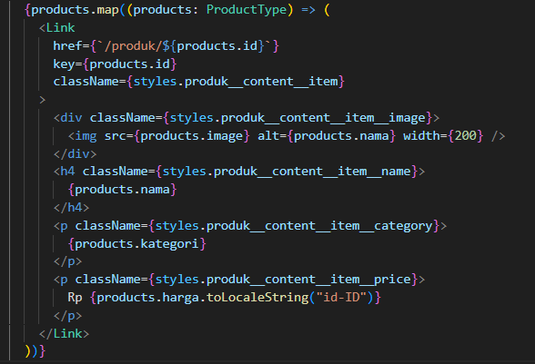

2. Jalankan browser http://localhost:3000/produk

   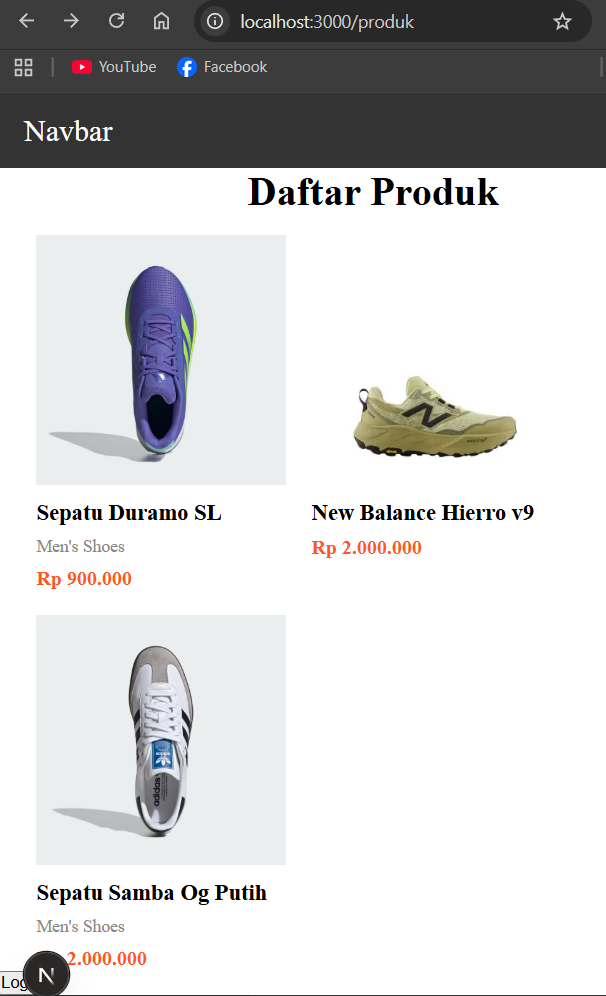

3. Jika kita klik salah satu gambar maka akan menuju halaman lain

   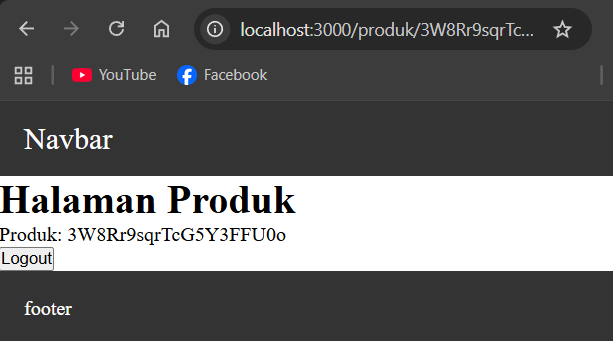

## 2. Implementasi CSR (Client Rendering)

1.  Modifikasi pada file [produk].tsx pada folder src/pages/produk/

    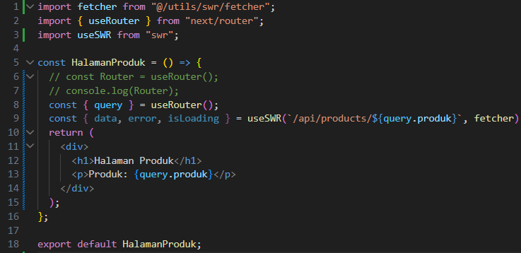

2.  Pada file produk.ts pada folder pages/api di rename menjadi [[...product]].ts

    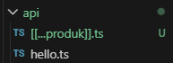

3.  Modifikasi file servicefirebase.ts

    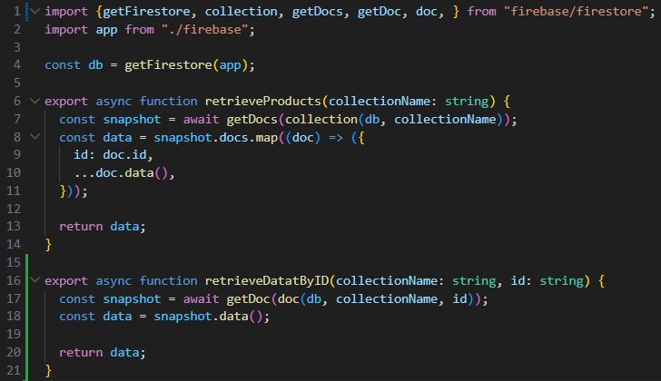

4.  Modifikasi file [[...produk]].ts

    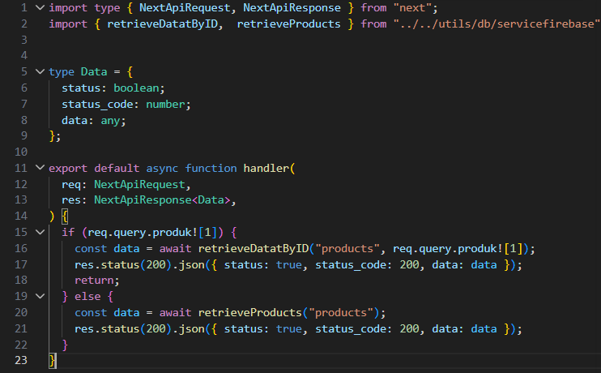

5.  Jalankan browser http://localhost:3000/api/produk/3W8Rr9sqrTcG5Y3FFU0o

    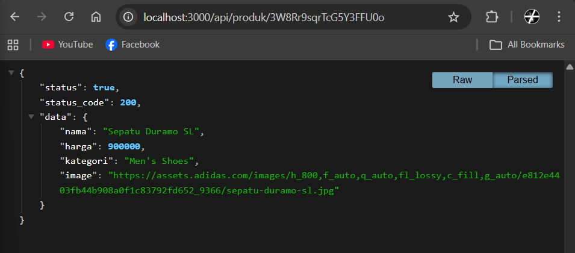

6.  Jalankan alamat url http://localhost:3000/api/produk/123

    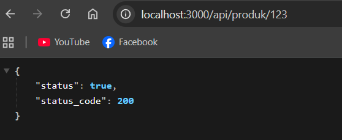

7.  Buat file dengan nama index.tsx pada folder views/DetailProduct selain itu buat juga file dengan nama detailProduct.module.scss

    

8.  Modifikasi detailProduct.module.scss

    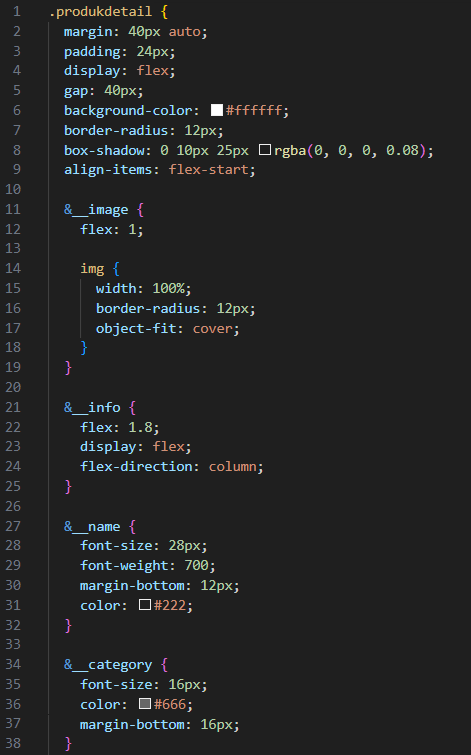

    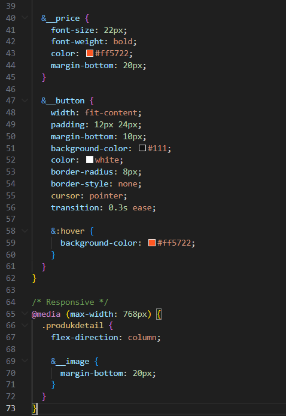

9.  Modifikasi index.tsx pada folder DetailProduct

    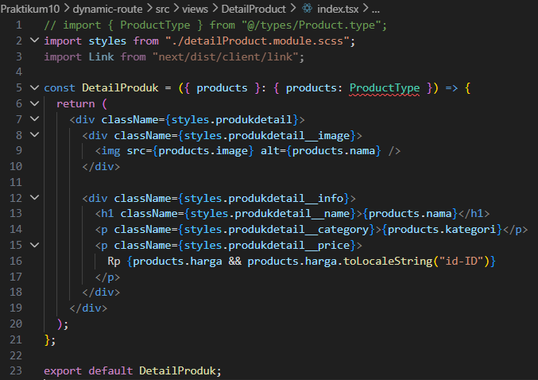

10. Modifikasi file [product].tsx

    
    
11. Modifikasi index.tsx pada folder views/detailProduct line 16

    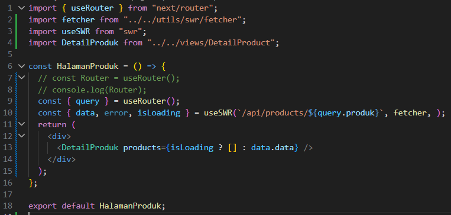

12. Jalankan browser http://localhost:3000/produk/ saat produk diklik maka akan muncul
    detailProduk http://localhost:3000/produk/pAWIT99SWmVbVrNm49ml

    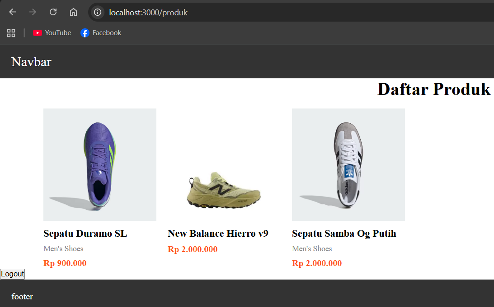

    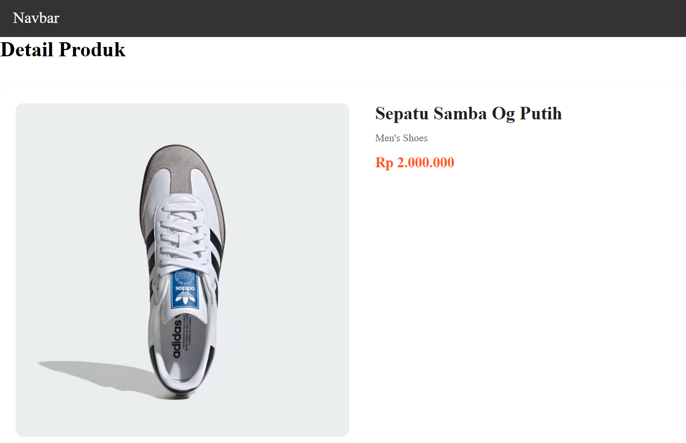

13. Agar tulisan detail produk ditengah maka modifikasi file detailProduct.module.scss line 103-108 dan file index.tsx tambahkan code pada line 7,8 dan 22 menjadi 

    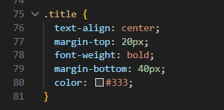

    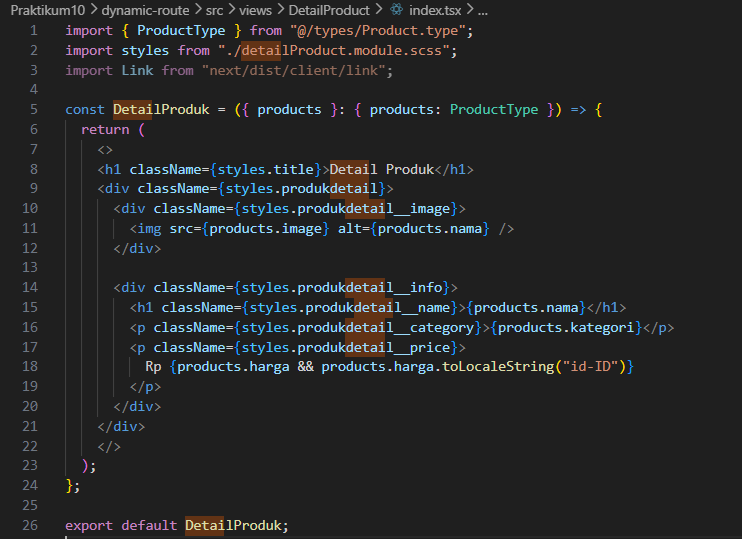

14. Sehingga hasilnya seperti berikut

    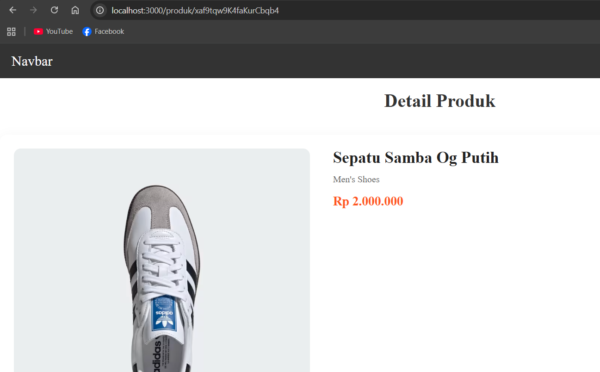