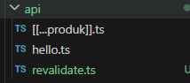
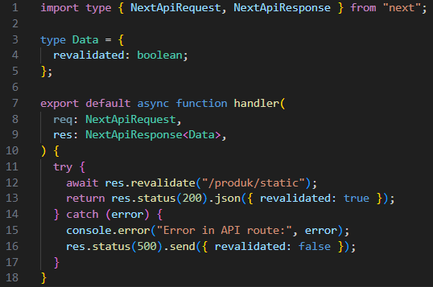

# Jobsheet 11

## Implementasi ISR Otomatis

### 1. Tambahkan revalidate

- Buka halaman static.tsx pada folder src/pages/produk

  

### 2. Pengujian ISR

- Jalankan npm run build & npm run start

  

  

- Tambahkan data baru di database pada firebase

  

- Refresh halaman sebelum 10 detik → Data lama.

  

- Refresh setelah 10 detik → Data baru muncul.

  

## On-Demand Revalidation

### 1. Buat API Revalidate

- Buat file revalidate.ts pada folder pages/api/ dan modifikasi

  
  
  
