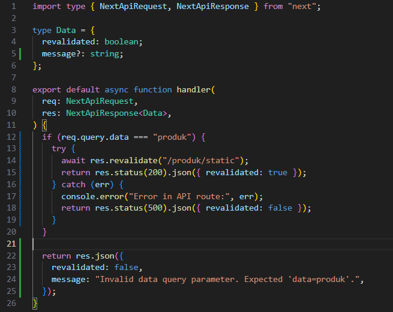
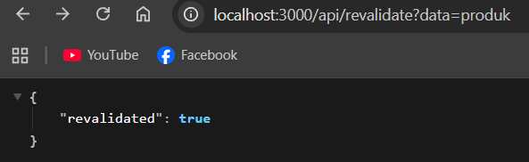
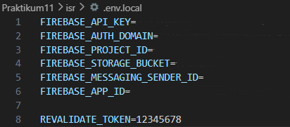
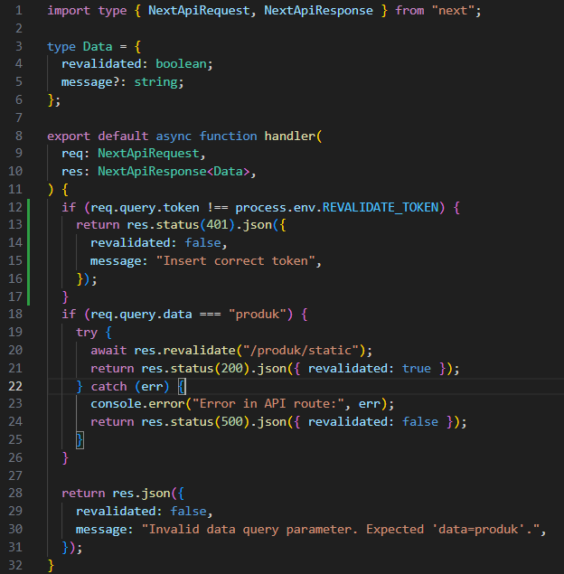
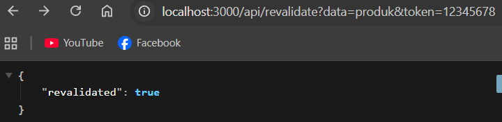
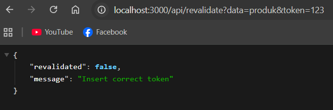

# Jobsheet 11

## Implementasi ISR Otomatis

### 1. Tambahkan revalidate

- Buka halaman static.tsx pada folder src/pages/produk

  

### 2. Pengujian ISR

- Jalankan npm run build & npm run start

  

  

- Tambahkan data baru di database pada firebase

  

- Refresh halaman sebelum 10 detik → Data lama.

  

- Refresh setelah 10 detik → Data baru muncul.

  

## On-Demand Revalidation

### 1. Buat API Revalidate

- Buat file revalidate.ts pada folder pages/api/ dan modifikasi

  

  

### 2. Tambahkan Parameter Data

- Modifikasi file revalidate.ts

  

- Uji coba menambahkan parameter dan value pada url http://localhost:3000/api/revalidate?data=produk maka akan muncul true dan sesuai dengan kondisi (req.query.data ===”produk”)

  

### 3. Tambahkan Token Security

- Buka file .env dan modifikasi

  

- Modifikasi file revalidate.ts

  

## 3. Pengujian Manual

- Akses http://localhost:3000/api/revalidate?data=products&token=12345678
  - Jika benar:

  

  -Jika token salah:

  

## 4. Pertanyaan Analisis

1. Mengapa ISR lebih fleksibel dibanding SSG?

   ISR (Incremental Static Regeneration) lebih fleksibel dibanding SSG karena memungkinkan halaman statis diperbarui secara berkala tanpa harus melakukan build ulang seluruh aplikasi, sehingga data bisa tetap relatif up-to-date dengan performa tinggi.

2. Apa perbedaan revalidate waktu dan on-demand?

   Perbedaan revalidate waktu dan on-demand adalah: revalidate waktu menggunakan interval tertentu (misalnya setiap 10 detik) untuk memperbarui halaman secara otomatis, sedangkan on-demand hanya melakukan revalidasi ketika dipicu secara manual melalui API atau event tertentu.

3. Mengapa endpoint revalidation harus diamankan?

   Endpoint revalidation harus diamankan karena endpoint tersebut bisa digunakan untuk memicu pembaruan halaman; jika tidak diamankan, pihak lain bisa menyalahgunakannya untuk mengirim request berulang dan membebani server.

4. Apa risiko jika token tidak digunakan?

   Risiko jika token tidak digunakan adalah endpoint bisa diakses oleh siapa saja, yang dapat menyebabkan serangan seperti spam revalidation, overload server, atau bahkan manipulasi konten yang tidak diinginkan.

5. Kapan ISR lebih cocok dibanding SSR?

   ISR lebih cocok dibanding SSR ketika data tidak perlu selalu real-time, tetapi tetap perlu diperbarui secara berkala, sehingga bisa mendapatkan kombinasi performa cepat (seperti SSG) dan data yang cukup fresh tanpa beban server sebesar SSR.
