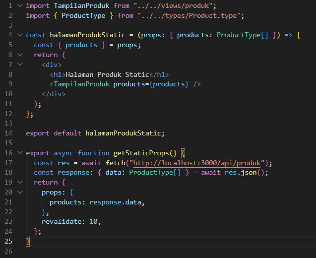
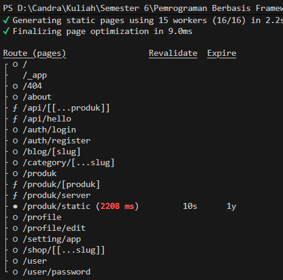
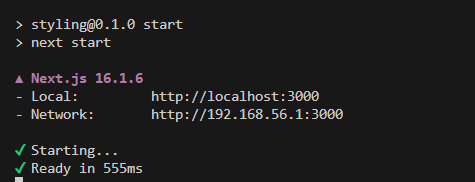
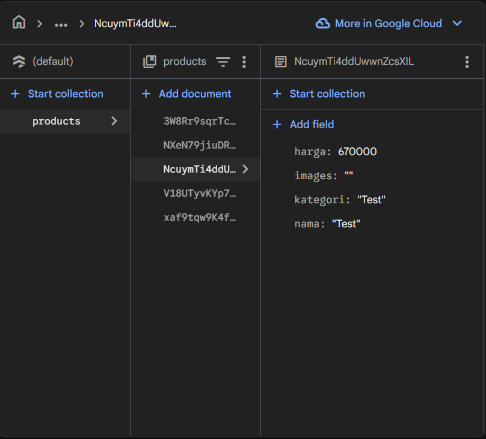
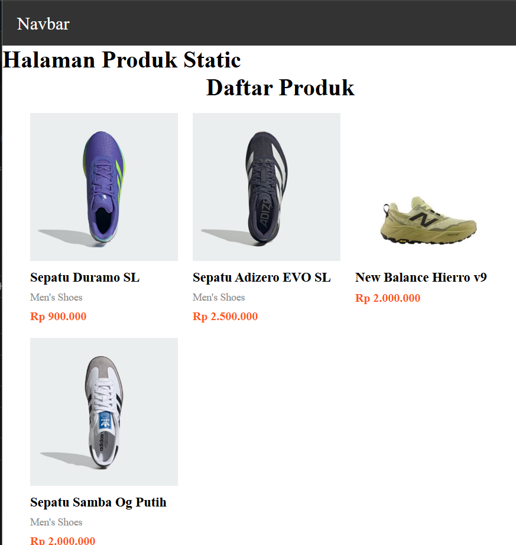
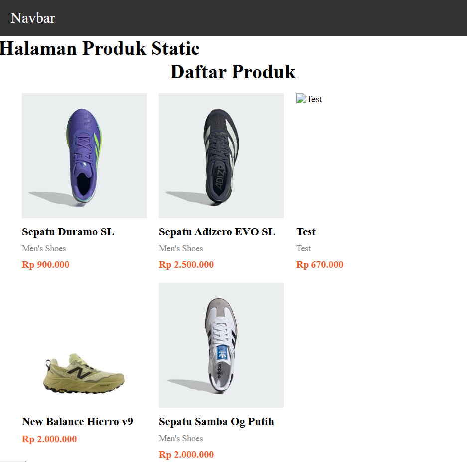

# Jobsheet 11

## 1. Tambahkan revalidate

- Buka halaman static.tsx pada folder src/pages/produk

  

## 2. Pengujian ISR

- Jalankan npm run build & npm run start

  

  

- Tambahkan data baru di database pada firebase

  

- Refresh halaman sebelum 10 detik → Data lama.

  

- Refresh setelah 10 detik → Data baru muncul.

  
