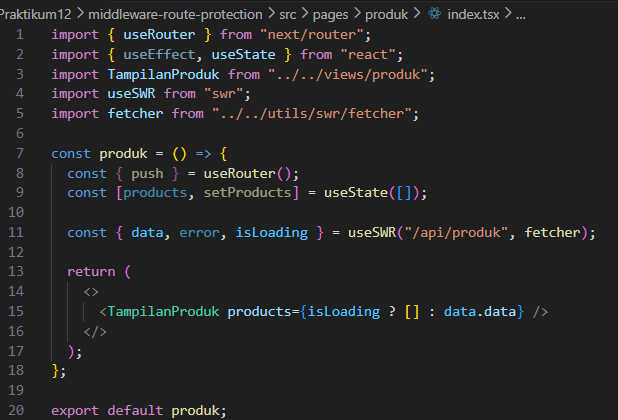
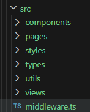
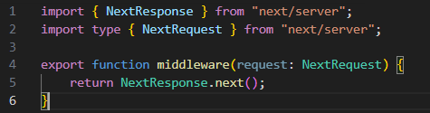
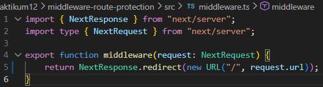
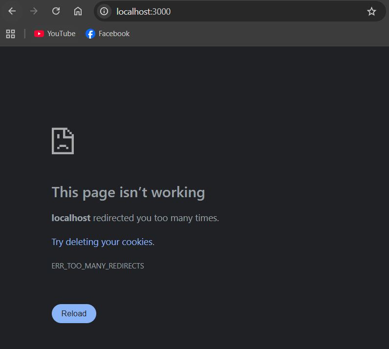
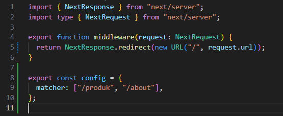
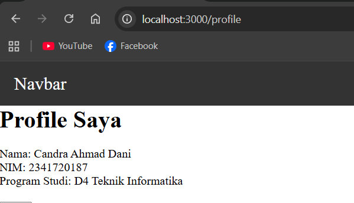
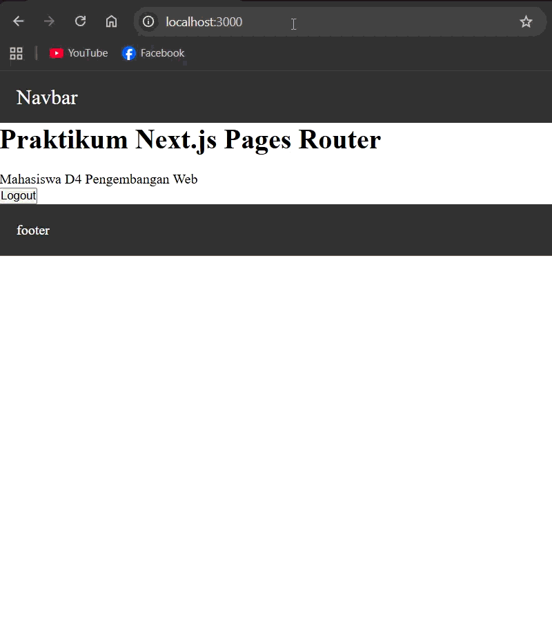
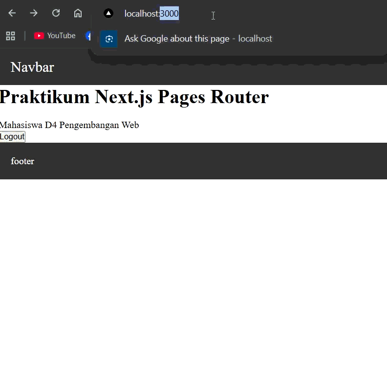
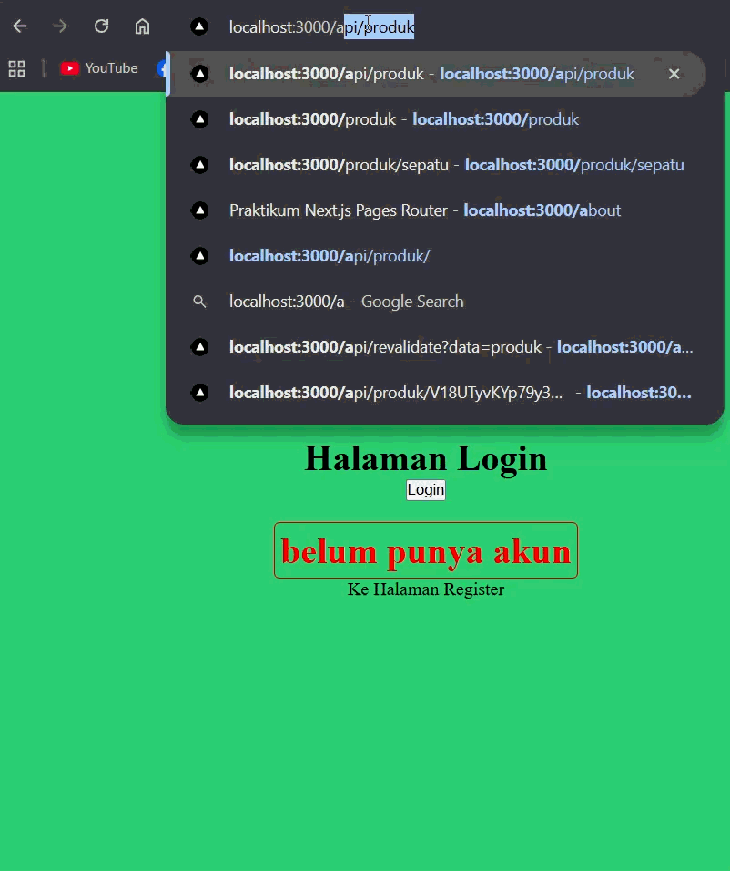

# Jobsheet 12

## 1. Membuat Middleware

- Modifikasi file index.tsx pada folder src/pages/produk

  

- Buat file: src/middleware.ts Sejajar dengan folder pages.

  

## 2. Struktur Dasar Middleware

- Jika menggunakan NextResponse.next() → tidak ada redirect.

  

- Jadi masih bisa mengakses ke http://localhost:3000/produk

## 3. Redirect Sederhana

- Semua halaman akan redirect ke home dan error dikarenakan terus menerus loading

  

## 4. Batasi Route Tertentu

- Untuk mengatasi pada bagian 3 maka perlu pembatasan route

  

- Artinya:
  - Halaman selain /produk dan /about tetap normal

    

  - Ketika user mengakses halaman produk dan about maka akan langsung redirect ke halaman home

## 5. Simulasi Sistem Login

- Modifikasi file middleware.ts

  

- Jika user langsung mengakses ke alamat http://localhost:3000/produk tidak akan bisa user akan diarahkan ke halaman login

  

## Pengujian

### Uji 1 – isLogin = false

### Uji 2 – isLogin = true

### Uji 3 – Tambahkan Multiple Route

## Perbandingan Middleware vs useEffect

| Aspek           | useEffect          | Middleware           |
| --------------- | ------------------ | -------------------- |
| Redirect timing | Setelah render     | Sebelum render       |
| Glitch          | Ada                | Tidak                |
| Security        | Lemah              | Lebih aman           |
| Skalabilitas    | Harus tiap halaman | Sekali di middleware |

## Pertanyaan Analisis

1. Mengapa middleware lebih aman dibanding useEffect?

   Middleware lebih aman dibanding useEffect karena dijalankan di server (sebelum halaman dikirim ke user), sehingga proteksi seperti autentikasi atau redirect tidak bisa dimanipulasi dari sisi client. Sedangkan useEffect berjalan di browser setelah halaman dirender, sehingga masih bisa terlihat atau diakses sementara oleh user.

2. Mengapa middleware tidak menimbulkan glitch?

   Middleware tidak menimbulkan glitch karena proses redirect atau pengecekan dilakukan sebelum halaman dirender. Berbeda dengan useEffect yang baru berjalan setelah render, sehingga sempat menampilkan konten sebentar (flash) sebelum diarahkan.

3. Apa risiko jika semua halaman diproteksi tanpa pengecualian?

   Jika semua halaman diproteksi tanpa pengecualian, risiko yang terjadi adalah user tidak bisa mengakses halaman publik seperti login atau register, bahkan bisa terjadi infinite redirect (loop) karena halaman tujuan juga ikut diproteksi.

4. Kapan middleware tidak diperlukan?

   Middleware tidak diperlukan ketika halaman bersifat publik dan tidak membutuhkan proteksi, atau ketika logika cukup sederhana dan hanya berjalan di client tanpa risiko keamanan yang tinggi.

5. Apa perbedaan middleware dan API route?

   Middleware adalah kode yang berjalan sebelum request diproses (biasanya untuk autentikasi, logging, atau redirect), sedangkan API route adalah endpoint backend yang digunakan untuk mengelola data atau menjalankan logika server seperti CRUD dan integrasi database.
