# Jobsheet 12

## 1. Install NextAuth

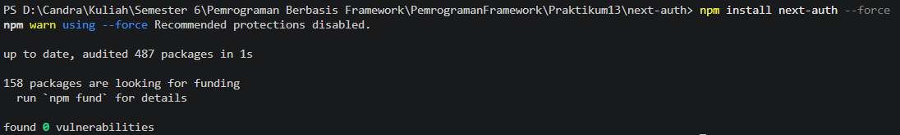

## 2. Konfigurasi API Auth

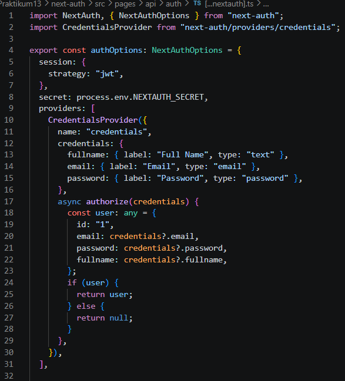

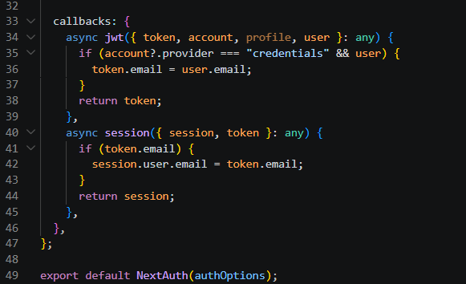

## 3. Tambahkan Secret

- Buka file .env.local dan tambahkan code pada line 12
  - NEXTAUTH_SECRET=RANDOM_BASE64_STRING
  - Untuk mendapatkan nilai RANDOM_BASE64_STRING gunakan generator
    RANDOM_BASE64_STRING seperti https://www.convertsimple.com/random-base64-generator/

    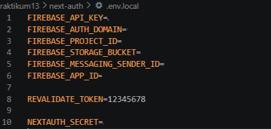

## 4. Tambahkan SessionProvider

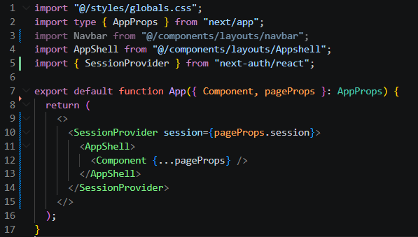

## 5. Tambahkan Tombol Login & Logout

- Buka index.tsx pada folder component/navbar dan modifikasi pada line 10 dan 2

  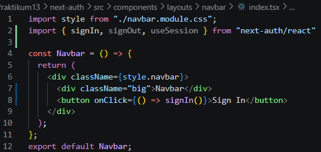

- Buka file file navbar.module.scss tambahkan code pada line 9

  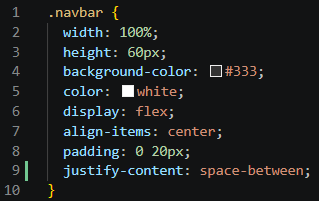

- Jalankan http://localhost:3000/

  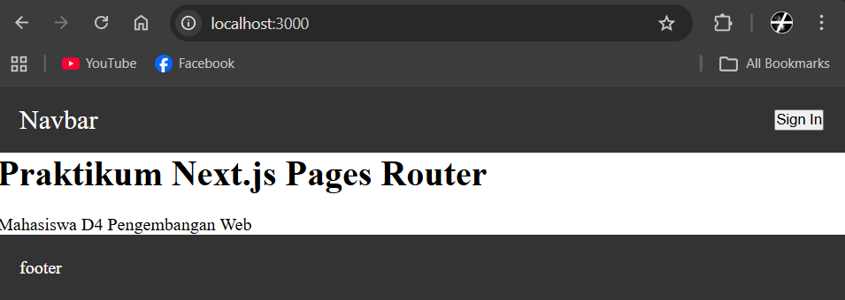

- Jika di klik sign in maka akan muncul dan isikan textbox masing. Setelah itu klik button sign in dan setelah diklik maka akan kembali ke halaman localhost

  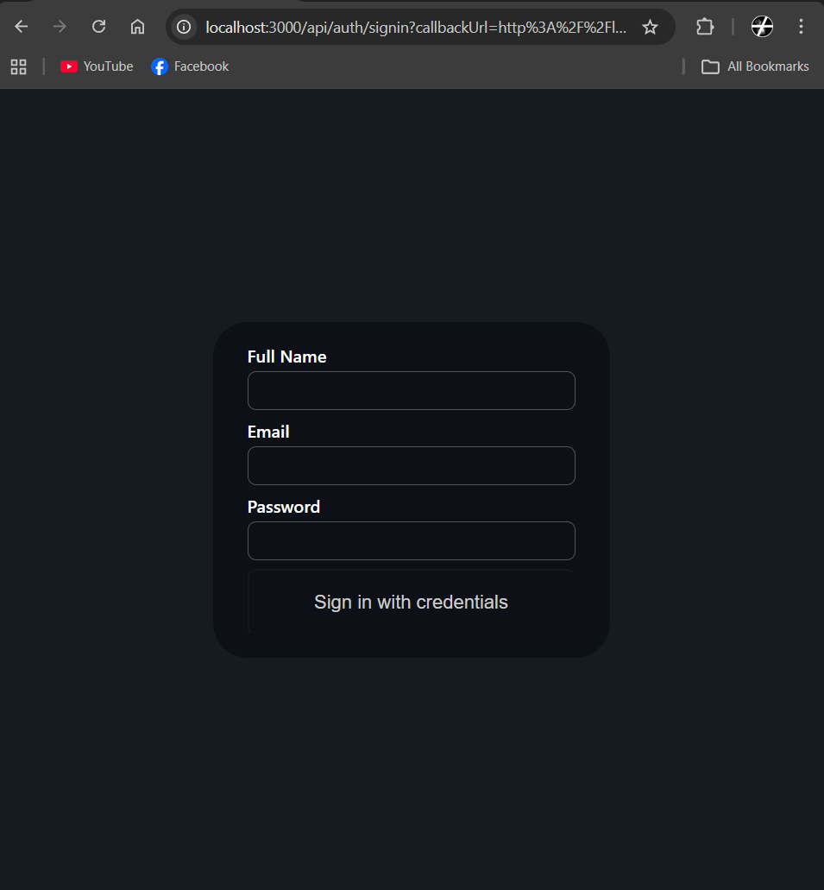

- Setelah berhasil login maka akan muncul session

  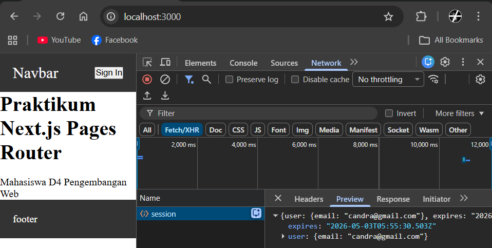

- Untuk dapat menangkap data pada session maka tambahkan code sebagai berikut:

  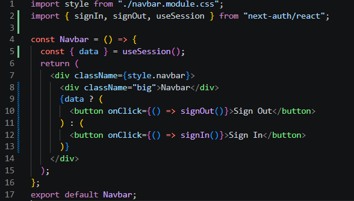

- Uji coba sign in dan sign out

  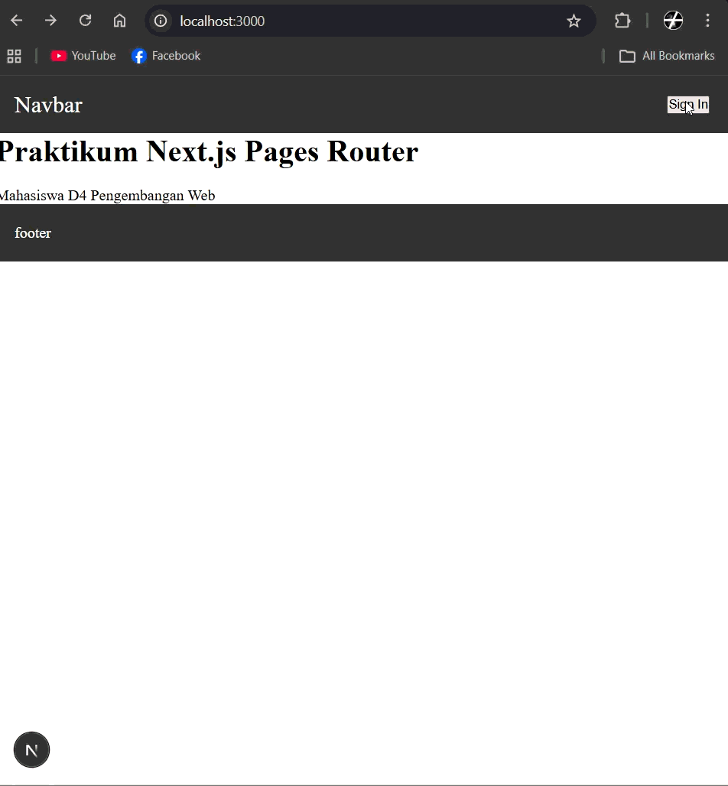

## 6. Menambahkan Data Tambahan (Full Name)

- Buka file [...nextauth].js

  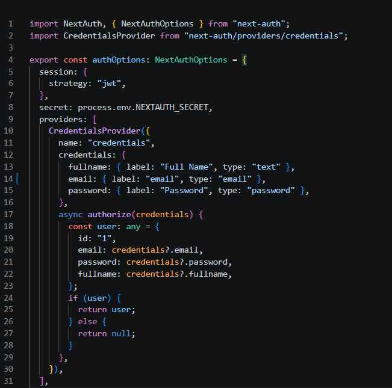

  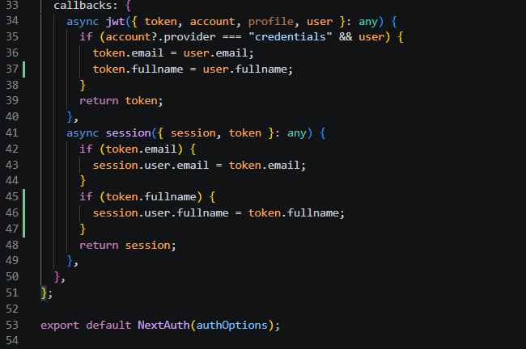

- Modifikasi navbar.module.scss

  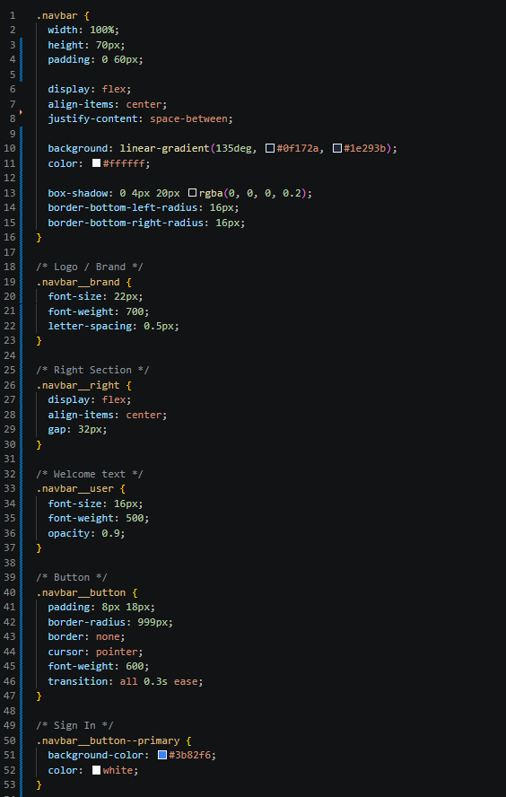

  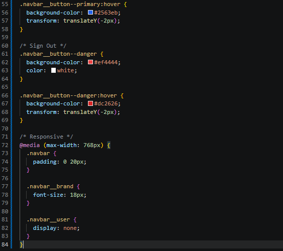

- Modifikasi index.tsx pada folder components/layouts/navbar

  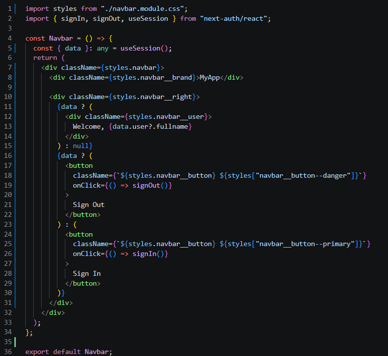

- Jalankan browser pada localhost & lakukan sign in

  

## 7. Proteksi Halaman Profile

- pages/profile/index.tsx dan modifikasi file index.tsx

  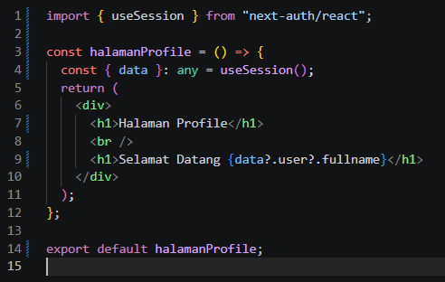

- jalankan browser

  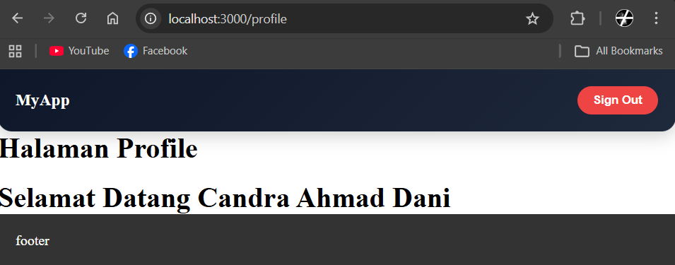

- Buat file withAuth.ts dan folder dengan nama middleware di src

  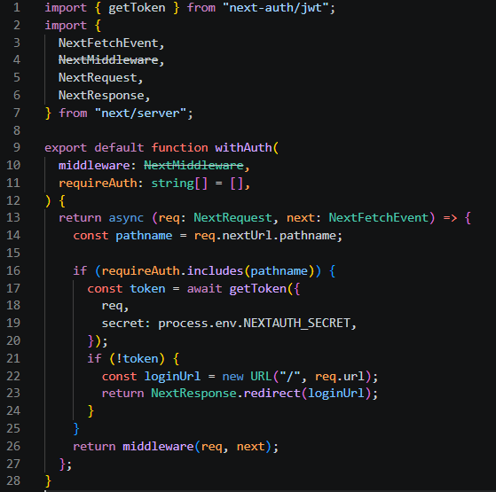

- Modifikasi middleware.ts

  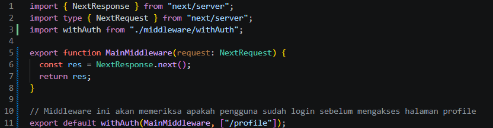

  
