# Jobsheet 14

## 1. Membuat Register View

- Buat folder pada views dengan nama register dan tambahkan 2 file yaitu index.tsx dan register.module.scss

  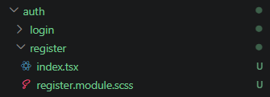

- Buka file register.tsx pada folder auth/register.tsx dan modifikasi file register.tsx ( pada folder pages/auth/register.tsx )

  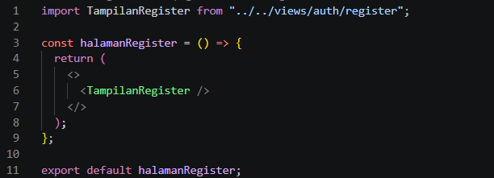

- Modifikasi register.module.scss

  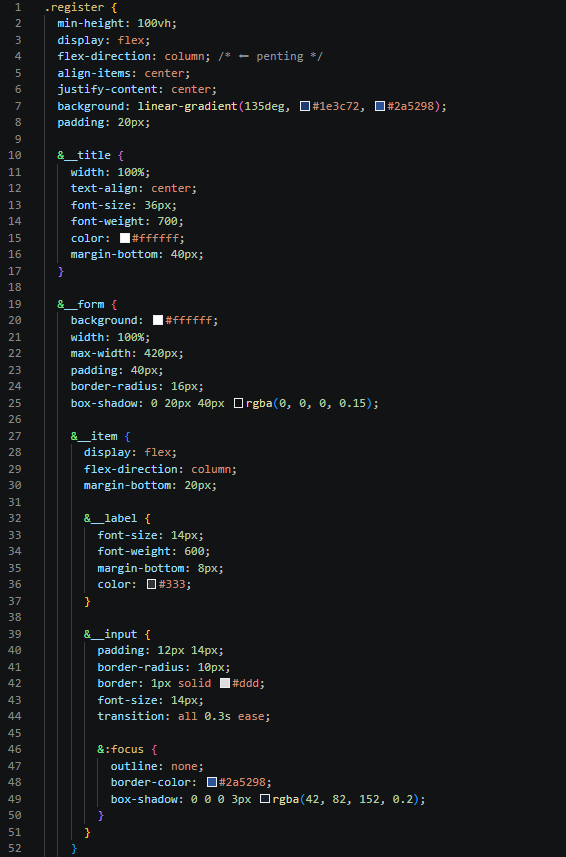

  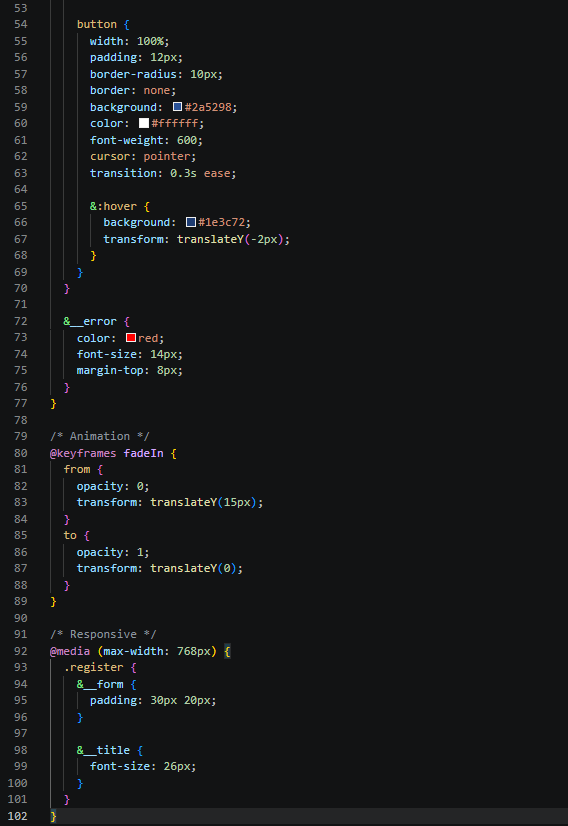

- Tambahkan form inputan pada file index.tsx ( pada folder views/auth/register/index.tsx ) Form berisi:
  - Email

    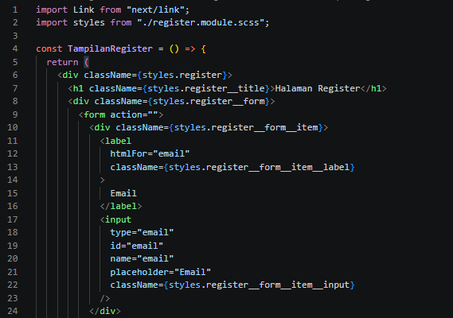

  - Full Name

    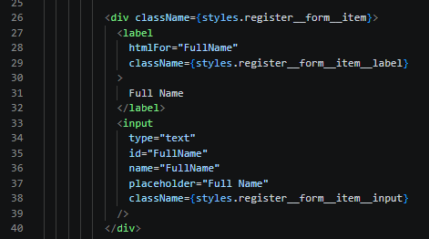

  - Password

    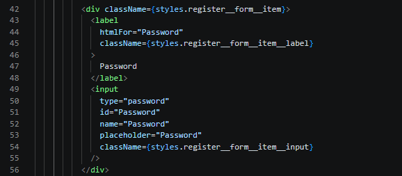

  - Button Register

    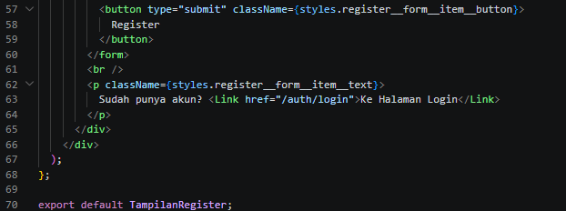

- Jalankan browsernya http://localhost:3000/auth/register sehingga tampilan sebagai
  berikut

  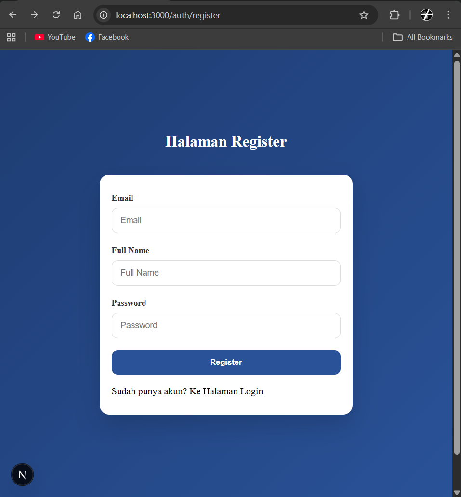

## 2. Membuat API Register

- Buka file servicefirebase.ts pada folder src/utils/db dan modifikasi

  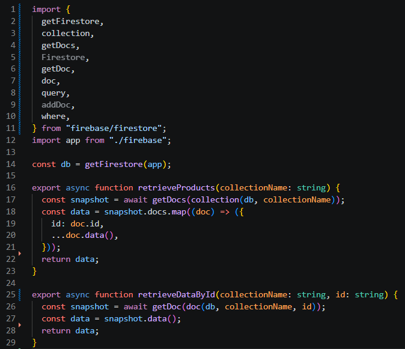

  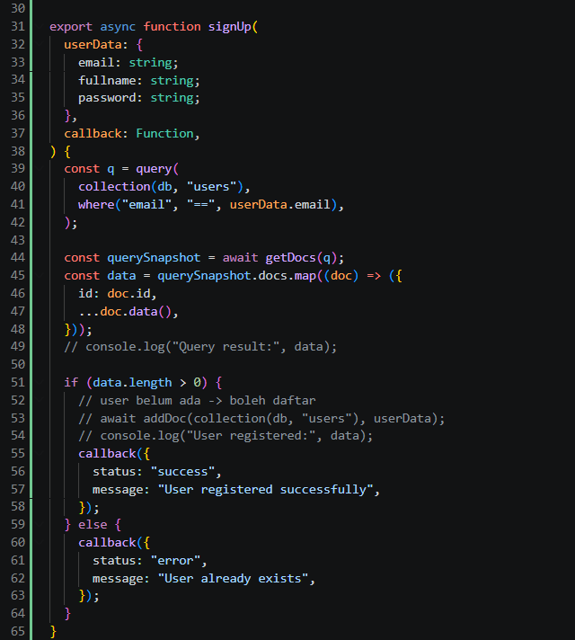

- Buat file register.ts pada folder api

  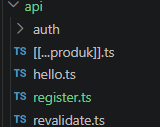

- Modifikasi file register.ts

  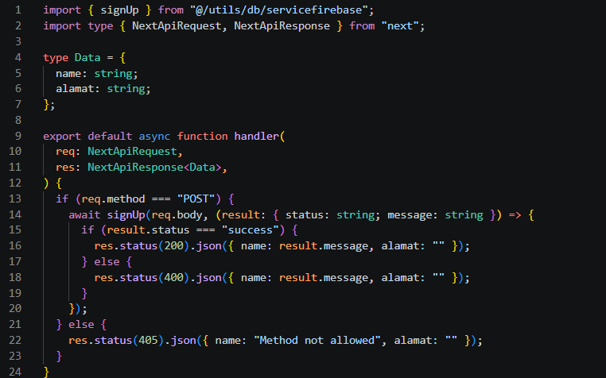

- Modifikasi index.tsx pada folder register ( tambahkan beberapa code)

  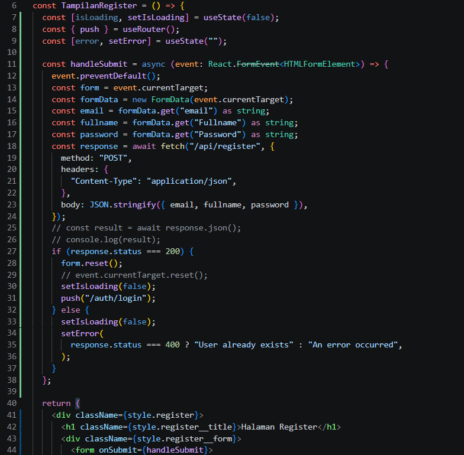

- Buka browser http://localhost:3000/auth/register isikan data dan klik register. Jika berhasil maka akan masuk ke menu login

  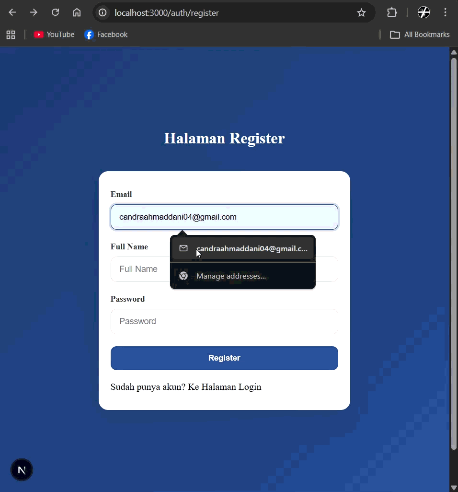

