# Jobsheet 14

## 1. Membuat Register View

- Buat folder pada views dengan nama register dan tambahkan 2 file yaitu index.tsx dan register.module.scss

  

- Buka file register.tsx pada folder auth/register.tsx dan modifikasi file register.tsx ( pada folder pages/auth/register.tsx )

  

- Modifikasi register.module.scss

  

  

- Tambahkan form inputan pada file index.tsx ( pada folder views/auth/register/index.tsx ) Form berisi:
  - Email

    

  - Full Name

    

  - Password

    

  - Button Register

    

- Jalankan browsernya http://localhost:3000/auth/register sehingga tampilan sebagai
  berikut

  

## 2. Membuat API Register

- Buka file servicefirebase.ts pada folder src/utils/db dan modifikasi

  

  

- Buat file register.ts pada folder api

  

- Modifikasi file register.ts

  

- Modifikasi index.tsx pada folder register ( tambahkan beberapa code)

  

- Buka browser http://localhost:3000/auth/register isikan data dan klik register. Jika berhasil maka akan masuk ke menu login

  

## 3. Install bcrypt

- npm install bcrypt --force

  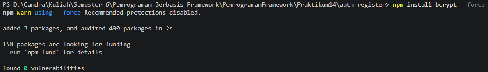

- npm install --save-dev @types/bcrypt –force

  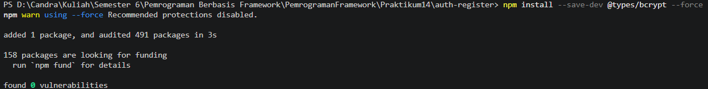

- Buka file servicefirebase.ts pada folder src/utils/db dan modifikasi

  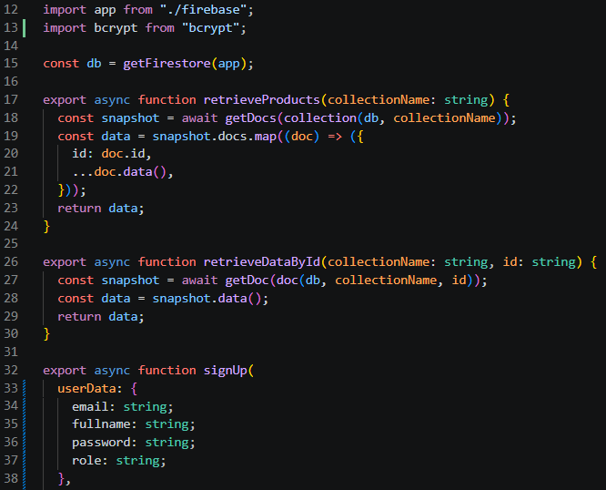

  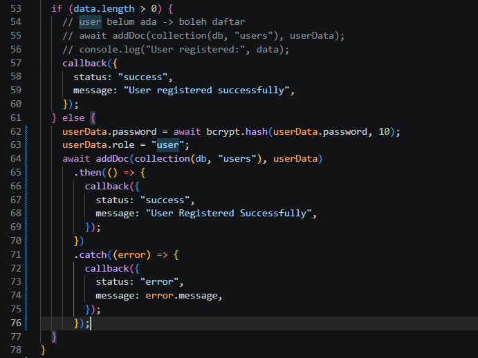

- Jalankan browser http://localhost:3000/auth/register dan input data setelah itu klik register

  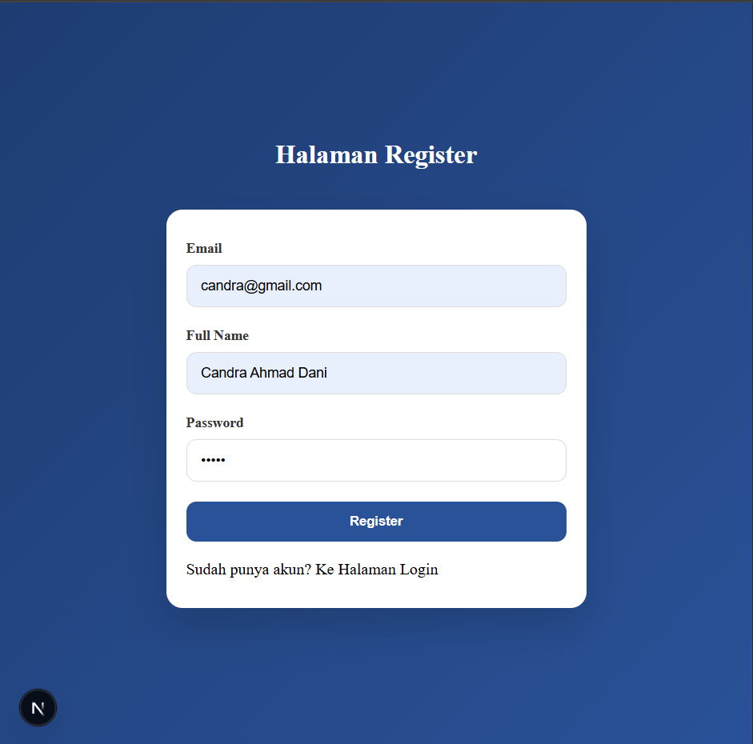

- Buka pada firebase jika berhasil maka data register akan masuk

  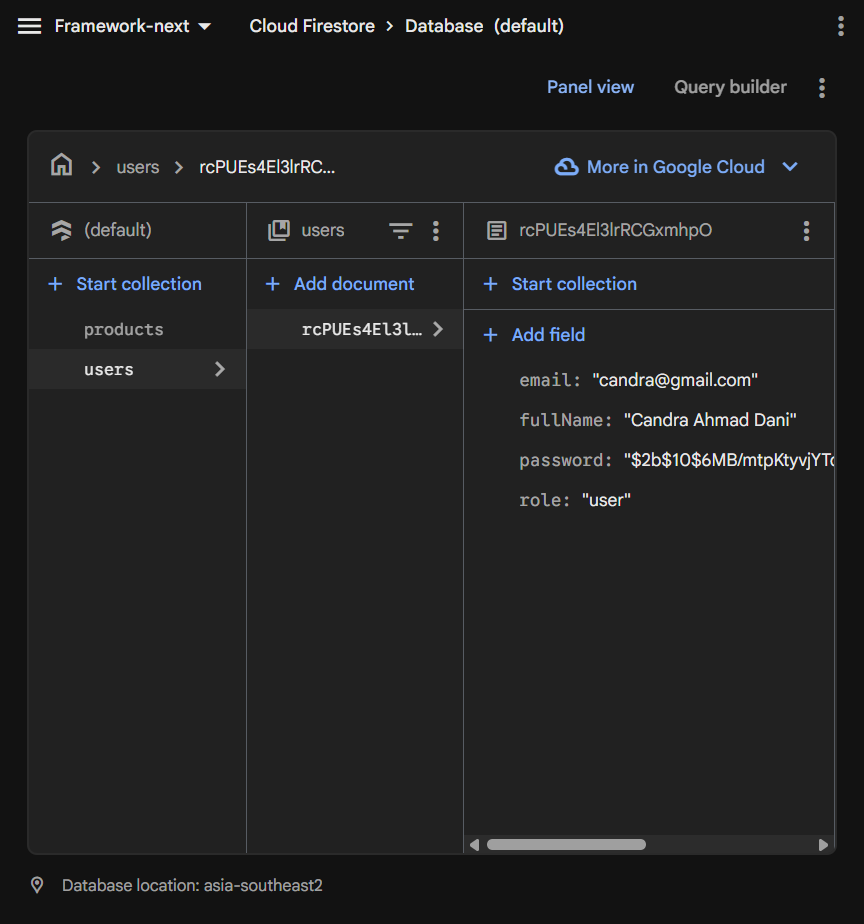

- Jika user memasukkan data yang sama sistem tidak akan memproses tetapi permasalahannya user memasukkan data yang sama tidak ada pemberitahuan pada layar maka dari itu perlu ada perubahan pada code index.tsx pada folder views/auth/register
  - Line 41

    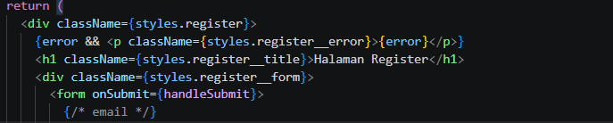

  - Line 94 dan 96

    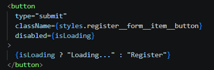

  - Line 34 rubah menjadi email

    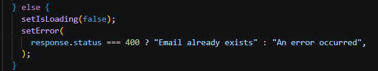

- Modifikasi juga pada register.module.scss

  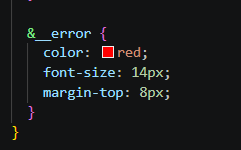

- Jika berhasil maka hasilnya seperti berikut

  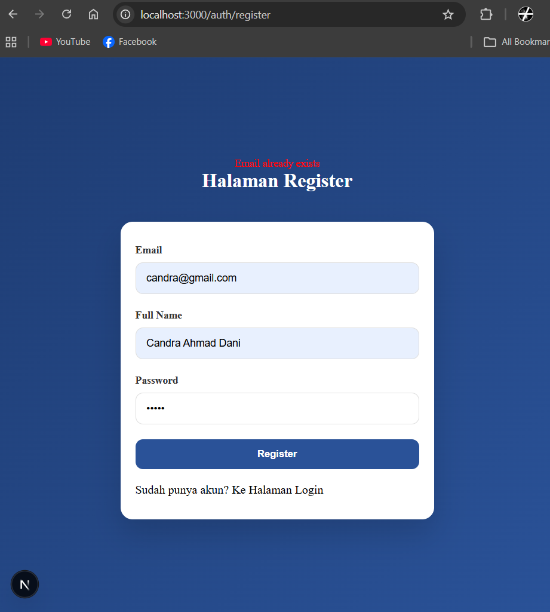

- Tambakan loading dengan menambahkan kode pada index.tsx

  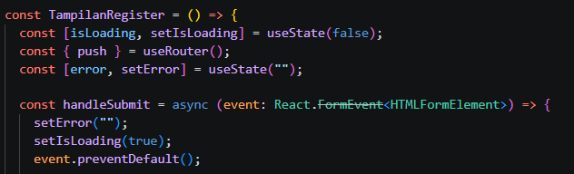

- Jika berhasil maka hasilnya akan muncul loading saat klik register

## Pengujian

### 1 – Register Baru

- Email baru

  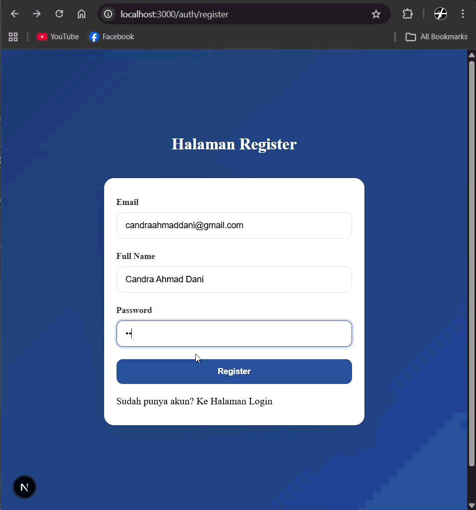

- Hasil data tersimpan di Firestore, password ter-hash, redirect ke login

### 2 – Email Sudah Ada

- Email yang sama

  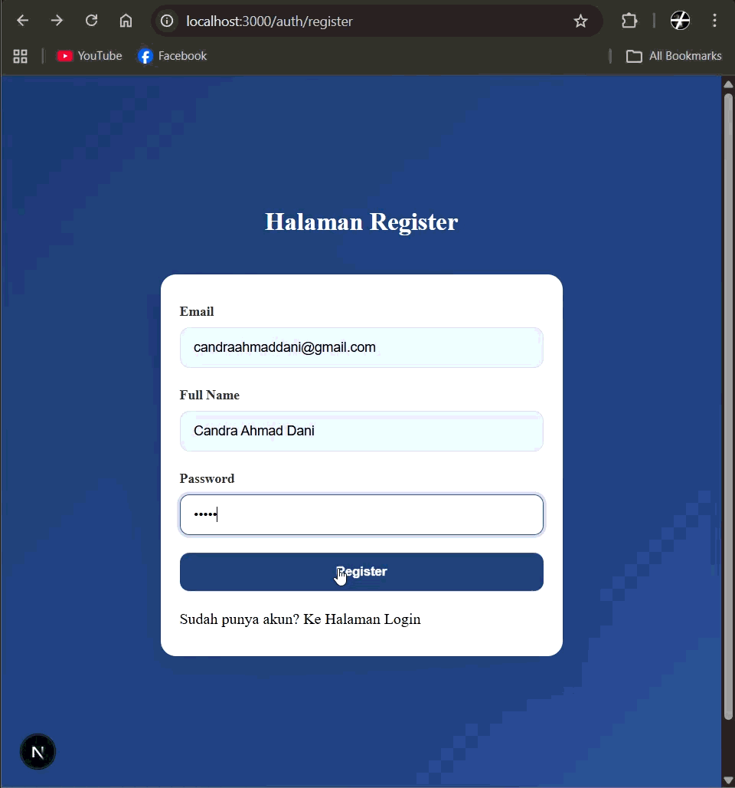

- Hasil Error 400 & Message: Email already exists

### 3 – Method GET

- Akses /api/register

  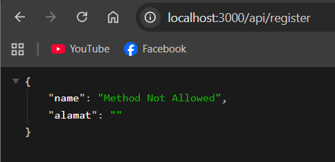

- Hasil 405 Method Not Allowed

## Tugas Praktikum

1. Implementasikan register terhubung database. Sudah
2. Tambahkan validasi:

- Email wajib

  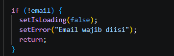

- Password minimal 6 karakter

  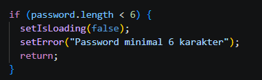

3. Tambahkan role default "member".

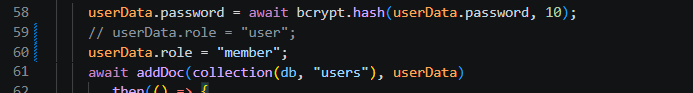

4. Tampilkan pesan error di UI.

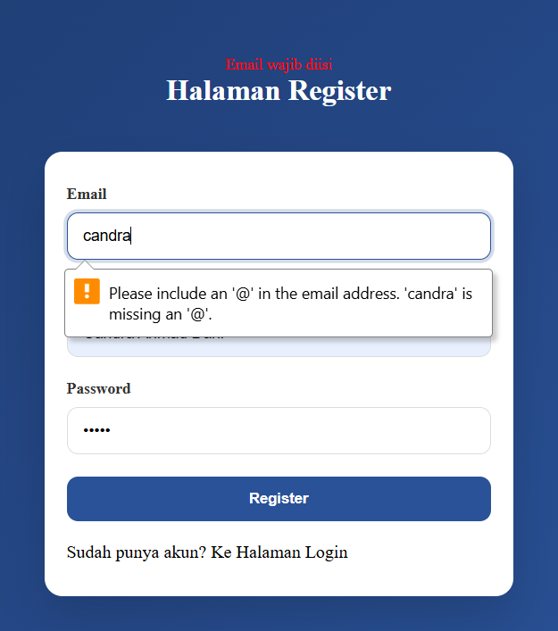

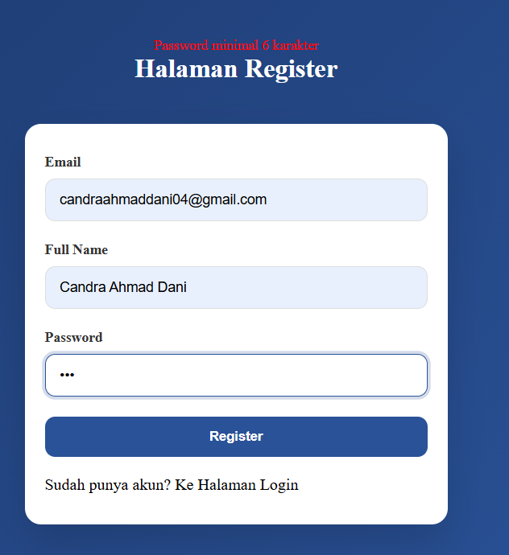

5. Screenshot hasil Register sukses, Email sudah ada Database Firestore

## Pertanyaan Analisis

1. Mengapa password harus di-hash?

   Password harus di-hash agar tidak tersimpan dalam bentuk asli, sehingga lebih aman jika database bocor.

2. Apa perbedaan addDoc dan setDoc?

   addDoc otomatis membuat ID dokumen baru, sedangkan setDoc bisa menentukan ID sendiri atau menimpa data yang sudah ada.

3. Mengapa perlu validasi method POST?

   Validasi method POST diperlukan agar API hanya menerima request yang sesuai (misalnya untuk kirim data), sehingga lebih aman dan terkontrol.

4. Apa risiko jika email tidak dicek unik?

   Jika email tidak dicek unik, bisa terjadi duplikasi akun dan konflik data saat login atau identifikasi user.

5. Apa fungsi role pada user?

   Role pada user berfungsi untuk mengatur hak akses, misalnya membedakan admin dan user biasa.
