# Jobsheet 15

## 1. Custom Login Page

- Tambahkan custom page di NextAuth

  

  

- Jalankan browser http://localhost:3000/ dan klik sign in maka akan diarahkan ke login

  

## 2. Handle Login di Frontend

- Copy paste isi dari register/index.tsx ke file login/index.tsx

  

- Copy paste isi dari register/register.module.scss ke file login/login.module.scss

- Semua text register pada file index.tsx pada folder login diubah menjadi login

  

- Jangan lupa setting link hrefnya

  

- Lakukan hal yang sama pada file login.module.scss rubah text register menjadi login

  

- Cek pada file login.tsx pada pages/auth

  

  

- Jalankan browser localhost:3000/auth/login. Tampilannya akan sama dengan register

  

- Pada tampilan login kita tidak perlu hapus fullname jadi pada folder views/auth/login/index.tsx hapus fullname

  

  Sehingga hasilnya seperti berikut :

  

- Buka file index.tsx pada folder views/auth/login dan modifikasi codenya seperti berikut

  

- Buka file servicefirebase.ts dan tambahkan code

  

## 3. Authorize di NextAuth (Database Login)

- Buka file [...nextauth].ts modifikasi menjadi berikut ( pada bagian providers )

  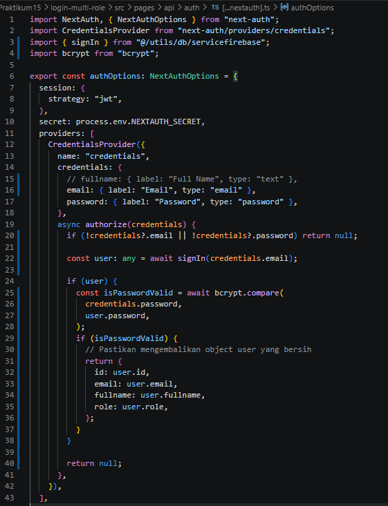

## 4. Tambahkan Role ke Token

- JWT Callback pada file [...nextauth].ts Modifikasi menjadi

  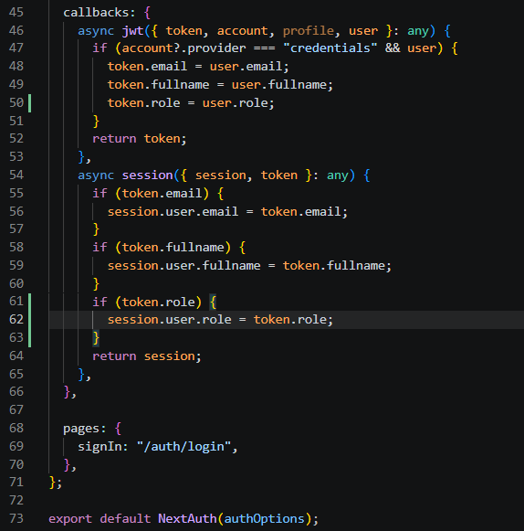

- Jalankan browser http://localhost:3000/auth/login

  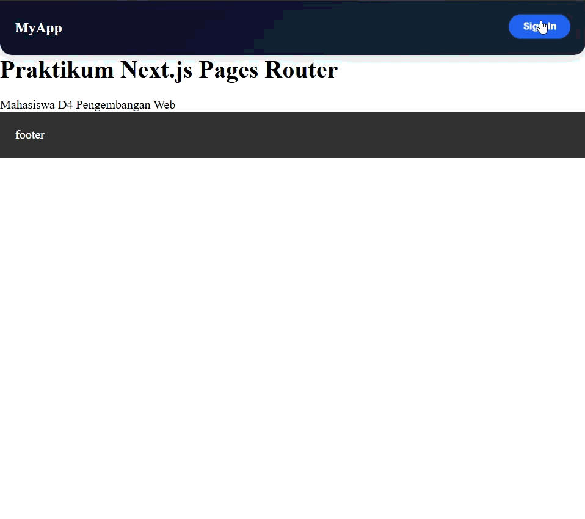

## 5. Callback URL Logic

- Modifikasi withAuth.ts pada folder src/middleware

  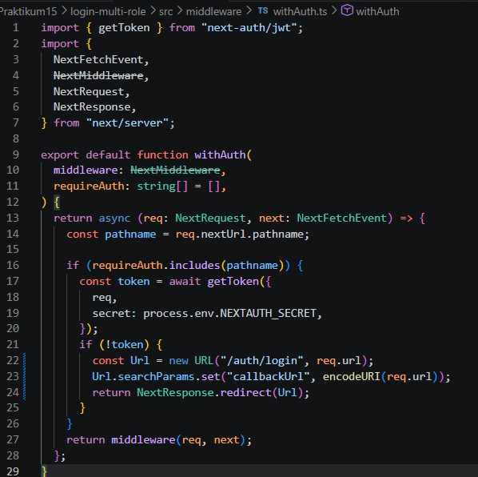

  Tujuannya setelah login, user kembali ke halaman sebelumnya.

## 6. Membuat halaman Admin dan authorize

- Buat halaman admin

  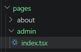

- Pada index.tsx tambahkan code berikut

  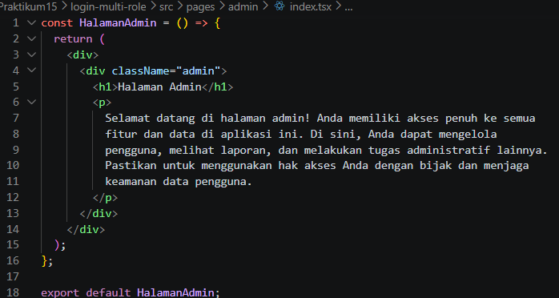

- Modifikasi withAuth.ts

  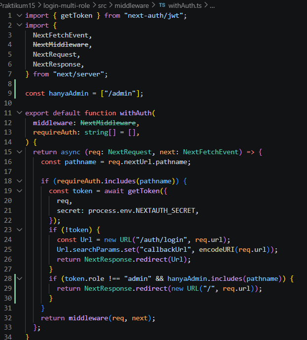

- Jalankan browser localhost:3000/produk dan pada status sudah login. Rubah urlnya menjadi http://localhost:3000/admin maka user akan diarahkan ke localhost. Pada intinya role selain admin tidak bisa mengakses

  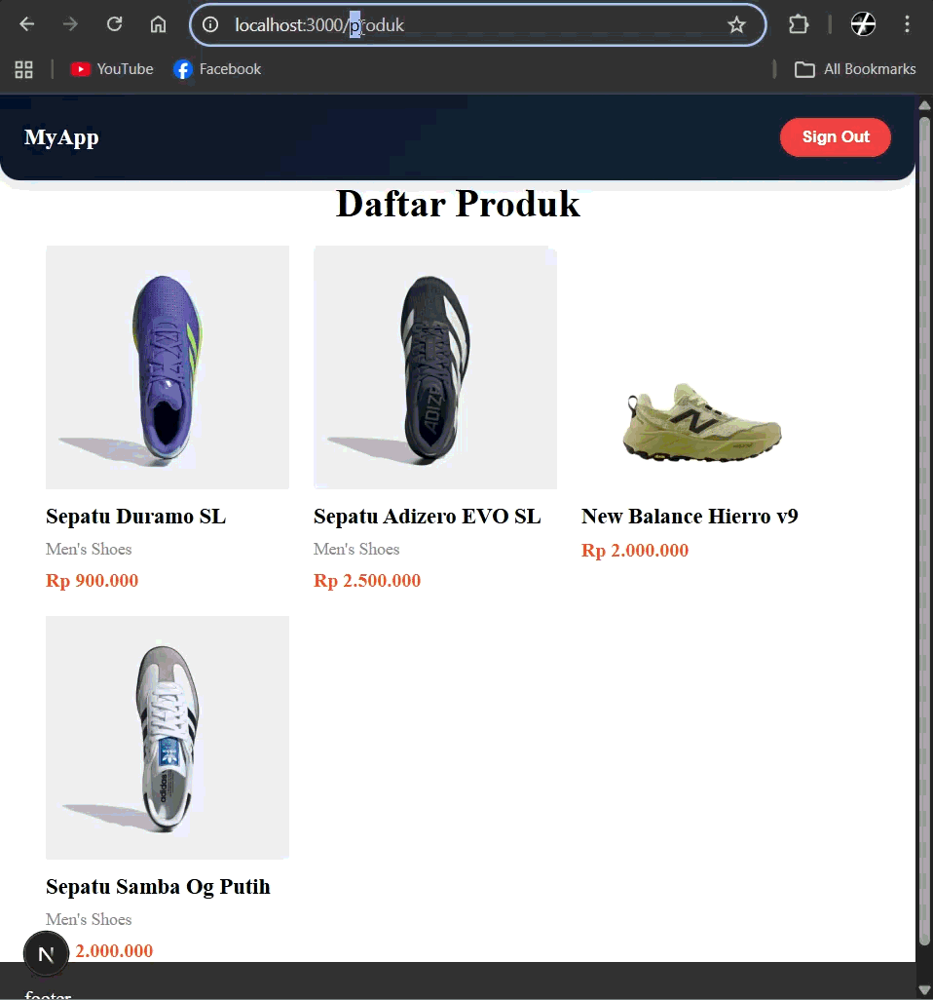

- Untuk mencoba halaman admin rubah role pada firebas pada salah satu akun dan jalankan http://localhost:3000/admin

  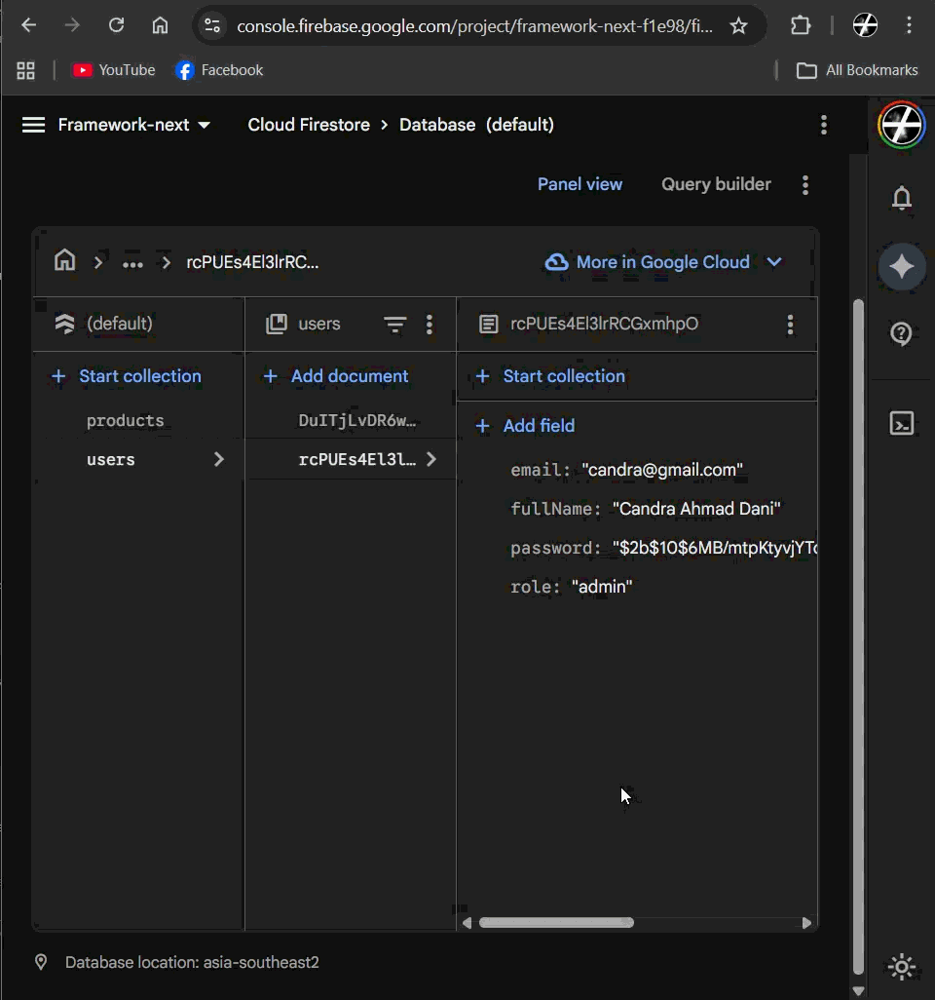

## Pengujian

### Uji 1 – Login Valid

Input:

- Email benar
- Password benar

  Hasil:

- Login berhasil
- Redirect sesuai callbackUrl

  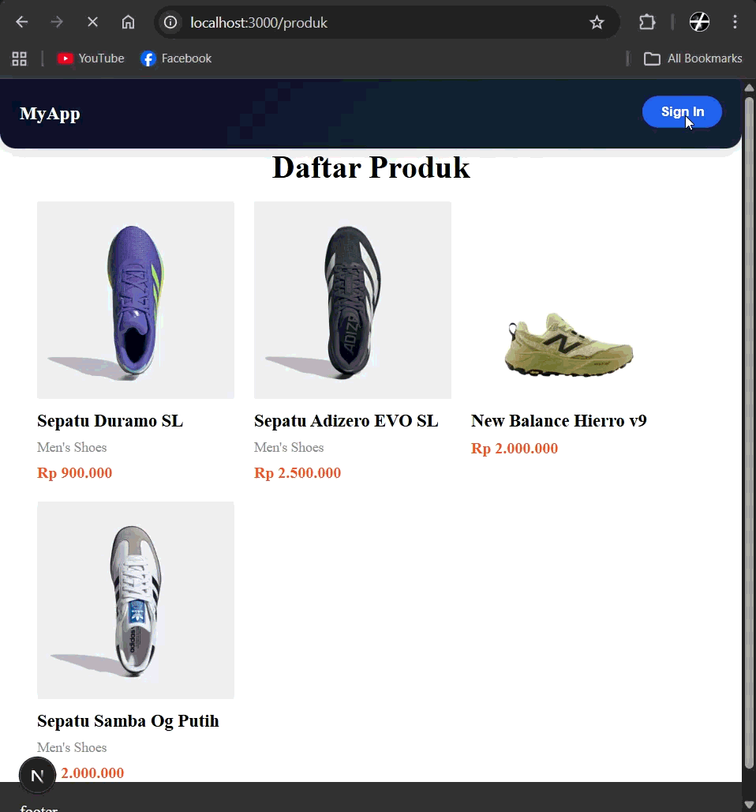

### Uji 2 – Password Salah

Input:

- Email benar
- Password salah

  Hasil:

- Error message tampil
- Tidak login

  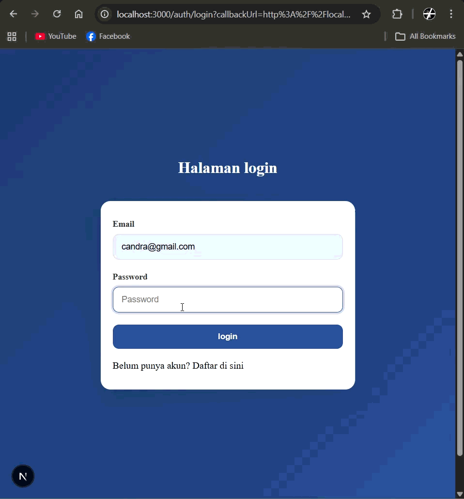

### Uji 3 – Akses Admin sebagai User

Login sebagai:

- role: user
  Akses:
  /admin

  Hasil:

- Redirect ke home

  

### Uji 4 – Akses Admin sebagai Admin

Login sebagai:

- role: admin
  Akses:
  /admin

  Hasil:

- Bisa masuk halaman admin

  

## Pertanyaan Analisis

1. Mengapa password harus diverifikasi dengan bcrypt.compare?

   Password harus diverifikasi dengan bcrypt.compare karena password di database disimpan dalam bentuk hash, bukan teks asli, sehingga perlu dibandingkan secara aman tanpa mengubah hash tersebut; selain itu bcrypt juga melindungi dari serangan seperti brute force dengan mekanisme salt.

2. Mengapa role disimpan di token?

   Role disimpan di token agar informasi hak akses user bisa langsung digunakan di setiap request tanpa perlu query ulang ke database, sehingga proses autentikasi dan otorisasi menjadi lebih cepat dan efisien.

3. Apa fungsi callbackUrl?

   callbackUrl berfungsi untuk menentukan ke halaman mana user akan diarahkan setelah login berhasil, sehingga user bisa kembali ke halaman yang sebelumnya ingin diakses.

4. Mengapa middleware penting untuk security?

   Middleware penting untuk security karena berjalan sebelum halaman diakses, sehingga bisa memblokir user yang belum login atau tidak memiliki izin sebelum konten ditampilkan, membuat sistem lebih aman dibanding pengecekan di client.

5. Apa risiko jika role tidak dicek di middleware?

   Jika role tidak dicek di middleware, maka user bisa mengakses halaman yang seharusnya terbatas (misalnya halaman admin), sehingga berpotensi terjadi kebocoran data atau penyalahgunaan fitur.
