# Jobsheet 15

## 1. Custom Login Page

- Tambahkan custom page di NextAuth

  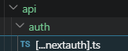

  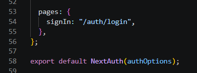

- Jalankan browser http://localhost:3000/ dan klik sign in maka akan diarahkan ke login

  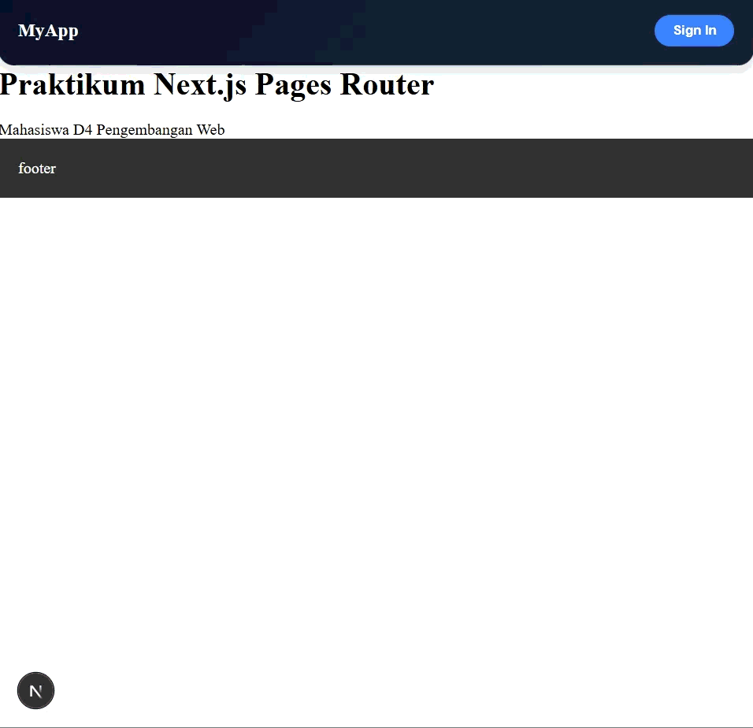

## 2. Handle Login di Frontend

- Copy paste isi dari register/index.tsx ke file login/index.tsx

  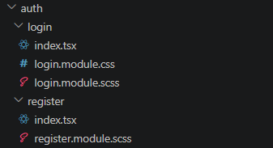

- Copy paste isi dari register/register.module.scss ke file login/login.module.scss

- Semua text register pada file index.tsx pada folder login diubah menjadi login

  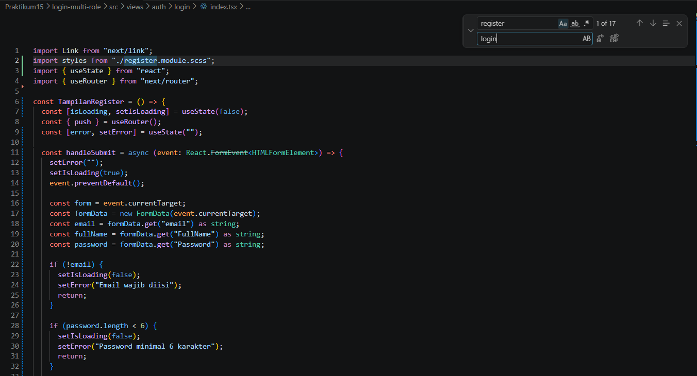

- Jangan lupa setting link hrefnya

  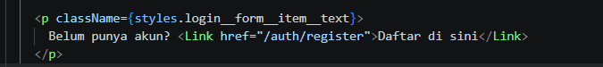

- Lakukan hal yang sama pada file login.module.scss rubah text register menjadi login

  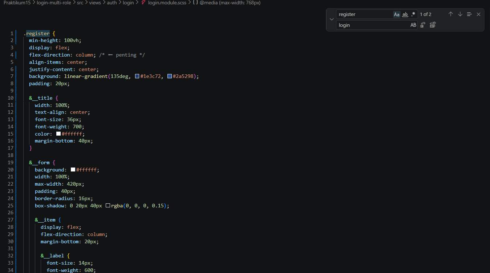

- Cek pada file login.tsx pada pages/auth

  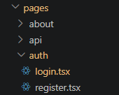

  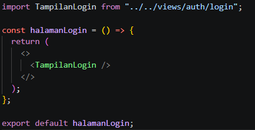

- Jalankan browser localhost:3000/auth/login. Tampilannya akan sama dengan register

  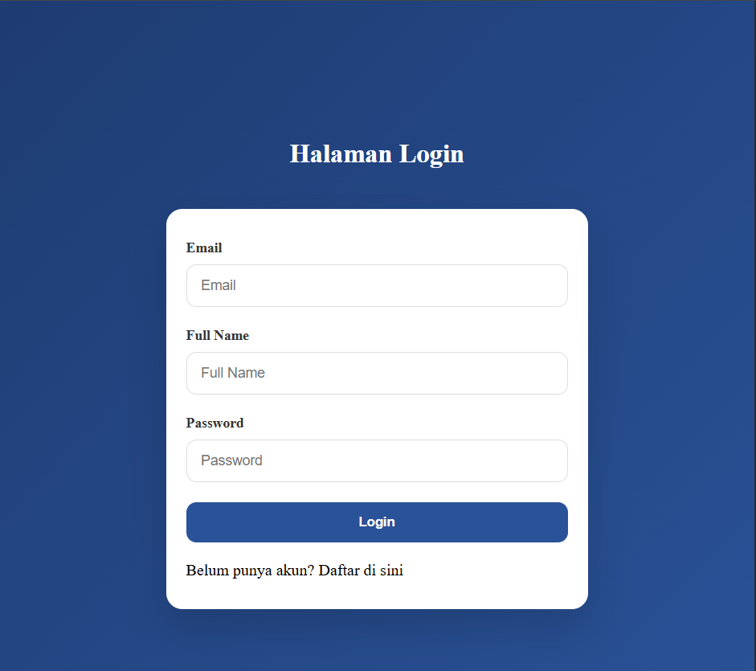

- Pada tampilan login kita tidak perlu hapus fullname jadi pada folder views/auth/login/index.tsx hapus fullname

  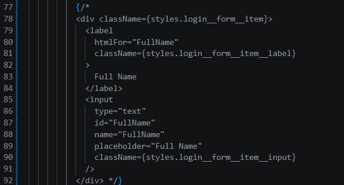

  Sehingga hasilnya seperti berikut :

  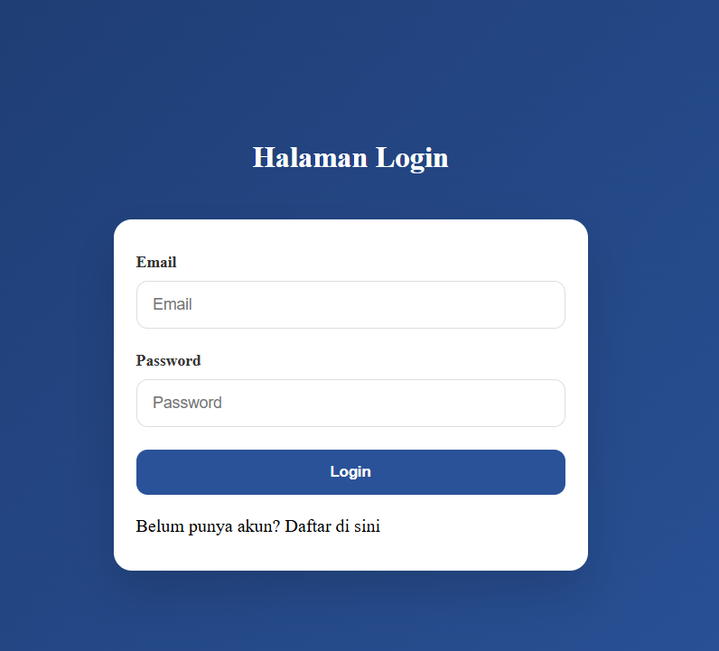

- Buka file index.tsx pada folder views/auth/login dan modifikasi codenya seperti berikut

  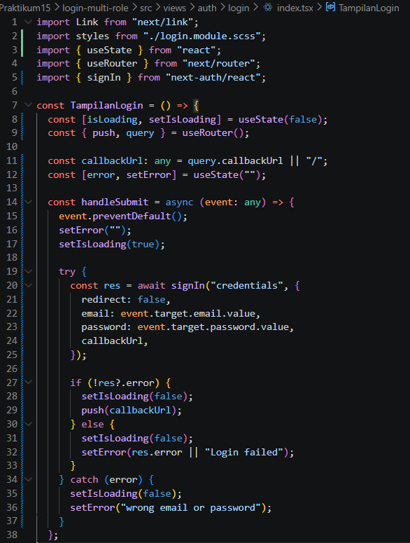

- Buka file servicefirebase.ts dan tambahkan code di line 25-38

  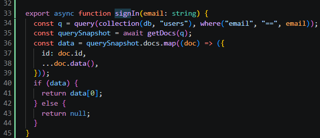

