# Jobsheet 17

# 1. Image Optimization

## A. Optimasi Gambar Lokal (Public Folder)

- Studi Kasus:\*\* Mengganti tag `` pada halaman 404 dengan `next/image` Langkah:

1.  Buka file `src/pages/404.tsx`

    

2.  Modifikasi line 7 menjadi line 8-11

    

**Hasil:**

- Warning hilang
- Image dioptimasi otomatis
- Mengurangi bandwidth
- Mendukung lazy loading otomatis

## B. Optimasi Gambar Remote (External URL)

**Langkah:**

1. Buka file `views/product/index.tsx`

   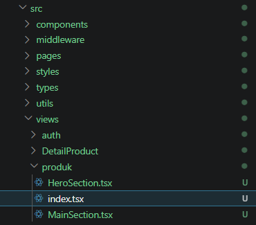

2. Modifikasi file `index.tsx`

   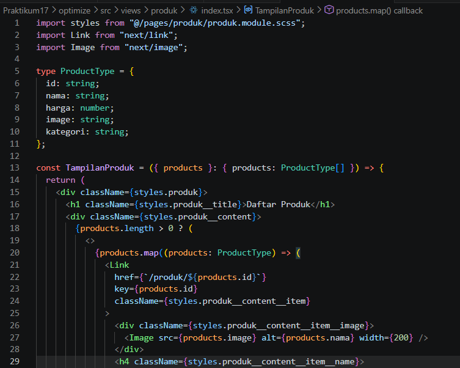

3. Buka file `next.config.js` (konfigurasi berbeda karena gambar dari URL eksternal)

   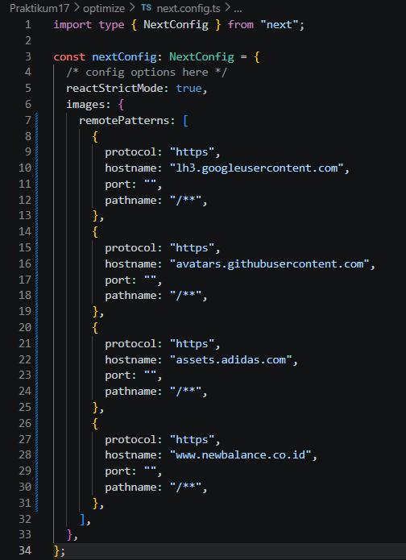

**Hasil:**

- Gambar di-proxy melalui `/_next/image`
- Performa lebih optimal
- Kompresi otomatis

---

# PRAKTIKUM 2 – Font Optimization

## A. Menggunakan next/font

**Langkah:**

1. Buka file `Appshell/index.tsx` dan modifikasi untuk menggunakan `next/font`

   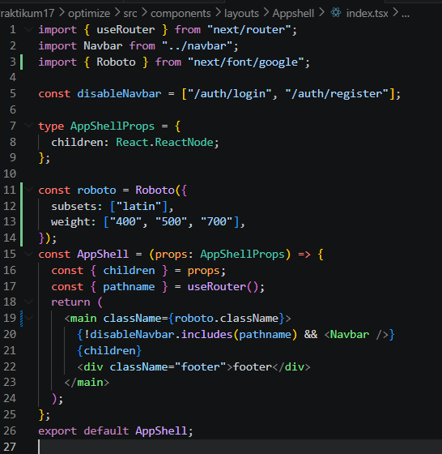

2. Jalankan browser `localhost:3000/produk` (font berubah menjadi Roboto)

   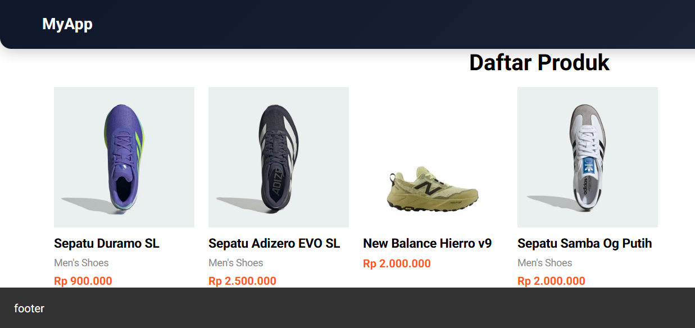

**Tips:** Gunakan extension FontFinder untuk mengecek font

**Hasil:**

- Tidak perlu load dari CDN manual
- Tidak blocking render
- Performance meningkat
- Tidak terjadi FOUT (Flash of Unstyled Text)

---

# PRAKTIKUM 3 – Script Optimization

## B. Menggunakan next/script

**Langkah:**

1. Buka file `layouts/Navbar/index.tsx` dan modifikasi

   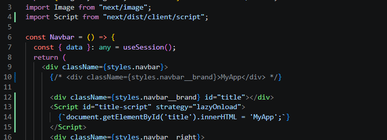

**Catatan:** Saat refresh web produk, tulisan "myApp" akan terlihat berkedip

### Perbedaan Line 11-13 vs Line 15-18

| Aspek         | Line 11-13 (Standard React/JSX) | Line 15-18 (Next.js Script)     |
| ------------- | ------------------------------- | ------------------------------- |
| **Rendering** | Teks "MyApp" langsung di HTML   | Teks disuntikkan via JavaScript |
| **SEO**       | Baik (terbaca crawler)          | ✗ Kurang baik (JS-dependent)    |
| **Keamanan**  | Aman (escape otomatis)          | ⚠ Risiko XSS (.innerHTML)       |
| **Performa**  | Render blocking                 | LazyOnload (akhir loading)      |

## C. Strategi Script

| Strategy            | Fungsi                     |
| ------------------- | -------------------------- |
| `beforeInteractive` | Sebelum halaman interaktif |
| `afterInteractive`  | Setelah halaman interaktif |
| `lazyOnload`        | Setelah semua selesai      |
| `worker`            | Web worker                 |

**Hasil:**

- Script tidak blocking
- Cocok untuk Google Analytics
- Performa lebih ringan

---

# PRAKTIKUM 4 – Optimasi Avatar dengan next/image

**Langkah:**

1. Buka file `layouts/navbar/index.tsx`

   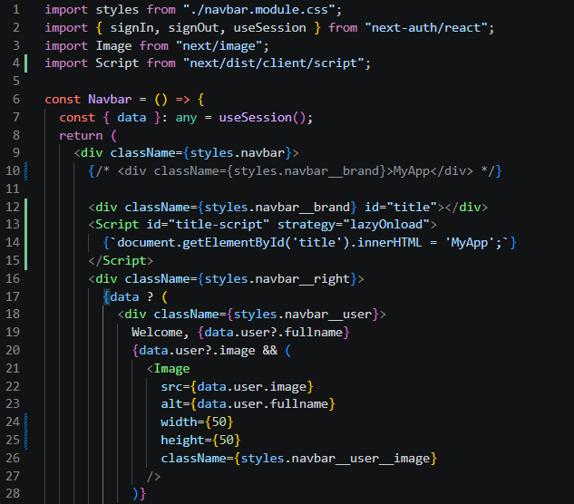

2. Modifikasi dan tambahkan hostname Google

   

---

# Tugas Praktikum

1.  Optimasi semua image di project menggunakan `next/image`

    Sudah dilakukan di halaman 404, produk dan navbar.

2.  Gunakan minimal 1 font dari `next/font`

    Sudah diterapkan di Appshell menggunakan font Roboto

3.  Tambahkan script Google Analytics menggunakan `next/script`

    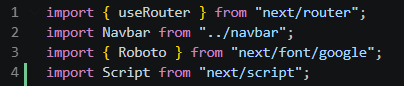

    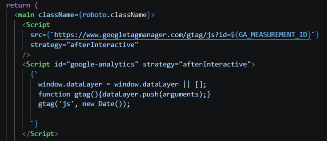

4.  Terapkan dynamic import pada minimal 1 komponen

    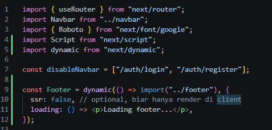

    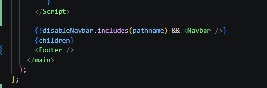

5.  Dokumentasikan perubahan performa (screenshot Lighthouse)

    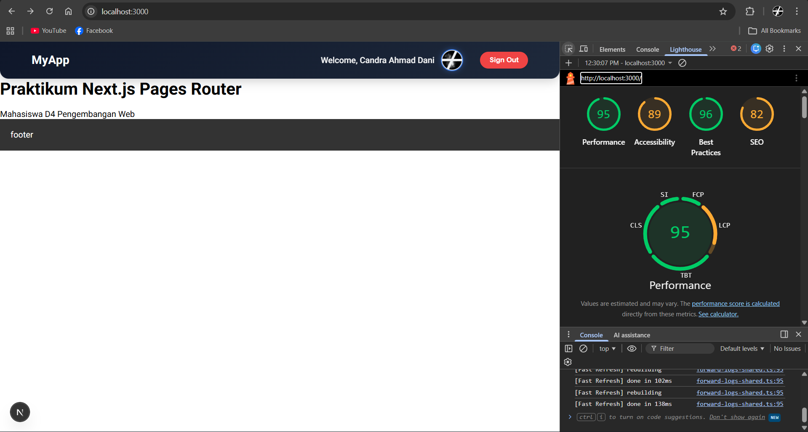

---

# Refleksi & Diskusi

1. Mengapa `` biasa tidak optimal?

    biasa tidak optimal karena tidak memiliki fitur optimasi otomatis seperti resize sesuai device, lazy loading bawaan, dan kompresi gambar. Akibatnya, gambar bisa terlalu besar dan memperlambat loading halaman, terutama di jaringan lambat.

2. Apa perbedaan font CDN dan `next/font`?

   Font CDN mengambil font dari server eksternal sehingga butuh request tambahan dan bisa menyebabkan delay (FOIT/FOUT), sedangkan next/font mengunduh dan meng-host font secara lokal sehingga lebih cepat, stabil, dan teroptimasi otomatis oleh Next.js.

3. Mengapa script bisa membuat website lambat?

   Script bisa membuat website lambat karena dijalankan di browser (main thread). Jika script besar atau blocking, maka rendering halaman akan tertunda, sehingga halaman terasa lama muncul atau tidak responsif.

4. Kapan harus menggunakan dynamic import?

   Dynamic import digunakan saat komponen tidak perlu dimuat di awal, misalnya komponen berat (chart, editor, footer tertentu) atau yang hanya muncul di kondisi tertentu, agar initial load lebih ringan dan performa lebih baik.

5. Apa dampak bundle size terhadap UX?

   Bundle size yang besar membuat waktu download dan parsing JavaScript lebih lama, sehingga halaman lebih lambat tampil dan interaksi terasa delay, yang akhirnya menurunkan pengalaman pengguna (UX).
