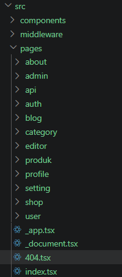
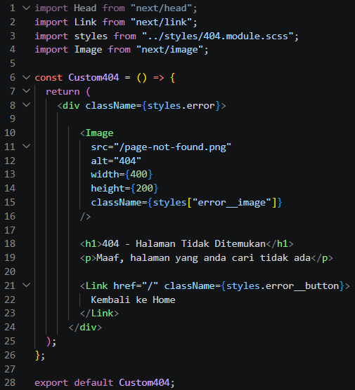

# 1. Image Optimization

## A. Optimasi Gambar Lokal (Public Folder)

- Studi Kasus:\*\* Mengganti tag `` pada halaman 404 dengan `next/image` Langkah:

1.  Buka file `src/pages/404.tsx`

    

2.  Modifikasi line 7 menjadi line 8-11

    

    Hasil:

- Warning hilang
- Image dioptimasi otomatis
- Mengurangi bandwidth
- Mendukung lazy loading otomatis

## B. Optimasi Gambar Remote (External URL)

**Langkah:**

1. Buka file `views/product/index.tsx`
2. Modifikasi file `index.tsx`
3. Buka file `next.config.js` (konfigurasi berbeda karena gambar dari URL eksternal)

**Hasil:**

- Gambar di-proxy melalui `/_next/image`
- Performa lebih optimal
- Kompresi otomatis

---

# PRAKTIKUM 2 – Font Optimization

## A. Menggunakan next/font

**Langkah:**

1. Buka file `Appshell/index.tsx`
2. Modifikasi untuk menggunakan `next/font`
3. Jalankan browser `localhost:3000/produk` (font berubah menjadi Roboto)

**Tips:** Gunakan extension FontFinder untuk mengecek font

**Hasil:**

- Tidak perlu load dari CDN manual
- Tidak blocking render
- Performance meningkat
- Tidak terjadi FOUT (Flash of Unstyled Text)

---

# PRAKTIKUM 3 – Script Optimization

## B. Menggunakan next/script

**Langkah:**

1. Buka file `layouts/Navbar/index.tsx`
2. Modifikasi line 11 menggunakan TypeScript

**Catatan:** Saat refresh web produk, tulisan "myApp" akan terlihat berkedip

### Perbedaan Line 11-13 vs Line 15-18

| Aspek         | Line 11-13 (Standard React/JSX) | Line 15-18 (Next.js Script)     |
| ------------- | ------------------------------- | ------------------------------- |
| **Rendering** | Teks "MyApp" langsung di HTML   | Teks disuntikkan via JavaScript |
| **SEO**       | Baik (terbaca crawler)          | ✗ Kurang baik (JS-dependent)    |
| **Keamanan**  | Aman (escape otomatis)          | ⚠ Risiko XSS (.innerHTML)       |
| **Performa**  | Render blocking                 | LazyOnload (akhir loading)      |

## C. Strategi Script

| Strategy            | Fungsi                     |
| ------------------- | -------------------------- |
| `beforeInteractive` | Sebelum halaman interaktif |
| `afterInteractive`  | Setelah halaman interaktif |
| `lazyOnload`        | Setelah semua selesai      |
| `worker`            | Web worker                 |

**Hasil:**

- Script tidak blocking
- Cocok untuk Google Analytics
- Performa lebih ringan

---

# PRAKTIKUM 4 – Optimasi Avatar dengan next/image

**Langkah:**

1. Buka file `layouts/navbar/index.tsx`
2. Modifikasi dan tambahkan hostname Google

---

# Tugas Praktikum

1. Optimasi semua image di project menggunakan `next/image`
2. Gunakan minimal 1 font dari `next/font`
3. Tambahkan script Google Analytics menggunakan `next/script`
4. Terapkan dynamic import pada minimal 1 komponen
5. Dokumentasikan perubahan performa (screenshot Lighthouse)

---

# Refleksi & Diskusi

1. Mengapa `` biasa tidak optimal?
2. Apa perbedaan font CDN dan `next/font`?
3. Mengapa script bisa membuat website lambat?
4. Kapan harus menggunakan dynamic import?
5. Apa dampak bundle size terhadap UX?
