# Jobsheet 18

## PRAKTIKUM 1: Setup Jest di Next.js

### Install Dependencies

```bash
npm install jest jest-environment-jsdom @testing-library/react @testing-library/jest-dom --save-dev --force
```

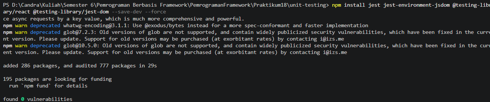

### Buat File Konfigurasi

**Dokumentasi:** https://nextjs.org/docs/pages/guides/testing/jest

- Buat file: `jest.config.mjs`

  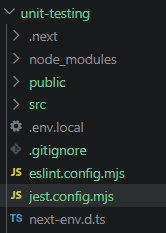

  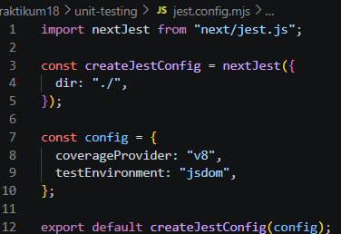

- Tambahkan script di `package.json`

  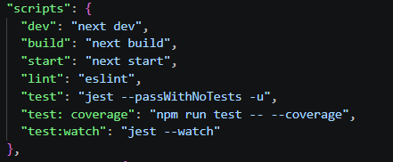

---

## PRAKTIKUM 2: Struktur Folder Testing

```
src/
├── pages/
├── components/
├── views/
└── __test__/
    ├── pages/
    └── components/
```

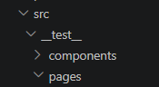

---

## PRAKTIKUM 3: Testing Halaman About

### Buat File Testing

- File: `src/__test__/pages/about.spec.tsx`

  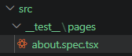

- Contoh Testing Snapshot. Pada about.spec.tsx tambahkan code berikut :

  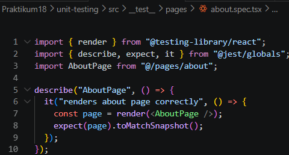

### Jalankan Testing

```bash
npm run test
```

**Output:** `PASS about.spec.tsx`

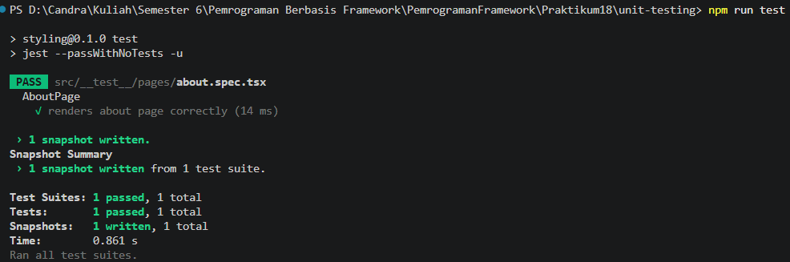

## PRAKTIKUM 4: Coverage Report

```bash
npm run test:coverage
```

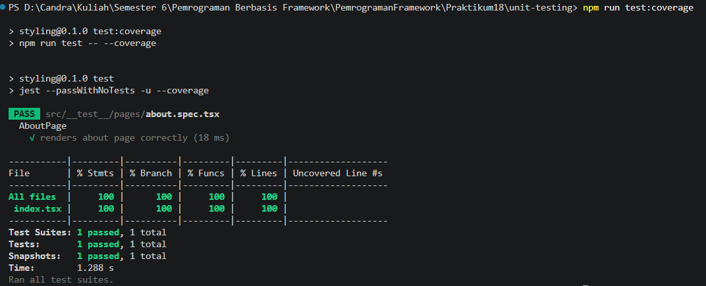

Buka: `coverage/lcov-report/index.html`

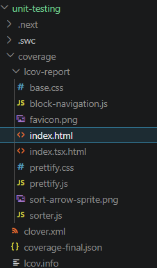

**Target industri:** ≥80% coverage

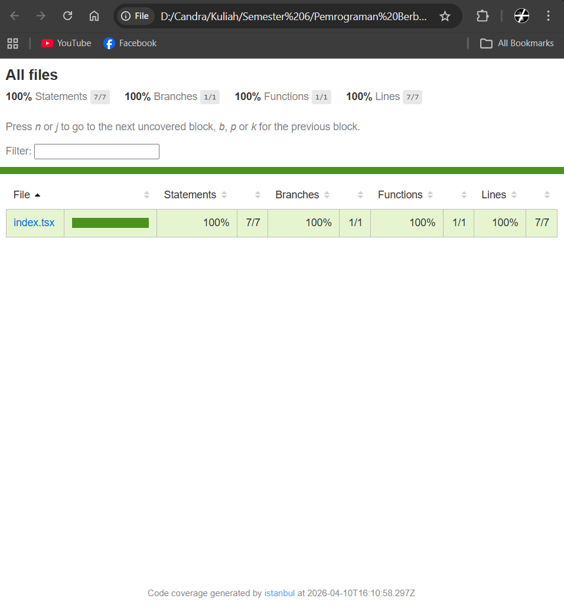

---

## PRAKTIKUM 5: Konfigurasi Coverage Lengkap

Update `jest.config.mjs` dan jalankan:

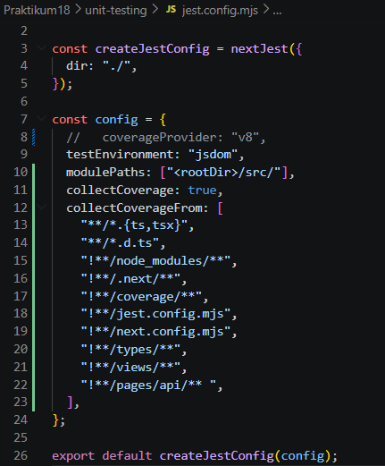

```bash
npm run test:coverage
```

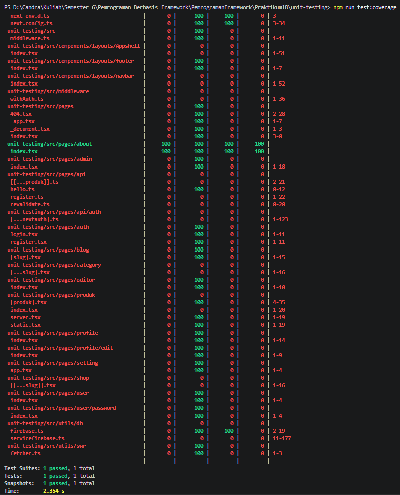

---

## PRAKTIKUM 6: Testing dengan getByTestId

1. Tambahkan pada About Page:

```jsx
<h1 data-testid="title">About Page</h1>
```

2. Update testing di `about.spec.tsx` dengan `getByTestId()`

---

## PRAKTIKUM 7: Testing dengan Router (Mocking)

Mock Next Router untuk mengatasi error "NextRouter was not mounted"

---

## PRAKTIKUM 8: Menangani Undefined Data

Tangani undefined properties untuk menghindari error pada coverage

---

## Analisis Coverage

| Metric     | Target |
| ---------- | ------ |
| Statements | ≥80%   |
| Branch     | ≥80%   |
| Functions  | ≥80%   |
| Lines      | ≥80%   |

---

## Tugas Praktikum

1. Buat unit test untuk halaman Product dan 1 komponen
2. Gunakan:
   - Min. 1 snapshot test
   - Min. 1 toBe()
   - Min. 1 getByTestId()
3. Coverage minimal 50%
4. Implementasikan router mocking
5. Dokumentasikan hasil coverage

---

## Diskusi & Refleksi

1. Mengapa unit testing penting sebelum production?
2. Mengapa branch coverage sulit mencapai 100%?
3. Apa itu mocking?
4. Kapan snapshot test digunakan?
5. Apakah semua file harus dites?

---

## Kesimpulan

Mahasiswa telah mempelajari:

- Instalasi dan konfigurasi Jest
- React Testing Library
- Unit testing pada pages
- Coverage report generation
- Router mocking
- Pentingnya testing di industri
