# Jobsheet 18

## PRAKTIKUM 1 – Membuat Repository GitHub

Sudah menggunakan repository sebelumnya

## PRAKTIKUM 2 – Deployment ke Vercel

### A. Login ke Vercel

- Buka: https://vercel.com

  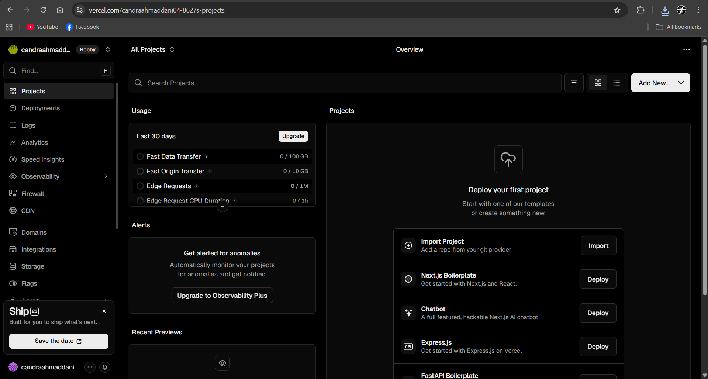

- Login menggunakan GitHub (buat akun jika belum punya)

  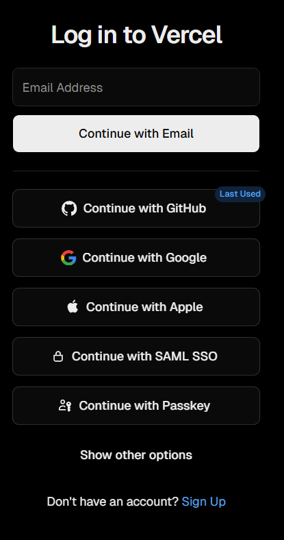

### B. Import Project

1. Klik Add New Project

   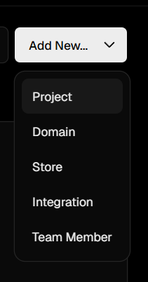

2. Klik Import

   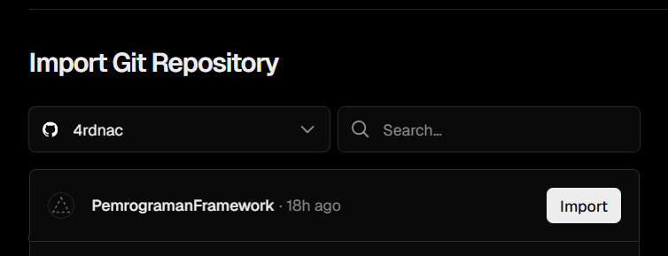

**Note**: Lakukan konfigurasi sebelum import

### C. Mengatasi Error Saat Deployment

**Masalah**: Static Site Generation Gagal

**Penyebab**: Masih ada code static-site generation di project

**Solusi**:

1. Hapus file `static.tsx`

   

2. Comment semua code SSG pada line 46 di file `[produk].tsx`

   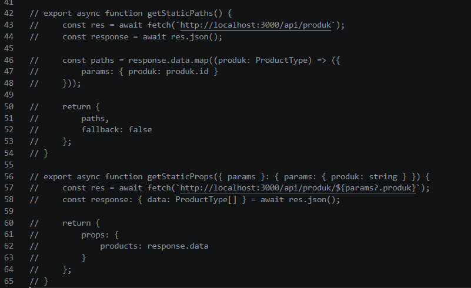

### D. Implementasi SSR (Server Side Rendering)

1. Buka comment SSR di file `[produk].tsx`

   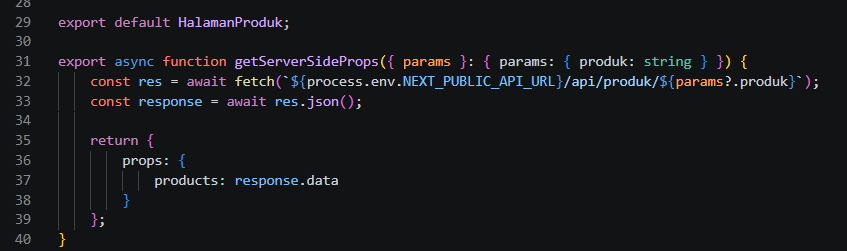

2. Buat file `.env.local`:

   ```
   NEXT_PUBLIC_API_URL=http://localhost:3000
   ```

   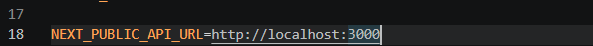

3. Ganti semua hardcoded URL dengan `process.env.NEXT_PUBLIC_API_URL`
   - Contoh: `fetch('${process.env.NEXT_PUBLIC_API_URL}/api/product')`
   - Update di file `[produk].tsx` dan `server.tsx`

   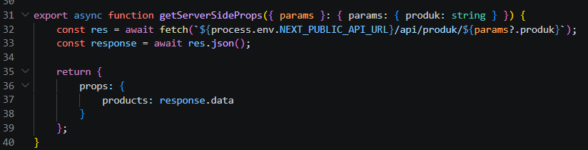

   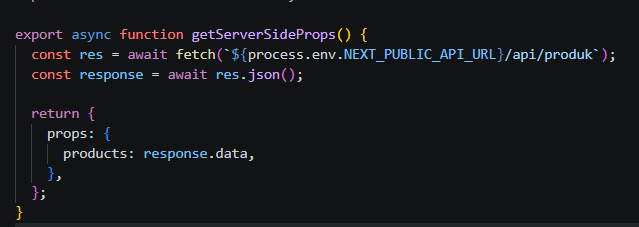

4. Commit dan push

   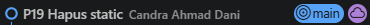

5. Klik deploy

   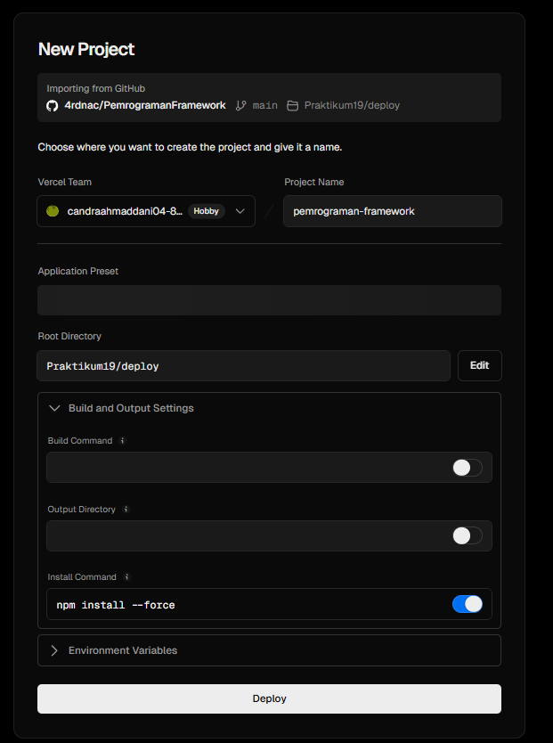

## PRAKTIKUM 3 – Environment Variable di Vercel

1. Buka Project di Vercel

   Settings → Environment Variables

   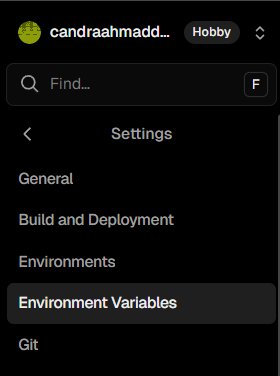

2. Import dari `.env.local` atau isi manual:

   ```
   NEXT_PUBLIC_API_URL=https://namaproject.vercel.app
   ```

   **Note**: Tanpa tanda `/` di belakang URL

   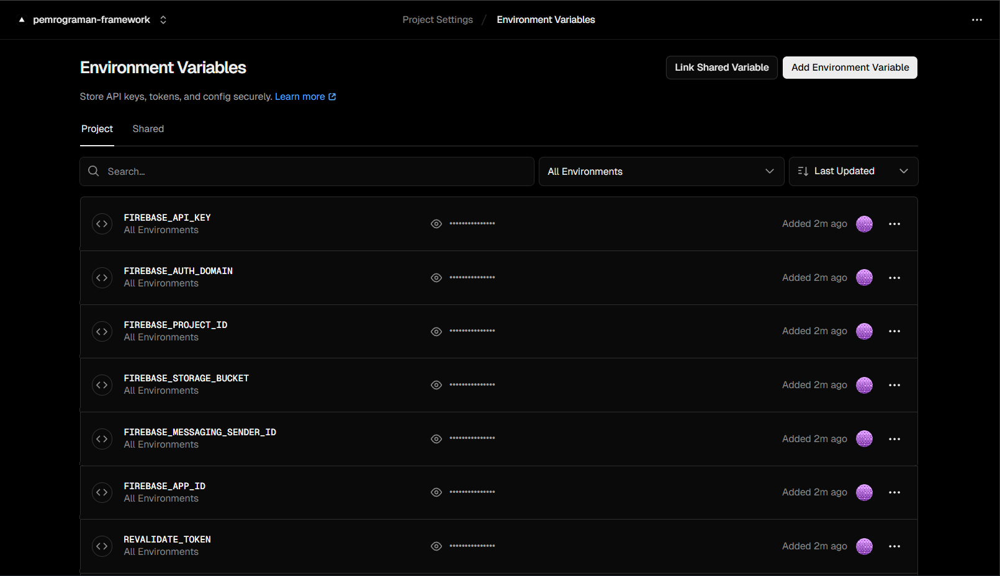

3. Redeploy: Deployment → Redeploy

   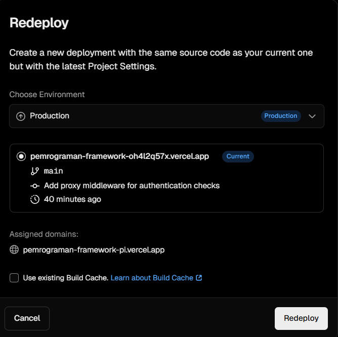

## PRAKTIKUM 4 – Konfigurasi Google OAuth Production

1. Masuk ke Google Cloud Console

   Credentials → OAuth Client

   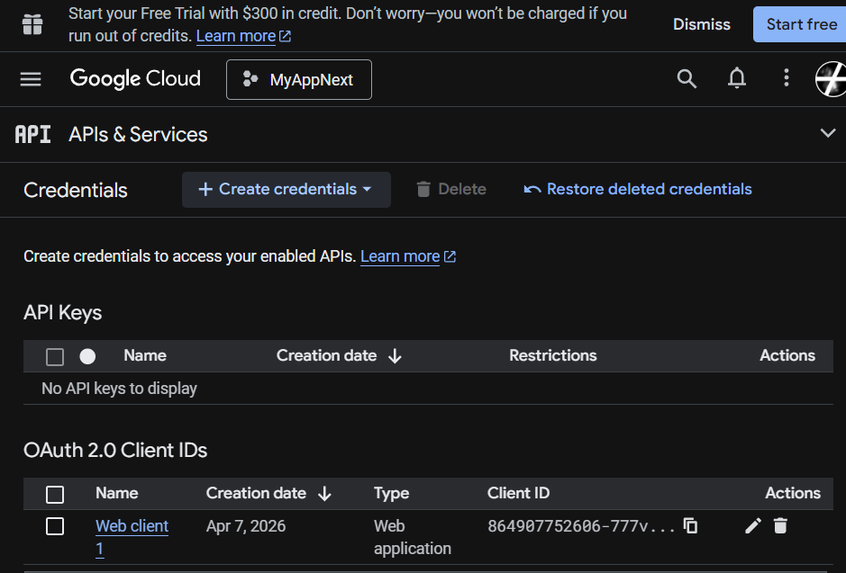

2. Tambahkan Authorized Origins

   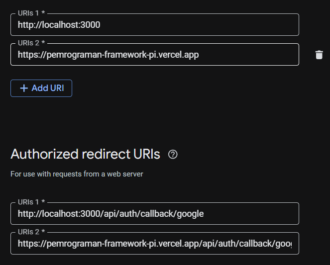

3. Tambahkan Redirect URI

   

4. Save perubahan

   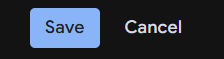

## PRAKTIKUM 5 – Pengujian Setelah Deployment

### Test Route

- `/` (Home)

  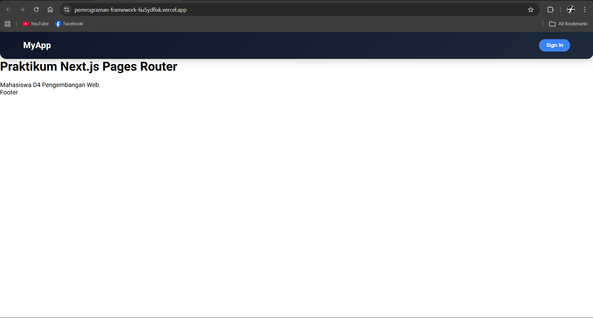

- `/about`

  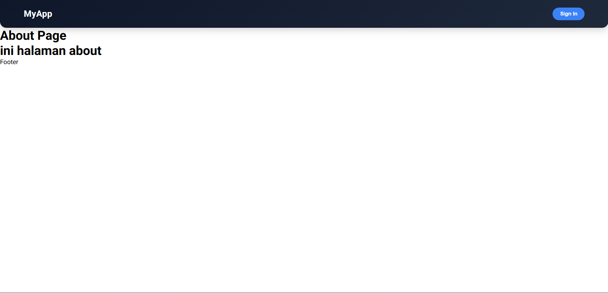

- `/product`

  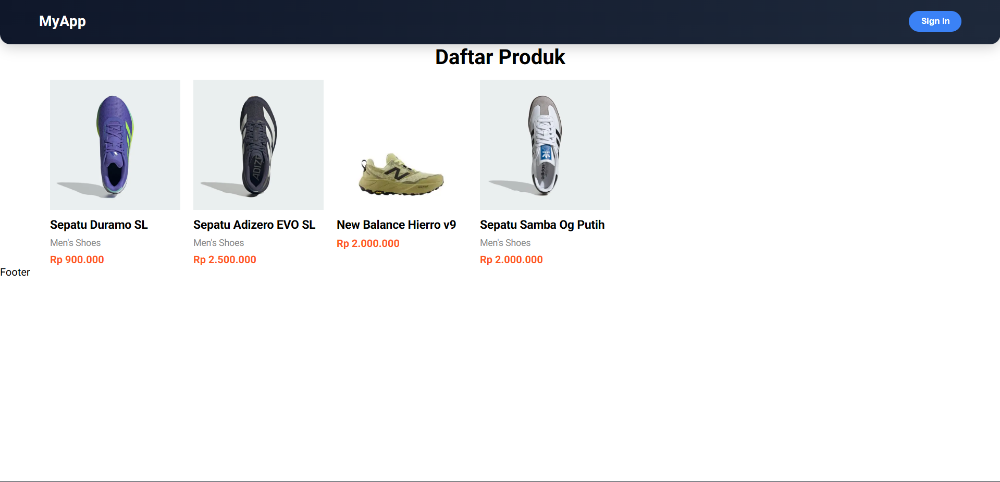

- `/profile`

  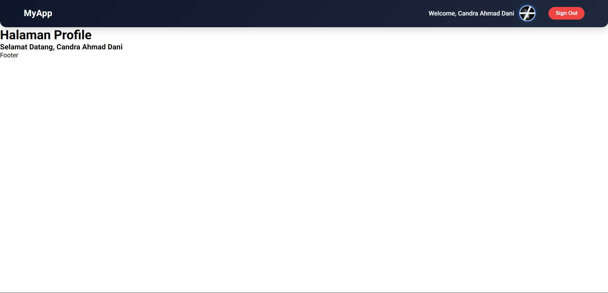

- Login Google

  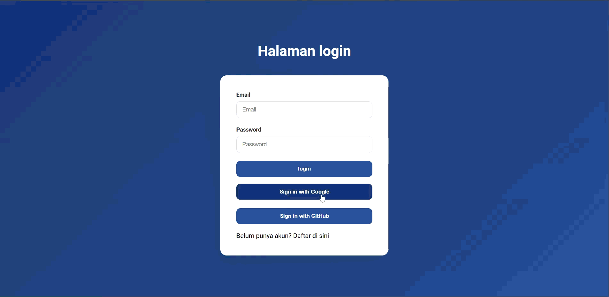

- Login credential biasa

  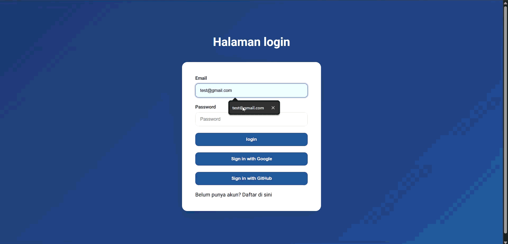

### Verifikasi

- SSR berjalan dengan baik
- API tidak menggunakan localhost
- Database terkoneksi
- Google login berhasil

## Analisis Konsep

| Konsep               | Penjelasan                     |
| -------------------- | ------------------------------ |
| SSG                  | Data diambil saat build        |
| SSR                  | Data diambil saat request      |
| CSR                  | Data diambil di browser        |
| Environment Variable | Variabel rahasia/konfigurasi   |
| Redeploy             | Build ulang setelah perubahan  |
| OAuth Production     | Harus update origin & callback |

## Refleksi & Diskusi

1.  Mengapa localhost tidak boleh digunakan di production?

    Localhost tidak boleh digunakan di production karena hanya berjalan di komputer lokal dan tidak bisa diakses oleh pengguna lain melalui internet. Jika dipakai di production, aplikasi tidak akan bisa diakses publik dan bisa menyebabkan error koneksi ke API atau service lain.

2.  Mengapa SSG bisa gagal saat build?

    SSG (Static Site Generation) bisa gagal saat build karena proses pengambilan data dilakukan saat build time. Jika API error, koneksi gagal, atau data tidak valid, maka proses build akan berhenti dan halaman tidak akan ter-generate.

3.  Apa perbedaan SSR dan SSG saat deployment?

    Perbedaan SSR dan SSG saat deployment adalah SSR (Server-Side Rendering) merender halaman setiap ada request di server sehingga butuh server aktif, sedangkan SSG menghasilkan file HTML statis saat build sehingga bisa langsung di-host tanpa server dinamis.

4.  Mengapa perlu redeploy setelah menambahkan environment?

    Perlu redeploy setelah menambahkan environment karena environment variable dibaca saat proses build atau startup. Jika ada perubahan tanpa redeploy, aplikasi tidak akan mengenali variabel baru tersebut.

5.  Apa fungsi redirect URI pada OAuth?

    Fungsi redirect URI pada OAuth adalah sebagai alamat tujuan setelah proses login berhasil. Redirect URI memastikan pengguna dikembalikan ke aplikasi yang benar sekaligus menjadi mekanisme keamanan agar token tidak dikirim ke URL yang tidak terdaftar.
